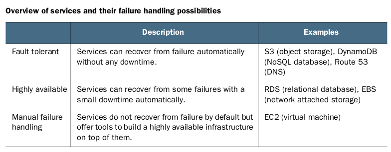
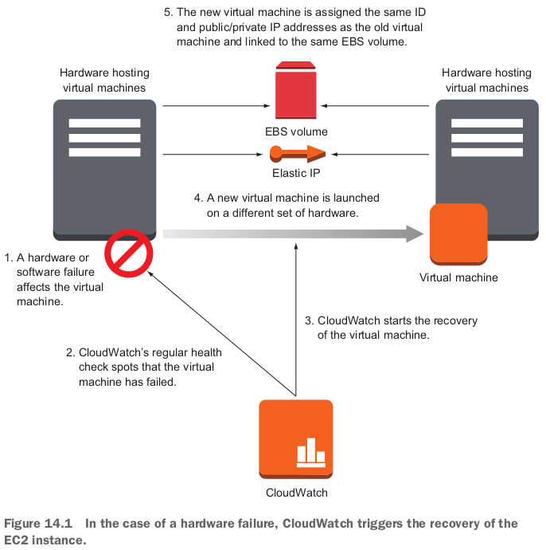
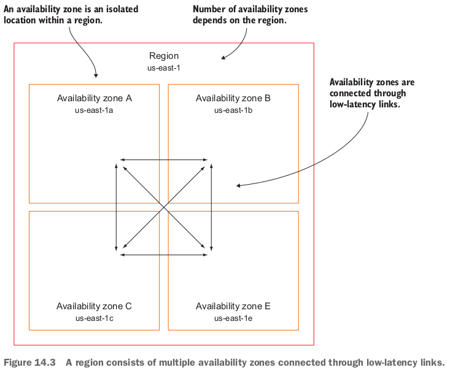
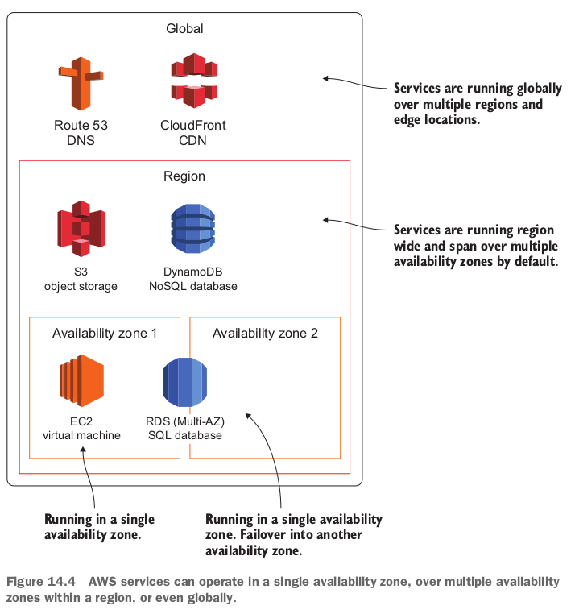
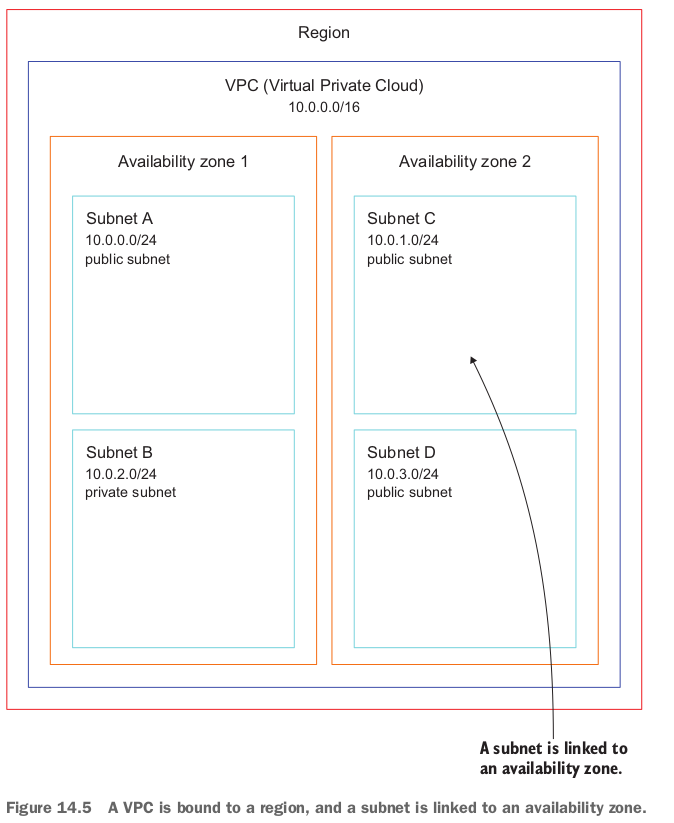
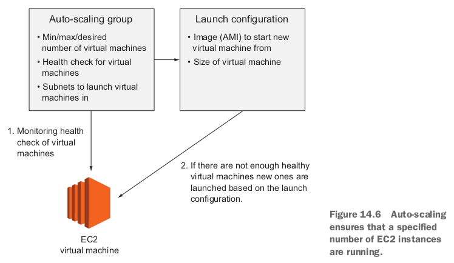
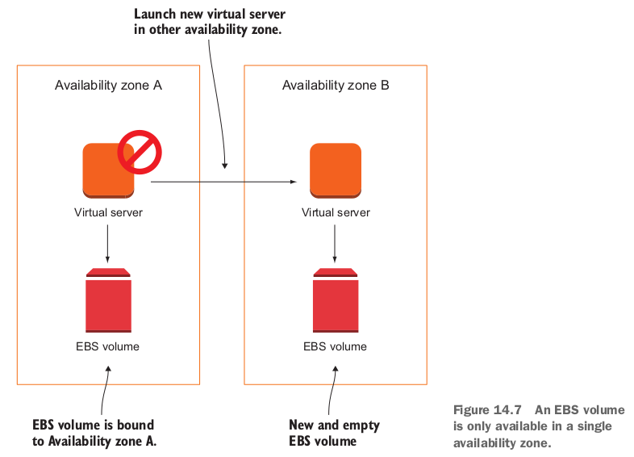
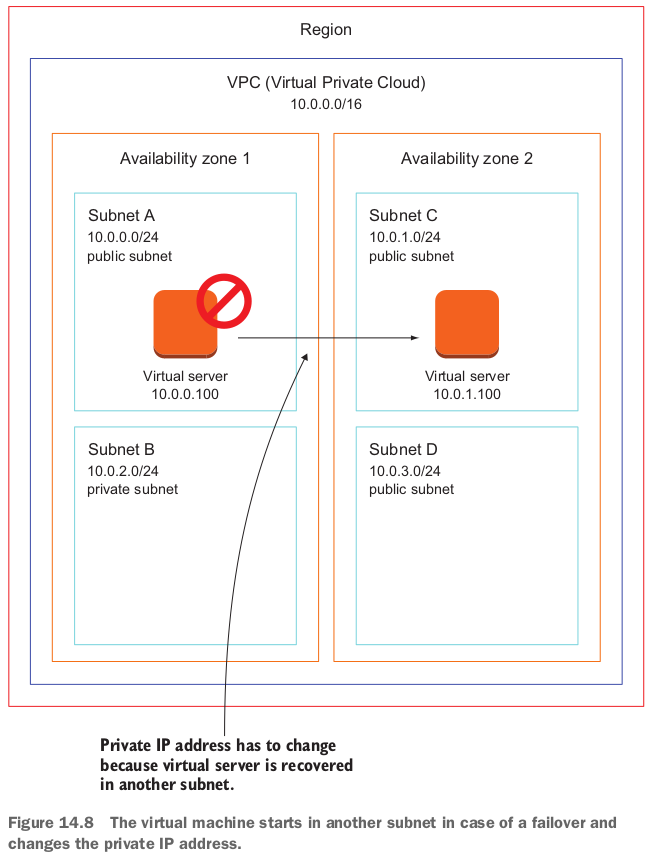
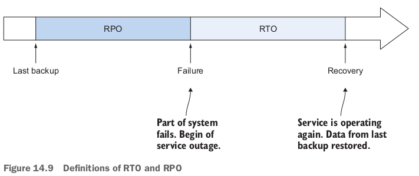
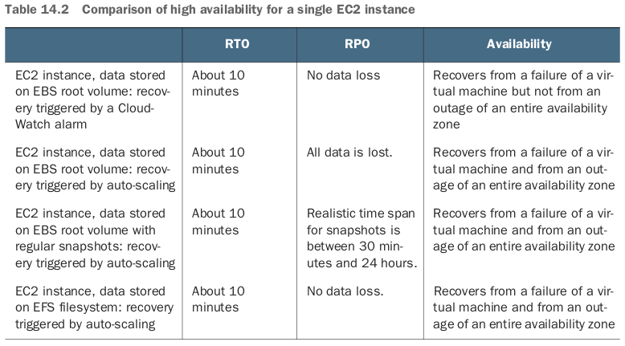

## 14.1 Recovering from EC2 instance failure with CloudWatch



### 14.1.1 Creating a CloudWatch alarm to trigger recovery when status checks fail

- CloudFormation templateに`Alarm`を定義する：

  ```yaml
    RecoveryAlarm:
      Type: 'AWS::CloudWatch::Alarm'
      Properties:
        AlarmDescription: 'Recover EC2 instance when underlying hardware fails.'
        Namespace: 'AWS/EC2' # the metric to monitor is provided by the EC2 service with namespace AWS/EC2
        MetricName: 'StatusCheckFailed_System'
        Statistic: Maximum # Statistical function to apply to the metric
        Period: 60 # Duration the statistical function is applied, in seconds. Must be a multiple of 60.
        EvaluationPeriods: 5 # the alarm will check the last 5 periods, the last 5 minutes in this example. If there are 5 consecutive failed checks, the alarm trips.
        ComparisonOperator: GreaterThanThreshold
        Threshold: 0
        AlarmActions:
        - !Sub 'arn:aws:automate:${AWS::Region}:ec2:recover'
        Dimensions: # the virtual machine is a dimension of the metric.
        - Name: InstanceId
          Value: !Ref VM
  ```

### 14.1.2 Monitoring and recovering a virtual machine based on a CloudWatch alarm

- You've been asked to set up a continuous integration (CI) server.
  - You've chosen to use Jenkins, an open source application written in Java that runs in a servlet container such as Apache Tomcat.
  - It's an important part of your infrastructure, because your colleagues won't be able to test and deploy new software if Jenkins suffers from downtime.
  - You can tolerate a short amount of downtime but still want to recover from hardware failures automatically.

- 提供してくれたtemplateはcreateできない（VMの立ち上げが失敗している。多分Jenkinsを立ち上げられていないでしょう）。`RecoveryAlarm`の部分は上記sectionにあった。失敗したので、templateを紹介する気もなくなった。。。ElasticIP, VM, RecoveryAlarmの３つresourceが定義されている。
  - ElasticIPを宣言する目的はrecovery前後VMのIPが変わらないこと。

## 14.2 Recovering from a data center outage

- Auto-scaling helps you start virtual machines that can recover from a data center outage with only a short amount of downtime.
- ２つpitfalls:
  - Data stored on network-attached storage (EBS) won't be available after failing over to another availability zone by default.
  - You can't start a new virtual machine in another availability zone with the same **private** IP address.
    - By default, you can't keep the same public IP address automatically after a recovery.

### 14.2.1 Availability zones: groups of isolated data centers





- To distribute resources across the different availability zones, the AZ identifier is generated randomly for each AWS account.
  - This means **us-east-1a points to a different availability zone in your AWS account than it does in our AWS account**.

- A VPC is always bound to a region. A subnet within a VPC is linked to an availability zone. A virtual machine is launched into a single subnet. 

### 14.2.2 Using auto-scaling to ensure that an EC2 instance is always running

- docker composeと似てる。Docker in Actionの第11章：Services with Docker and Compose.
- `AutoScalingGroup`の`HealthCheckType`のvalue: `EC2` to use the status checks of the virtual machine, or `ELB` to use the health check of the load balancer.
  - auto-scalingを機能させるために、`AutoScalingGroup`や`LaunchConfiguration`の２つresourceを定義。

- Jenkinsの例：

  ```yaml
    LaunchConfiguration:
      Type: 'AWS::AutoScaling::LaunchConfiguration'
      Properties:
        AssociatePublicIpAddress: true
        ImageId: !FindInMap [RegionMap, !Ref 'AWS::Region', AMI]
        InstanceMonitoring: false
        InstanceType: 't2.micro'
        KeyName: !Ref KeyName
        SecurityGroups:
        - !Ref SecurityGroup
        UserData:
          'Fn::Base64': !Sub |
            #!/bin/bash -x
            bash -ex << "TRY"
              # install Jenkins
              wget -q -T 60 https://pkg.jenkins.io/redhat/jenkins-1.616-1.1.noarch.rpm
              rpm --install jenkins-1.616-1.1.noarch.rpm
  
              # configure Jenkins
              sed -i -e 's/JENKINS_ARGS=""/JENKINS_ARGS="--argumentsRealm.passwd.admin=${JenkinsAdminPassword} --argumentsRealm.roles.admin=admin"/g' /etc/sysconfig/jenkins
              if [ ! -f /var/lib/jenkins/config.xml ]; then
                echo '<?xml version="1.0" encoding="UTF-8"?><hudson><version>1.0</version><useSecurity>true</useSecurity><authorizationStrategy class="hudson.security.FullControlOnceLoggedInAuthorizationStrategy"/><securityRealm class="hudson.security.LegacySecurityRealm"/></hudson>' > /var/lib/jenkins/config.xml
                chown jenkins:jenkins /var/lib/jenkins/config.xml
              fi
  
              # start jenkins
              service jenkins start
            TRY
            /opt/aws/bin/cfn-signal -e $? --stack ${AWS::StackName} --resource AutoScalingGroup --region ${AWS::Region}
    AutoScalingGroup:
      Type: 'AWS::AutoScaling::AutoScalingGroup'
      Properties:
        LaunchConfigurationName: !Ref LaunchConfiguration
        Tags:
        - Key: Name
          Value: 'jenkins-multiaz'
          PropagateAtLaunch: true # attach the same tags to the virtual machine started by this auto-scaling group
        MinSize: '1'
        MaxSize: '1'
        VPCZoneIdentifier:
        - !Ref SubnetA
        - !Ref SubnetB
        HealthCheckGracePeriod: 600
        HealthCheckType: EC2
      CreationPolicy:
        ResourceSignal:
          Timeout: PT10M
      DependsOn: VPCGatewayAttachment
  ```

  - Definition of a single EC2 instanceやlaunch configurationの違い：the subnet for the virtual machine isn't defined in the launch configuration, but rather in the auto-scaling group.

### 14.2.3 Recovering a failed virtual machine to another availability zone with the help of auto-scaling

- また失敗している。`multiaz.yaml`.

### 14.2.4 Pitfall: recovering network-attached storage

- 背景：EBSのdomainはavailability zone, なので、別のAZにEC2を最起動すると、もともとのEBSにアクセスできなくなる。
- In case of an availability zone outage, the volume is no longer available.
  - This does not imply that you lose any data.
  - As soon as the availability zone is back online, you can access the EBS volume again with all its data.

- 可能な対策：
  - Outsource the state of your virtual machine to a managed service **that uses multiple availability zones** by default: **RDS, DynamoDB (NoSQL database), EFS (NFSv4.1 share), or S3 (object store)**.
  - Create snapshots of your EBS volumes regularly, and use these snapshots if an EC2 instance needs to recover in another availability zone.
    - **EBS snapshots are stored on S3, thus available in multiple availability zones**.
    - If the EBS volume is the root volume of the EC2 instance, create AMIs to back up the EBS volume instead of a snapshot.
- **The Jenkins server stores data directly on disk. To outsource the state of the virtual machine, you can't use RDS, DyanmoDB, or S3; you need a block-level storage solution**.
  - EFSはできる！

- Embed EFS into the Jenkins setupステップ: create an EFS filesystem; create EFS mount targets in each availability zone; adjust the user data to mount the EFS filesystem.

### 14.2.5 Pitfall: network interface recovery



- static endpointを保つ方法：
  - Allocate an Elastic IP, and associate this public IP address during the bootstrap of the virtual machine. stackを作る時このpublic IPは既に決まったので、failoverの時でも同じpublic IPにひもづけられちゃう。
  - **Create or update a DNS entry linking to the current public or private IP address of the virtual machine**.
  - **Use an Elastic Load Balancer (ELB) as a static endpoint that forwards requests to the current virtual machine**.

- 1つ目方法のやること：allocate an Elastic IP; add the association of an Elastic IP to the script in the user data; **Create an IAM role and policy to allow the EC2 instance to associate an Elastic IP**.

  ```yaml
    ##########################################################################
    #                                                                        #
    #                      fixed public IP address (EIP)                     #
    #                                                                        #
    ##########################################################################
    ElasticIP:
      Type: 'AWS::EC2::EIP'
      Properties:
        Domain: vpc
      DependsOn: VPCGatewayAttachment
    ##########################################################################
    #                                                                        #
    #                   Auto Scaling Group running Jenkins                   #
    #                                                                        #
    ##########################################################################
    IamRole:
      Type: 'AWS::IAM::Role'
      Properties:
        AssumeRolePolicyDocument:
          Version: '2012-10-17'
          Statement:
          - Effect: Allow
            Principal:
              Service: 'ec2.amazonaws.com'
            Action: 'sts:AssumeRole'
        Policies:
        - PolicyName: root
          PolicyDocument:
            Version: '2012-10-17'
            Statement:
            - Action: 'ec2:AssociateAddress'
              Resource: '*'
              Effect: Allow
    IamInstanceProfile:
      Type: 'AWS::IAM::InstanceProfile'
      Properties:
        Roles:
        - !Ref IamRole
    LaunchConfiguration:
      Type: 'AWS::AutoScaling::LaunchConfiguration'
      Properties:
        AssociatePublicIpAddress: true
        IamInstanceProfile: !Ref IamInstanceProfile # EC2のIAM role
        ImageId: !FindInMap [RegionMap, !Ref 'AWS::Region', AMI]
        InstanceMonitoring: false
        InstanceType: 't2.micro'
        KeyName: !Ref KeyName
        SecurityGroups:
        - !Ref SecurityGroup
        UserData: # この中にAssociate the Elastic IP with the virtual machine; aws cli command.
  ```

## 14.3 Analyzing disaster-recovery requirements

- The recovery time objective (RTO) and recovery point objective (RPO) are standards for defining the importance of disaster recovery from a business point of view. 
  - Recovery point objective (RPO) is the acceptable data-loss time caused by a failure.
  - If an outage happens at 10:00 a.m. and the system recovers with a data snapshot from 09:00 a.m., the time span of the data loss is one hour.
  - In the example of a Jenkins server using auto-scaling, the RPO would be zero, because data is stored on EFS and is not lost during an AZ outage.

### 14.3.1 RTO and RPO comparison for a single EC2 instance



- 一番目がno data lossだが、availability zoneが失敗したら、対応できない。

- **If you want to be able to recover from an outage of an availability zone and need to decrease the RPO, you should try to achieve a stateless server**.
  - Using storage services like RDS, EFS, S3, and DynamoDB can help you to do so.

### 復習

- You can use auto-scaling to guarantee that a single virtual machine is always running even if an availability zone fails.
  - The pitfalls are that you can no longer blindly rely on EBS volumes and by default, IP addresses will change.

- Recovering data in another availability zone is tricky when stored on EBS volumes instead of managed storage services like RDS, EFS, S3 and DynamoDB.