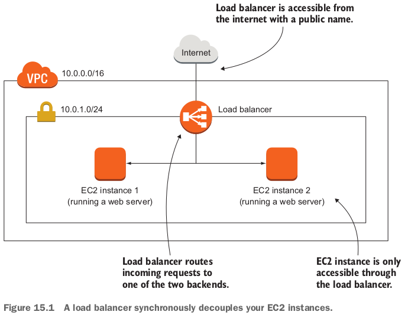
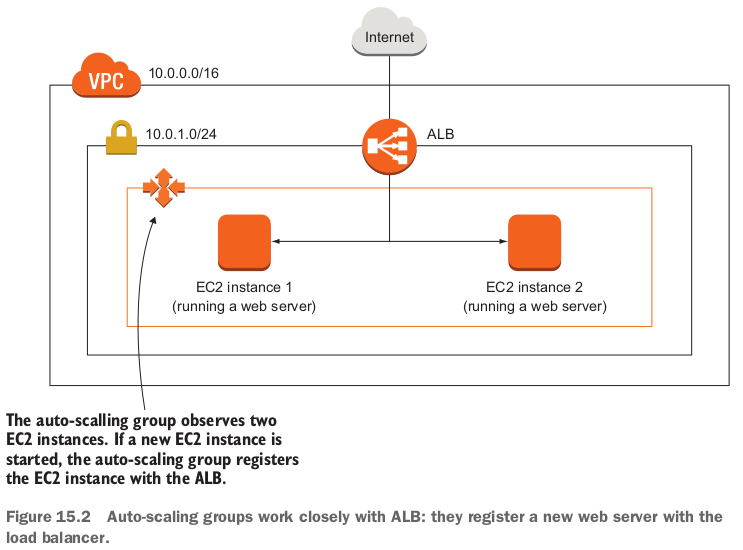
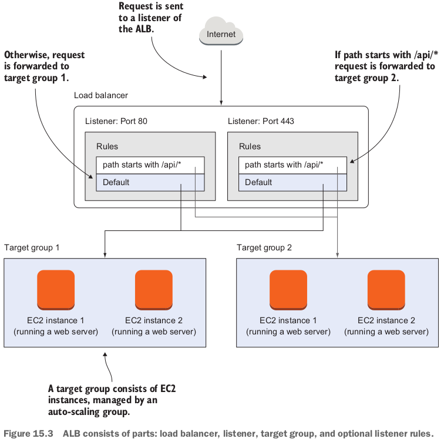
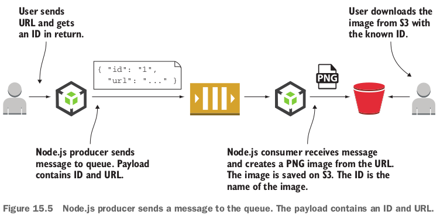

Synchronous decoupling with load balancers to distribute requests; Asynchronous decoupling with message queues to buffer message peaks.

## 15.1 Synchronous decoupling with load balancers

- Instead of exposing your EC2 instances (running web servers) to the outside world, you only expose the load balancer to the outside world. 同じじゃないか。。。load balancerのIPは変えられないでしょう？
- Load balancerの分類：
  - Application load balancer (ALB) - HTTP, HTTPS.
  - Network load balancer (NLB) - TCP.
  - Classic load balancer (CLB) - HTTP, HTTPS, TCP, TCP+TLS.

- If you start a new project, we recommend going with the ALB or NLB, because they are in most cases more cost efficient and more feature-rich.
- Load balancers can be used with more than web servers - you can use load balancers in front of any systems that deal with request/response-style communication as long as the protocol is based on TCP.

### 15.1.1 Setting up a load balancer with virtual machines



- ALBの３つ部分：
  - Load balancer.
  - Listener: The listener defines the port and protocol that you can use to make requests to the load balancer.
    - A listener links to a **target group** that is used as the default if no other **listener rules** match the request.
  - Target group: a target group defines your group of backends.
    - Usually backends are EC2 instances, **but could also be a Docker container running on EC2 Container Service** or a machine in your data center paired with your VPC.
  - Listener rule: (optional) the rule can choose a different target group based on the HTTP path or host.



- Creating a load balancer and connecting it to an auto-scaling group: 

  ```yaml
    LoadBalancerSecurityGroup:
      Type: 'AWS::EC2::SecurityGroup'
      Properties:
        GroupDescription: 'alb-sg'
        VpcId: !Ref VPC
        SecurityGroupIngress:
        - CidrIp: '0.0.0.0/0' # only traffic on port 80 from the internet will reach the load balancer.
          FromPort: 80
          IpProtocol: tcp
          ToPort: 80
    LoadBalancer:
      Type: 'AWS::ElasticLoadBalancingV2::LoadBalancer'
      Properties:
        Scheme: 'internet-facing' # the ALB is publicly accessible (use internal instead of internet-facing to define a load balancer reachable from private network only).
        SecurityGroups:
        - !Ref LoadBalancerSecurityGroup # assign the security group to the load balancer.
        Subnets:
        - !Ref SubnetA
        - !Ref SubnetB
        Type: application
      DependsOn: 'VPCGatewayAttachment'
    Listener:
      Type: 'AWS::ElasticLoadBalancingV2::Listener'
      Properties:
        DefaultActions:
        - TargetGroupArn: !Ref TargetGroup # forward requests to the default target group.
          Type: forward
        LoadBalancerArn: !Ref LoadBalancer
        Port: 80
        Protocol: HTTP
    TargetGroup:
      Type: 'AWS::ElasticLoadBalancingV2::TargetGroup'
      Properties:
        HealthCheckIntervalSeconds: 10 # every 10s, HTTP requests are made to /index.html.
        HealthCheckPath: '/index.html'
        HealthCheckProtocol: HTTP
        HealthCheckTimeoutSeconds: 5
        HealthyThresholdCount: 3
        UnhealthyThresholdCount: 2
        Matcher:
          HttpCode: '200-299' # if HTTP status code is 2XX, the backend is considered healthy.
        Port: 80
        Protocol: HTTP
        VpcId: !Ref VPC
    AutoScalingGroup:
      Type: 'AWS::AutoScaling::AutoScalingGroup'
      Properties:
        LaunchConfigurationName: !Ref LaunchConfiguration
        MinSize: !Ref NumberOfVirtualMachines
        MaxSize: !Ref NumberOfVirtualMachines
        TargetGroupARNs: # the auto-scaling group registers new EC2 instances with the default target group.
        - !Ref TargetGroup
        VPCZoneIdentifier:
        - !Ref SubnetA
        - !Ref SubnetB
      CreationPolicy:
        ResourceSignal:
          Timeout: 'PT10M'
      DependsOn: 'VPCGatewayAttachment'
  ```

  - 上記stackの効果：Every time you reload the page, you should see one of the private IP addresses of a backend web server.

## 15.2 Asynchronous decoupling with message queues

- A message queue has a head and a tail.
  - You can add new messages to the tail while reading messages from the head.
  - This allows you to decouple the production and consumption of messages.
  - The queue acts as a buffer.
  - The queue hides your backend.

- The *Simple Queue Service* (SQS) is a fully managed AWS service.
  - Under rare circumstances, a single message will be available for consumption twice...
  - SQS doesn't guarantee the order of messages, so you may read messages in a different order than they were produced...

### 15.2.1 Turning a synchronous process into an asynchronous one

- If you want to make a process asynchronous, you must manage the way the process initiator tracks the process status.
  - One way of doing that is to return an ID to the initiator that can be used to look up the process.

### 15.2.2 Architecture of the URL2PNG application(面白そうだが、失敗だった)



- To complete the example, you need to create an S3 bucket with **web hosting** enabled.

  ```bash
  sen@sen-XPS-8930:~/work/aws-in-action/code2/chapter15$ aws s3 mb s3://url2png-sen
  make_bucket: url2png-sen
  sen@sen-XPS-8930:~/work/aws-in-action/code2/chapter15$ aws s3 website s3://url2png-sen --index-document index.html --error-document error.html
  ```

- **Web hosting is needed so users can later download the images from S3**.

### 15.2.3 Setting up a message queue

```bash
sen@sen-XPS-8930:~/work/aws-in-action/code2/chapter15$ aws sqs create-queue --queue-name url2png
{
    "QueueUrl": "https://queue.amazonaws.com/719326062820/url2png"
}
```

### 15.2.4 Producing messages programmatically

- `index.js`:

  ```javascript
  const AWS = require('aws-sdk');
  const uuid = require('uuid/v4');
  const config = require('./config.json');
  const sqs = new AWS.SQS({ // create an SQS client.
    region: 'us-east-1'
  });
  
  if (process.argv.length !== 3) { // check whether a URL was provided.
    console.log('URL missing');
    process.exit(1);
  }
  
  const id = uuid(); // create a random ID.
  const body = { // the payload contains the random ID and the URL.
    id: id,
    url: process.argv[2]
  };
  
  sqs.sendMessage({
    MessageBody: JSON.stringify(body), // convert the payload into a JSON string.
    QueueUrl: config.QueueUrl // queue to which the message is sent (was returned when creating the queue).
  }, (err) => {
    if (err) {
      console.log('error', err);
    } else {
      console.log('PNG will be soon available at http://' + config.Bucket + '.s3-website-us-east-1.amazonaws.com/' + id + '.png');
    }
  });
  ```

- messageを追加：

  ```bash
  root@dd7d9e750774:/user/sen/code2/chapter15/url2png# node index.js "http://aws.amazon.com"
  PNG will be soon available at http://url2png-sen.s3-website-us-east-1.amazonaws.com/968d88c6-c95d-4647-92f9-9358f2fe23a2.png
  root@dd7d9e750774:/user/sen/code2/chapter15/url2png# aws sqs get-queue-attributes --queue-url "https://queue.amazonaws.com/719326062820/url2png" --attribute-names ApproximateNumberOfMessages
  {
      "Attributes": {
          "ApproximateNumberOfMessages": "1"
      }
  }
  ```

### 15.2.5 Consuming messages programmatically

- ３つタスク：receive a message; process the message; acknowledge that the message was successfully processed. `worker.js`:

  ```javascript
  const fs = require('fs');
  const AWS = require('aws-sdk');
  const webshot = require('node-webshot');
  const config = require('./config.json');
  const sqs = new AWS.SQS({
    region: 'us-east-1'
  });
  const s3 = new AWS.S3({
    region: 'us-east-1'
  });
  
  const acknowledge = (message, cb) => {
    const params = {
      QueueUrl: config.QueueUrl,
      ReceiptHandle: message.ReceiptHandle // ReceiptHandle is unique for each receipt of a message.
    };
    sqs.deleteMessage(params, cb);
  };
  
  const process = (message, cb) => {
    const body = JSON.parse(message.Body); // the message body is a JSON string. You convert it back into a JavaScript object.
    const file = body.id + '.png';
    webshot(body.url, file, (err) => { // create the screenshot with the webshot module.
      if (err) {
        cb(err);
      } else {
        fs.readFile(file, (err, buf) => { // open the screenshot that was saved to local disk by the webshot module.
          if (err) {
            cb(err);
          } else {
            const params = {
              Bucket: config.Bucket,
              Key: file,
              ACL: 'public-read', // allow everyone to read the screenshot on S3.
              ContentType: 'image/png',
              Body: buf
            };
            s3.putObject(params, (err) => { // upload the screenshot to S3.
              if (err) {
                cb(err);
              } else {
                fs.unlink(file, cb); // remove the screenshot from local disk.
              }
            });
          }
        });
      }
    });
  };
  
  const receive = (cb) => {
    const params = {
      QueueUrl: config.QueueUrl,
      MaxNumberOfMessages: 1, // consume no more than 1 message at once. We usually set this to 10 for best performance and lowest overhead.
      VisibilityTimeout: 120, // take the message from the queue for 120s. Within that time, you must delete the message, or it will be delivered back to the queue. We usually set this to the average processing time multiplied by 4.
      WaitTimeSeconds: 10 // long poll for 10s to wait for new messages.
    };
    sqs.receiveMessage(params, (err, data) => {
      if (err) {
        cb(err);
      } else {
        if (data.Messages === undefined) {
          cb(null, null);
        } else {
          cb(null, data.Messages[0]);
        }
      }
    });
  };
  
  const run = () => {
    receive((err, message) => {
      if (err) {
        throw err;
      } else {
        if (message === null) {
          console.log('nothing to do');
          setTimeout(run, 1000); // call the run method again in 1 second.
        } else {
          console.log('process');
          process(message, (err) => {
            if (err) {
              throw err;
            } else {
              acknowledge(message, (err) => {
                if (err) {
                  throw err;
                } else {
                  console.log('done');
                  setTimeout(run, 1000); // call the run method again in 1s to poll for further messages (kind of a recursive loop, but with a timer in between. When the timer starts, a new call stack is allocated; this will not lead to a stack overflow!)
                }
              });
            }
          });
        }
      }
    });
  };
  
  run(); // call the run method to start.
  ```

- consume a message: `node worker.js`. エラーだった。。。

  ```bash
  root@dd7d9e750774:/user/sen/code2/chapter15/url2png# node worker.js 
  process
  /user/sen/code2/chapter15/url2png/worker.js:83
              throw err;
              ^
  
  Error: PhantomJS exited with return value 127
      at ChildProcess.<anonymous> (/user/sen/code2/chapter15/url2png/node_modules/node-webshot/lib/webshot.js:251:13)
      at emitTwo (events.js:126:13)
      at ChildProcess.emit (events.js:214:7)
      at Process.ChildProcess._handle.onexit (internal/child_process.js:198:12)
  ```

- You can add as many workers as you like to consume those messages.
- If a worker dies for some reason, the message that was in flight will become available for consumption after 2 minutes and will be picked up by another worker.

### 15.2.6 Limitations of messaging with SQS

- The problem of repeated delivery of a message can be solved by making the message processing idempotent (べき等、冪等).
  - *Idempotent* means that no matter how often the message is processed, the result stays the same.
  - Idempotence solves many problems in distributed systems that guarantee messages will be delivered at least once.

- **Not everything can be made idempotent**.
  - **Sending an email is a good example**.

- If you need a stable message order, you'll have difficulty finding a solution that scales like SQS.
  - Our advice is to change the design of your system so you no longer need the stable order, or put the messages in order on the client side.

- なんとなくROSのモデルを思いついた。
- SQS doesn't replace a **message broker**.
  - message broker: https://en.wikipedia.org/wiki/Message_broker
  - A message broker is an intermediary computer program module that translates a message from the formal messaging protocol of the sender to the formal messaging protocol of the receiver.

- Don't expect features like message routing or message priorities. でもAmazon MQが存在している。

### 復習

- Most applications can be synchronously decoupled without touching the code, by using a load balancer offered by the ELB service.
  - ユーザーがアクセスするのはLoadBalancer.DNSName.

- Asynchronous decoupling is only possible with asynchronous processes.
  - But you can modify a synchronous process to be an asynchronous one most of the time.

- Asynchronous decoupling with SQS requires programming against SQS with one of the SDKs.