Retrying on failure; Using idempotent operations to achieve retry on failure;

- You can achieve fault-tolerance by introducing redundancy into your system and by decoupling the parts of your architecture such that one side does not rely on the uptime of the other.

- The most convenient way to make your system fault-tolerant is to build the architecture using **fault-tolerant blocks**.
  - If all blocks are fault-tolerant, the whole system will be fault-tolerant as well.

- Unfortunately, one important service isn't fault-tolerant by default: EC2 instances.
  - そのため、AWSがauto-scaling groups, Elastic Load Balancing (ELB), Simple Queue Service (SQS)を提供している。

- **single point of failure** (SPOF): neither highly available nor fault-tolerant.
- single-point-of-failure block: EC2, RDS (relational database service, use Multi-AZ mode to achieve high availability).
- high-available block: Elastic Network Interface (ENI, bound to an AZ), VPC (bound to an AZ), EBS (Elastic Block Store),  RDS Multi-AZ instance (a short downtime is expected if an issue occurs with the master instance while changing DNS records to switch to the standby instance).

- fault-tolerant block: **Elastic Load Balancing (ELB, deployed to at least two AZs)**; EC2 security groups; VPC with an ACL and a route table; Elastic IP addresses; S3; EBS snapshots; DynamoDB; CloudWatch; auto-scaling groups; Simple Queue Service; Elastic Beanstalk (**the management service itself, not necessarily your application running within the environment**); OpsWorks (Elastic Beanstalkと同じ); CloudFormation; IAM (**if you create an IAM user, that user is available in all regions**) 

## 16.1 Using redundant EC2 instances to increase availability

### 16.1.1 Redundancy can remove a single point of failure

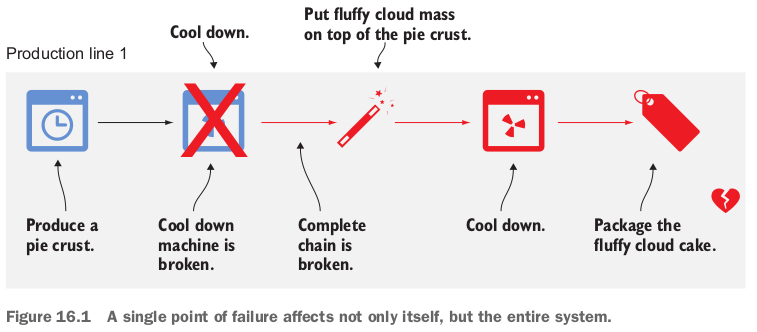

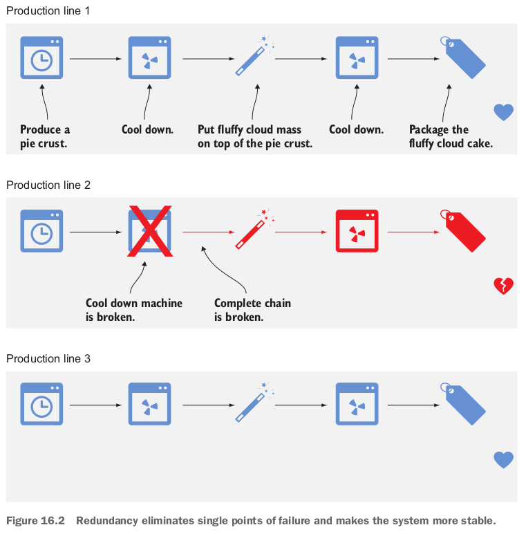

### 16.1.2 Redundancy requires decoupling

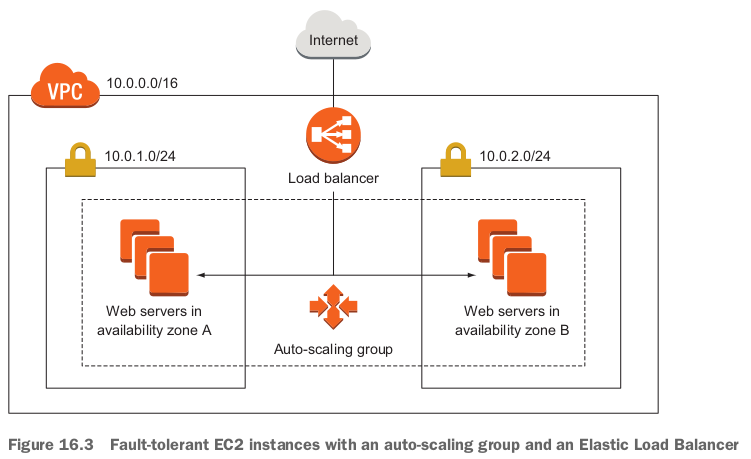

- なんとなく極端のfault-tolerantにも未達。本当はhigh availabilityのレベル。。。例えば２つweb serversが同時に壊れたら。
- redundant部分：AZ; subnets; EC2 instances.

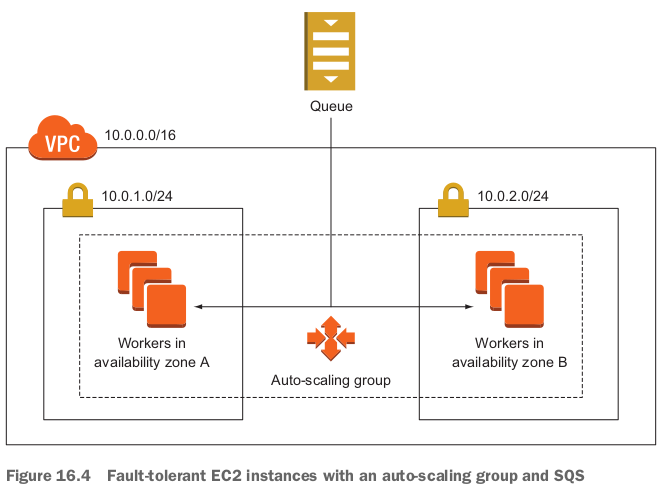

- In both figures, the load balancer and the SQS queue appear only once.
  - This doesn't mean that ELB or SQS are single points of failure; on the contrary, ELB and SQS are both fault-tolerant by default.

## 16.2 Considerations for making your code fault-tolerant

### 16.2.1 Let it crash, but also retry

- **The Erlang programming language is famous for the concept of "let it crash" (fail fast)**.
  - That means **whenever the program doesn't know what to do, it crashes, and someone needs to deal with the crash**.

- Erlang is also famous for retrying.
- **Retrying is built into asynchronous systems by default**.
  - If a message is consumed but not acknowledged within a certain amount of time, it goes back to the queue.

### 16.2.2 Idempotent retry makes fault tolerance possible

- シーン：**How can you prevent a blog post from being added to the database multiple times because of a retry?**
  - このシーンのステップ：create a blog post entry in the database; invalidate the cache because data has changed; post the link to the blog's Twitter feed.

- Step 1: Create a blog post entry in the database: 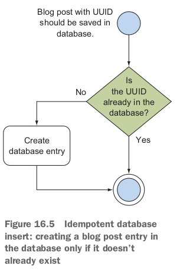
- Step 2: Invalidate the cache: You don't need to worry about idempotence too much here: it doesn't hurt if the cache is invalidated more often than needed.
- Step 3: Post to the blog's Twitter feed:
  - **You interact with a third party that doesn't support idempotent operations**. 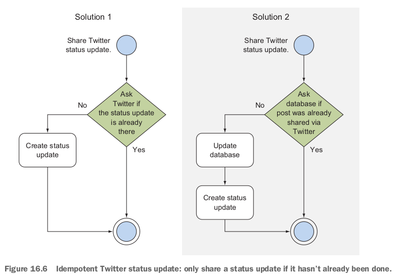

## 16.3 Building a fault-tolerant web application: Imagery

- Synchronous process: 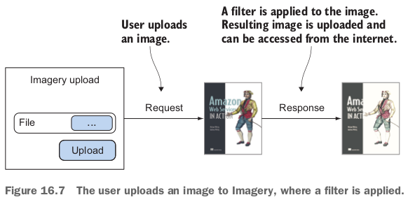

- When designing an asynchronous process, it's important to keep track of the process.
- Asynchronous process: 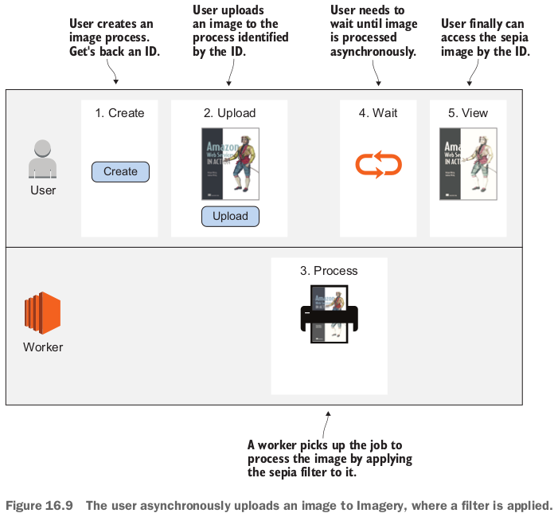
- **Map the process to AWS services**: 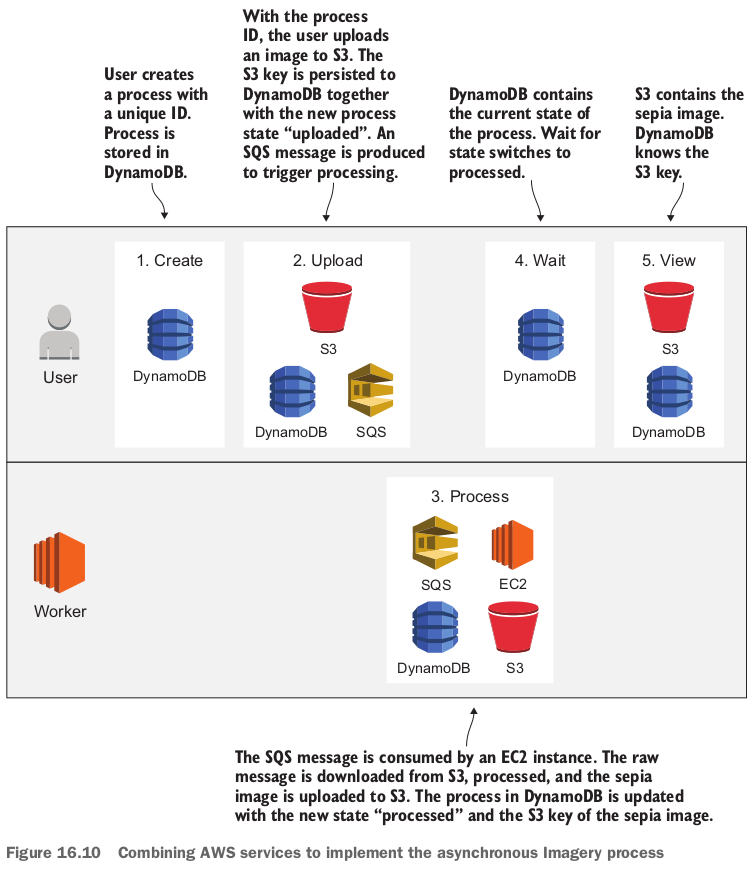

### 16.3.1 The idempotent state machine

- An idempotent state transition must have the same result no matter how often the transition takes place.
  - If you can make sure that your state transitions are idempotent, you can do a simple trick: in case of a failure during transitioning, you retry the entire state transition.

### 16.3.2 Implementing a fault-tolerant web service

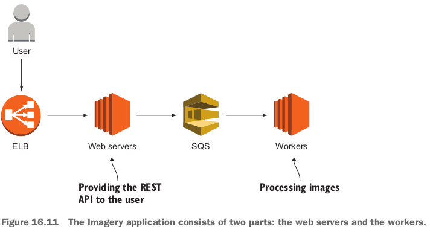

- **REST API**は以下：
  - `POST /image`: a new image process is created when executing this **route**. これは多分idがreturnされる。
  - `GET /image/:id`: this **route** returns the **state** of the process specified with the path parameter `:id`.
  - `POST /image/:id/upload`: this **route** offers a file upload for the process specified with the `path` parameter `:id`. ユーザーが画像を選んでupload.

- `server/server.js`:

  ```javascript
  var express = require('express');
  var bodyParser = require('body-parser');
  var AWS = require('aws-sdk');
  var uuidv4 = require('uuid/v4');
  var multiparty = require('multiparty');
  
  var lib = require('./lib.js');
  
  var db = new AWS.DynamoDB({ // create a DynamoDB endpoint.
    'region': 'us-east-1'
  });
  var sqs = new AWS.SQS({ // create an SQS endpoint.
    'region': 'us-east-1'
  });
  var s3 = new AWS.S3({ // create an S3 endpoint.
    'region': 'us-east-1'
  });
  
  var app = express(); // create an Express application.
  app.use(bodyParser.json()); // tell Express to parse the request bodies.
  app.use(express.static('public'));
  
  function getImage(id, cb) {
    db.getItem({
      'Key': {
        'id': {
          'S': id
        }
      },
      'TableName': 'imagery-image'
    }, function(err, data) {
      if (err) {
        cb(err);
      } else {
        if (data.Item) {
          cb(null, lib.mapImage(data.Item));
        } else {
          cb(new Error('image not found'));
        }
      }
    });
  }
  
  function uploadImage(image, part, response) {
    var rawS3Key = 'upload/' + image.id + '-' + Date.now(); // create a key for the S3 object.
    s3.putObject({ // call the S3 API to upload an object.
      'Bucket': process.env.ImageBucket, // the S3 bucket name is passed in as an environment variable (the bucket will be created later).
      'Key': rawS3Key,
      'Body': part, // the body is the uploaded stream of data.
      'ContentLength': part.byteCount
    }, function(err, data) {
      if (err) {
        throw err;
      } else {
        db.updateItem({ // call the DynamoDB API to update an object.
          'Key': {
            'id': {
              'S': image.id
            }
          },
          'UpdateExpression': 'SET #s=:newState, version=:newVersion, rawS3Key=:rawS3Key', // update the state, version and raw S3 key.
          'ConditionExpression': 'attribute_exists(id) AND version=:oldVersion AND #s IN (:stateCreated, :stateUploaded)', // update only when item exists. Version equals the expected version, and state is one of those allowed.
          'ExpressionAttributeNames': {
            '#s': 'state'
          },
          'ExpressionAttributeValues': { // 上のnewState, newVersionなどの値を定義する。
            ':newState': {
              'S': 'uploaded'
            },
            ':oldVersion': {
              'N': image.version.toString()
            },
            ':newVersion': {
              'N': (image.version + 1).toString()
            },
            ':rawS3Key': {
              'S': rawS3Key
            },
            ':stateCreated': {
              'S': 'created'
            },
            ':stateUploaded': {
              'S': 'uploaded'
            }
          },
          'ReturnValues': 'ALL_NEW',
          'TableName': 'imagery-image'
        }, function(err, data) {
          if (err) {
             throw err;
          } else {
            sqs.sendMessage({ // call the SQS API to publish a message.
              'MessageBody': JSON.stringify({'imageId': image.id, 'desiredState': 'processed'}), // create the message body containing the image's ID and the desired state.
              'QueueUrl': process.env.ImageQueue, // the queue URL is passed in as an environment variable.
            }, function(err) {
              if (err) {
                throw err;
              } else {
                response.redirect('/#view=' + image.id);
                response.end();
              }
            });
          }
        });
      }
    });
  }
  
  // POST /image creates an image process.
  app.post('/image', function(request, response) { // register the route with Express.
    var id = uuidv4(); // create a unique ID for the process.
    db.putItem({ // invoke the putItem operation on DynamoDB.
      'Item': {
        'id': {
          'S': id // the id attribute will be the primary key in DynamoDB.
        },
        'version': {
          'N': '0' // use the version for optimistic locking. まだ分かっていない。
        },
        'created': {
          'N': Date.now().toString() // store the data and time when the process was created.
        },
        'state': {
          'S': 'created' // the process is now in the created state: this attribute will change when state transitions happen.
        }
      },
      'TableName': 'imagery-image', // the DynamoDB table will be created later.
      'ConditionExpression': 'attribute_not_exists(id)' // prevent the item from being replaced if it already exists.
    }, function(err, data) {
      if (err) {
        throw err;
      } else {
        response.json({'id': id, 'state': 'created'}); // respond with the process ID.
      }
    });
  });
  
  app.get('/image/:id', function(request, response) {
    getImage(request.params.id, function(err, image) {
      if (err) {
        throw err;
      } else {
        response.json(image); // respond with the image process.
      }
    });
  });
  
  app.post('/image/:id/upload', function(request, response) { // register the route with Express.
    getImage(request.params.id, function(err, image) {
      if (err) {
        throw err;
      } else {
        var form = new multiparty.Form(); // we are using the multiparty module to handle multi-part uploads.
        form.on('part', function(part) {
          uploadImage(image, part, response);
        });
        form.parse(request);
      }
    });
  });
  
  app.listen(process.env.PORT || 8080, function() { // start Express on the port defined by the environment variable PORT, or defaults to 8080.
    console.log('Server started. Open http://localhost:' + (process.env.PORT || 8080) + ' with browser.');
  });
  ```
  - To provide a REST API to create image processes, a fleet of EC2 instances will run Node.js code behind a load balancer. 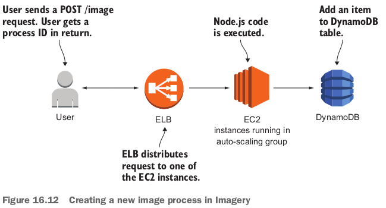
  - **Optimistic locking**: When you want to update an item, you must specify which version you want to update. If that version doesn't match the current version of the item in the database, your update will be rejected.
    - Imagine the following scenario. An item is created in version 0. Process A looks up that item (version 0). Process B also looks up that item (version 0). Now process A wants to make a change by invoking the `updateItem` operation on DynamoDB. Therefore process A specifies that the expected version is 0. DynamoDB will allow that modification, because the version matches; but DynamoDB will also change the item's version to 1 because an update was performed. Now process B wants to make a modification and sends a request to DynamoDB with the expected item version 0. DynamoDB will reject that modification because the expected version doesn't match the version DynamoDB knows of, which is 1.
    - To solve the problem for process B, you can use **retry**. Process B will again look up the item, now in version 1, and can (you hope) make the change.
    - The opposite of optimistic locking is pessimistic locking. A pessimistic lock strategy can be implemented by using a semaphore.
  - Looking up an imagery process: 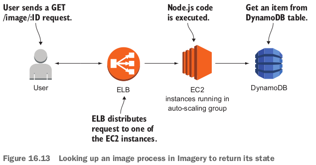
    - Express will take care of the path parameter `:id`; Express will provide it within `request.params.id`.
  - Uploading an image: 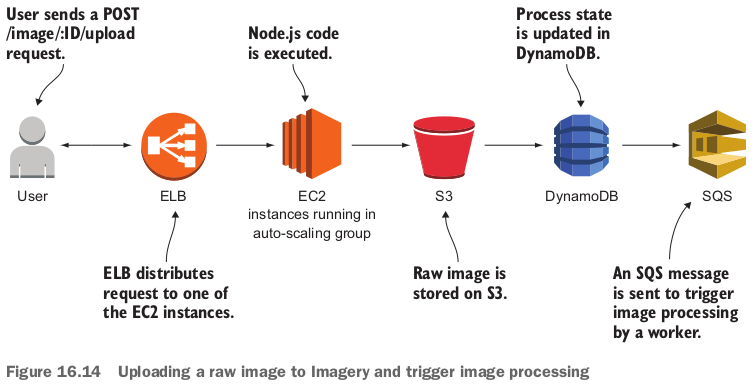

### 16.3.3 Implementing a fault-tolerant worker to consume SQS messages

- Fortunately, consuming SQS messages is a common task that is solved by Elastic Beanstalk, which you'll use to deploy the application.

  - Elastic Beanstalk can be configured to listen to SQS messages and execute an HTTP `POST` request for every message.
  - The worker implements a REST API that is **invoked by Elastic Beanstalk**.

- `worker/worker.js`:

  ```javascript
  var express = require('express');
  var bodyParser = require('body-parser');
  var AWS = require('aws-sdk');
  var assert = require('assert-plus');
  var Jimp = require('jimp');
  var fs = require('fs');
  
  var lib = require('./lib.js');
  
  var db = new AWS.DynamoDB({ // create a DynamoDB endpoint.
    'region': 'us-east-1'
  });
  var s3 = new AWS.S3({ // create an S3 endpoint.
    'region': 'us-east-1'
  });
  
  var app = express(); // create an Express application.
  app.use(bodyParser.json());
  
  function getImage(id, cb) {
    db.getItem({
      'Key': {
        'id': {
          'S': id
        }
      },
      'TableName': 'imagery-image'
    }, function(err, data) {
      if (err) {
        cb(err);
      } else {
        if (data.Item) {
          cb(null, lib.mapImage(data.Item));
        } else {
          cb(new Error('image not found'));
        }
      }
    });
  }
  
  app.get('/', function(request, response) { // register a route for health checks that returns an empty object.
    response.json({});
  });
  
  app.post('/sqs', function(request, response) { // register the route with Express.
    assert.string(request.body.imageId, 'imageId');
    assert.string(request.body.desiredState, 'desiredState');
    getImage(request.body.imageId, function(err, image) { // the implementation of getImage is the same as on the server.
      if (err) {
        throw err;
      } else {
        if (typeof states[request.body.desiredState] === 'function') { // 'function'??
          states[request.body.desiredState](image, request, response);
        } else {
          throw new Error('unsupported desiredState');
        }
      }
    });
  });
  
  var states = {
    'processed': processed
  };
  
  function processImage(image, cb) {
    var processedS3Key = 'processed/' + image.id + '-' + Date.now() + '.png';
    var rawFile = './tmp_raw_' + image.id;
    var processedFile = './tmp_processed_' + image.id;
    s3.getObject({ // download raw image from S3.
      'Bucket': process.env.ImageBucket,
      'Key': image.rawS3Key
    }, function(err, data) {
      if (err) {
        cb(err);
      } else {
        fs.writeFile(rawFile, data.Body, {'encoding': null}, function(err) {
          if (err) {
            cb(err);
          } else {
            Jimp.read(rawFile, (err, lenna) => {
              if (err) {
                throw err;
              } else {
                lenna.sepia().write(processedFile); // process image.
                fs.unlink(rawFile, function() {
                  fs.readFile(processedFile, {'encoding': null}, function(err, buf) {
                    if (err) {
                      cb(err);
                    } else {
                      s3.putObject({ // upload sepia image to S3.
                        'Bucket': process.env.ImageBucket,
                        'Key': processedS3Key,
                        'ACL': 'public-read',
                        'Body': buf,
                        'ContentType': 'image/png'
                      }, function(err) {
                        if (err) {
                          cb(err);
                        } else {
                          fs.unlink(processedFile, function() {
                            cb(null, processedS3Key);
                          });
                        }
                      });
                    }
                  });
                });
              }
            });
          }
        });
      }
    });
  }
  
  function processed(image, request, response) {
    processImage(image, function(err, processedS3Key) {
      if (err) {
        throw err;
      } else {
        db.updateItem({ // invoke the updateItem operation on DynamoDB.
          'Key': {
            'id': {
              'S': image.id
            }
          },
          'UpdateExpression': 'SET #s=:newState, version=:newVersion, processedS3Key=:processedS3Key', // update the state, version, and processed S3 key.
          'ConditionExpression': 'attribute_exists(id) AND version=:oldVersion AND #s IN (:stateUploaded, :stateProcessed)', // update only when an item exists, version equals the expected version, and state is one of those allowed.
          'ExpressionAttributeNames': {
            '#s': 'state'
          },
          'ExpressionAttributeValues': {
            ':newState': {
              'S': 'processed'
            },
            ':oldVersion': {
              'N': image.version.toString()
            },
            ':newVersion': {
              'N': (image.version + 1).toString()
            },
            ':processedS3Key': {
              'S': processedS3Key
            },
            ':stateUploaded': {
              'S': 'uploaded'
            },
            ':stateProcessed': {
              'S': 'processed'
            }
          },
          'ReturnValues': 'ALL_NEW',
          'TableName': 'imagery-image'
        }, function(err, data) {
          if (err) {
            throw err;
          } else {
            response.json(lib.mapImage(data.Attributes)); // respond with the process's new state.
          }
        });
      }
    });
  }
  
  app.listen(process.env.PORT || 8080, function() { // start Express on a port defined by the environment variable PORT, or defaults to 8080.
    console.log('Worker started on port ' + (process.env.PORT || 8080));
  });
  ```

  - Handling SQS messages and processing the image: 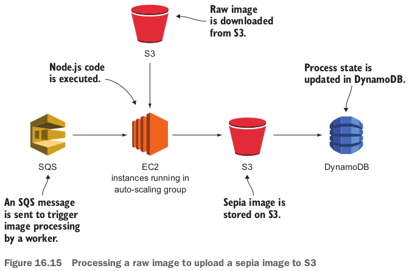
  - If the `POST /sqs` route responds with a 2XX HTTP status code, Elastic Beanstalk considered the message delivery successful and deletes the message from the queue.
    - Otherwise, the message is redelivered.

### 16.3.4 Deploying the application

- CloudFormation templateの中身：the S3 bucket for raw and processed images; the DynamoDB table `imagery-image`; the SQS queue and dead-letter queue; IAM roles for the server and worker EC2 instances; Elastic Beanstalk applications for the server and worker.

- 疑問：cliでcreate-stackコマンドによく`--capabilities`を使っていて、consoleでどこにこのパラメータを設定するかは分からない。失敗したら、もう一度cliでやりましょう。。。失敗した。cliでやった：

  ```bash
  sen@sen-XPS-8930:~/work/aws-in-action/code2/chapter16$ aws cloudformation create-stack --stack-name imagery --template-url https://s3.amazonaws.com/awsinaction-code2/chapter16/template.yaml --capabilities CAPABILITY_IAM
  {
      "StackId": "arn:aws:cloudformation:us-east-1:719326062820:stack/imagery/4c2aa250-3196-11eb-89f1-123e22873efd"
  }
  ```

  - やっぱり失敗した。諦める。Elastic Beanstalkのところ失敗した。

- templateのDeploying S3, DynamoDB, SQSのところ：

  ```yaml
  Resources:
    Bucket: # S3 bucket for uploaded and processed images, with web hosting enabled.
      Type: 'AWS::S3::Bucket'
      Properties:
        BucketName: !Sub 'imagery-${AWS::AccountId}' # the bucket name contains the account ID to make the name unique.
        WebsiteConfiguration:
          ErrorDocument: error.html
          IndexDocument: index.html
    Table: # DynamoDB table containing the image processes.
      Type: 'AWS::DynamoDB::Table'
      Properties:
        AttributeDefinitions:
        - AttributeName: id # the id attribute is used as the partition key.
          AttributeType: S
        KeySchema:
        - AttributeName: id
          KeyType: HASH
        ProvisionedThroughput:
          ReadCapacityUnits: 1
          WriteCapacityUnits: 1
        TableName: 'imagery-image'
    SQSDLQueue: # SQS queue that receives messages that can't be processed.
      Type: 'AWS::SQS::Queue'
      Properties:
        QueueName: 'message-dlq'
    SQSQueue:
      Type: 'AWS::SQS::Queue'
      Properties:
        QueueName: message
        RedrivePolicy: # If a message is received more than 10 times, it's moved to the dead-letter queue. よく分かっていない。下に説明してある。
          deadLetterTargetArn: !Sub '${SQSDLQueue.Arn}'
          maxReceiveCount: 10
  ```

  - **Dead-letter queue** (DLQ): If a single SQS message can't be processed, the message becomes visible again on the queue for other workers. This is called a retry.
    - **But if for some reason every retry fails (maybe you have a bug in your code), the message will reside in the queue forever and may waste a lot of resources because of all the retries**.
    - To avoid this, you can configure a dead-letter queue. **If a message is retried more than a specific number of times, it's removed from the original queue and forwarded to the DLQ**.
    - **The difference is that no worker listens for messages on the DLQ**.
    - **But you should create a CloudWatch alarm that triggers if the DLQ contains more than zero messages**, because you need to investigate this problem manually by looking at the message in the DLQ.

- IAM roles for server and worker EC2 instances:

  ```yaml
    WorkerRole:
      Type: 'AWS::IAM::Role'
      Properties:
        ...
        Policies:
        - PolicyName: sqs
          PolicyDocument:
            Version: '2012-10-17'
            Statement:
            - Effect: Allow
              Action:
              - 'sqs:ChangeMessageVisibility'
              - 'sqs:DeleteMessage'
              - 'sqs:ReceiveMessage'
              Resource: !Sub '${SQSQueue.Arn}'
        - PolicyName: cloudwatch
          PolicyDocument:
            Version: '2012-10-17'
            Statement:
            - Effect: Allow
              Action:
              - 'cloudwatch:PutMetricData'
              Resource: '*'
        - PolicyName: 's3-elasticbeanstalk'
          PolicyDocument:
            Version: '2012-10-17'
            Statement:
            - Effect: Allow
              Action:
              - 's3:Get*'
              - 's3:List*'
              - 's3:PutObject'
              Resource:
              - !Sub 'arn:aws:s3:::elasticbeanstalk-*-${AWS::AccountId}/*'
              - !Sub 'arn:aws:s3:::elasticbeanstalk-*-${AWS::AccountId}-*/*'
        - PolicyName: 's3-image'
          PolicyDocument:
            Version: '2012-10-17'
            Statement:
            - Effect: Allow
              Action:
              - 's3:GetObject'
              - 's3:PutObject'
              - 's3:PutObjectAcl'
              Resource: !Sub 'arn:aws:s3:::${Bucket}/*'
        - PolicyName: dynamodb
          PolicyDocument:
            Version: '2012-10-17'
            Statement:
            - Effect: Allow
              Action:
              - 'dynamodb:GetItem'
              - 'dynamodb:UpdateItem'
              Resource: !Sub 'arn:aws:dynamodb:${AWS::Region}:${AWS::AccountId}:table/${Table}'
    ServerRole:
      Type: 'AWS::IAM::Role'
      Properties:
        ...
        Policies:
        - PolicyName: sqs
          PolicyDocument:
            Version: '2012-10-17'
            Statement:
            - Effect: Allow
              Action: 'sqs:SendMessage'
              Resource: !Sub '${SQSQueue.Arn}'
        - PolicyName: cloudwatch
          PolicyDocument:
            Version: '2012-10-17'
            Statement:
            - Effect: Allow
              Action: 'cloudwatch:PutMetricData'
              Resource: '*'
        - PolicyName: 's3-elasticbeanstalk'
          PolicyDocument:
            Version: '2012-10-17'
            Statement:
            - Effect: Allow
              Action:
              - 's3:Get*'
              - 's3:List*'
              - 's3:PutObject'
              Resource:
              - !Sub 'arn:aws:s3:::elasticbeanstalk-*-${AWS::AccountId}/*'
              - !Sub 'arn:aws:s3:::elasticbeanstalk-*-${AWS::AccountId}-*/*'
        - PolicyName: 's3-image'
          PolicyDocument:
            Version: '2012-10-17'
            Statement:
            - Effect: Allow
              Action: 's3:PutObject'
              Resource: !Sub 'arn:aws:s3:::${Bucket}/*'
        - PolicyName: dynamodb
          PolicyDocument:
            Version: '2012-10-17'
            Statement:
            - Effect: Allow
              Action:
              - 'dynamodb:GetItem'
              - 'dynamodb:PutItem'
              - 'dynamodb:UpdateItem'
              Resource: !Sub  'arn:aws:dynamodb:${AWS::Region}:${AWS::AccountId}:table/${Table}'
  ```

- Elastic Beanstalk applicationの部分、古いところがあるから、失敗しているはず：今後時間があればdebugする。

  ```yaml
    EBServerConfigurationTemplate:
      Type: 'AWS::ElasticBeanstalk::ConfigurationTemplate'
      Properties:
        ApplicationName: !Ref EBServerApplication
        Description: 'Imagery server: AWS in Action: chapter 16'
        SolutionStackName: '64bit Amazon Linux 2018.03 v4.14.1 running Node.js'
        OptionSettings:
        - Namespace: 'aws:autoscaling:asg'
          OptionName: 'MinSize'
          Value: '2' # minimum of 2 EC2 instances for fault-tolerance.
        - Namespace: 'aws:autoscaling:launchconfiguration'
          OptionName: 'EC2KeyName'
          Value: !Ref KeyName
        - Namespace: 'aws:autoscaling:launchconfiguration'
          OptionName: 'IamInstanceProfile'
          Value: !Ref ServerInstanceProfile
        - Namespace: 'aws:elasticbeanstalk:container:nodejs'
          OptionName: 'NodeCommand'
          Value: 'node server.js'
        - Namespace: 'aws:elasticbeanstalk:application:environment'
          OptionName: 'ImageQueue'
          Value: !Ref SQSQueue # pass the SQS queue into an environment variable.
        - Namespace: 'aws:elasticbeanstalk:application:environment'
          OptionName: 'ImageBucket'
          Value: !Ref Bucket # pass the S3 bucket into an environment variable.
        - Namespace: 'aws:elasticbeanstalk:container:nodejs:staticfiles'
          OptionName: '/public'
          Value: '/public'
    EBServerEnvironment:
      Type: 'AWS::ElasticBeanstalk::Environment'
      Properties:
        ApplicationName: !Ref EBServerApplication
        Description: 'Imagery server: AWS in Action: chapter 16'
        TemplateName: !Ref EBServerConfigurationTemplate
        VersionLabel: !Ref EBServerApplicationVersion
    EBServerApplication: # describe the server application container.
      Type: 'AWS::ElasticBeanstalk::Application'
      Properties:
        ApplicationName: 'imagery-server'
        Description: 'Imagery server: AWS in Action: chapter 16'
    EBServerApplicationVersion:
      Type: 'AWS::ElasticBeanstalk::ApplicationVersion'
      Properties:
        ApplicationName: !Ref EBServerApplication
        Description: 'Imagery server: AWS in Action: chapter 16'
        SourceBundle:
          S3Bucket: 'awsinaction-code2'
          S3Key: 'chapter16/build/server.zip' # load code from the book's S3 bucket.
  ```

  - Under the hood, Elastic Beanstalk uses an ELB to distribute the traffic to the EC2 instances that are also managed by Elastic Beanstalk.

- Elastic Beanstalk for the worker:

  ```yaml
    EBWorkerConfigurationTemplate:
      Type: 'AWS::ElasticBeanstalk::ConfigurationTemplate'
      Properties:
        ApplicationName: !Ref EBWorkerApplication
        Description: 'Imagery worker: AWS in Action: chapter 16'
        SolutionStackName: '64bit Amazon Linux 2018.03 v4.14.1 running Node.js'
        OptionSettings:
        - Namespace: 'aws:autoscaling:launchconfiguration'
          OptionName: 'EC2KeyName'
          Value: !Ref KeyName
        - Namespace: 'aws:autoscaling:launchconfiguration'
          OptionName: 'IamInstanceProfile'
          Value: !Ref WorkerInstanceProfile
        - Namespace: 'aws:elasticbeanstalk:sqsd'
          OptionName: 'WorkerQueueURL'
          Value: !Ref SQSQueue
        - Namespace: 'aws:elasticbeanstalk:sqsd'
          OptionName: 'HttpPath'
          Value: '/sqs' # configure the HTTP resource that is invoked when an SQS message is received.
        - Namespace: 'aws:elasticbeanstalk:container:nodejs'
          OptionName: 'NodeCommand'
          Value: 'node worker.js'
        - Namespace: 'aws:elasticbeanstalk:application:environment'
          OptionName: 'ImageQueue'
          Value: !Ref SQSQueue
        - Namespace: 'aws:elasticbeanstalk:application:environment'
          OptionName: 'ImageBucket'
          Value: !Ref Bucket
    EBWorkerEnvironment:
      Type: 'AWS::ElasticBeanstalk::Environment'
      Properties:
        ApplicationName: !Ref EBWorkerApplication
        Description: 'Imagery worker: AWS in Action: chapter 16'
        TemplateName: !Ref EBWorkerConfigurationTemplate
        VersionLabel: !Ref EBWorkerApplicationVersion
        Tier: # switch to the worker environment tier (push SQS messages to your app).
          Type: 'SQS/HTTP'
          Name: 'Worker'
          Version: '1.0'
    EBWorkerApplication: # describe the worker application container.
      Type: 'AWS::ElasticBeanstalk::Application'
      Properties:
        ApplicationName: 'imagery-worker'
        Description: 'Imagery worker: AWS in Action: chapter 16'
    EBWorkerApplicationVersion:
      Type: 'AWS::ElasticBeanstalk::ApplicationVersion'
      Properties:
        ApplicationName: !Ref EBWorkerApplication
        Description: 'Imagery worker: AWS in Action: chapter 16'
        SourceBundle:
          S3Bucket: 'awsinaction-code2'
          S3Key: 'chapter16/build/worker.zip'
  ```

### 復習

- Fault tolerance means expecting that failures happen, and designing your systems in such a way that they can deal with failure.
- **To create a fault-tolerant application, you can use idempotent actions to transfer from one state to the next**.
- State shouldn't reside on the EC2 instance (a stateless server) as a prerequisite for fault-tolerance.
- AWS offers fault-tolerant services and gives you all the tools you need to create fault-tolerant systems.
  - EC2 is one of the few services that isn't fault-tolerant out of the box.
- You can use multiple EC2 instances to eliminate the single point of failure.
  - Redundant EC2 instances in different availability zones, started with an auto-scaling group, are the way to make EC2 fault-tolerant.