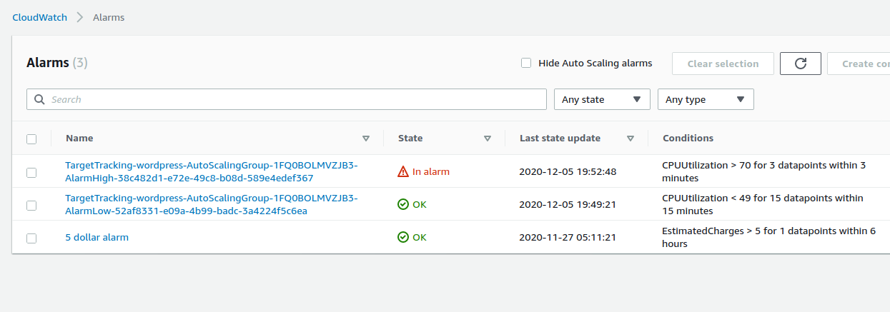

- Use a dynamic EC2 instance **pool**:
  - Change the number of virtual machines based on CPU load with the help of CloudWatch alarms.
  - Change the number of virtual machines based on a schedule, to adapt to recurring traffic patterns.
  - Use a load balancer as an **entry point** to the dynamic EC2 instance pool.
  - Use a queue to **decouple the jobs from the dynamic EC2 instance pool**.

- 前提条件：
  - **The EC2 instances you want to scale need to be stateless**.
    - You can achieve stateless servers by storing data with the help of service like RDS (SQL database), DynamoDB (NoSQL database), EFS (network filesystem), or S3 (object store) instead of storing data on disks (instance store or EBS) that are only available to a single EC2 instance.
  - EC2 instances can be **decoupled synchronously with a load balancer, or asynchronously with a queue**.

## 17.1 Managing a dynamic EC2 instance pool


- auto-scalingの構成は、auto-scaling group, launch configuration以外：scaling plans that adjust the desired number of EC2 instances in the auto-scaling group based on a plan or dynamically.
- Auto-scaling group (ASG) parametersに`DesiredCapacity`がある：the desired capacity can be changed automatically based on load or a schedule or manually.
  - また`VPCZoneIdentifier`がある：if you specify multiple subnets with the help of `VPCZoneIdentifier` for the auto-scaling group, EC2 instances will be **evenly distributed among these subnets** and thus among availability zones.
  - また`HealthCheckGracePeriod`があって、例えば`HealthCheckGracePeriod: 300`の意味は：wait 300s before terminating a new virtual machine because of a unsuccessful health check.
  - また`HealthCheckType`があって、valueが`ELB`だったら：health check of instance performed by a load balancer.

- If you need to make changes to a launch configuration, follow these steps: create a launch configuration; edit the auto-scaling group, and reference the new launch configuration; delete the old launch configuration.
  - Fortunately, CloudFormation does this for you when you make changes to a launch configuration in a template.

## 17.2 Using metrics or schedules to trigger scaling


- Scaling based on a schedule is less complex than scaling based on a CloudWatch metric, because it's difficult to find a metric to scale on reliably.
  - On the other hand, scaling based on a schedule is less precise, as you have to over-provision your infrastructure to be able to handle unpredicted spikes in load.

### 17.2.1 Scaling based on a schedule

- When operating a blogging platform, you might notice the following load patterns:

  - **One-time actions: requests to your registration page increase heavily after you run a TV advertisement in the evening**.

  - Recurring actions.

    ```yaml
      OneTimeScheduledActionUp:
        Type: 'AWS::AutoScaling::ScheduledAction'
        Properties:
          AutoScalingGroupName: !Ref AutoScalingGroup
          DesiredCapacity: 4
          StartTime: '2022-01-01T12:00:00Z'
      RecurringScheduledActionUp:
        Type: 'AWS::AutoScaling::ScheduledAction'
        Properties:
          AutoScalingGroupName: !Ref AutoScalingGroup
          DesiredCapacity: 4
          Recurrence: '0 8 * * *'
      RecurringScheduledActionDown:
        Type: 'AWS::AutoScaling::ScheduledAction'
        Properties:
          AutoScalingGroupName: !Ref AutoScalingGroup
          DesiredCapacity: 2
          Recurrence: '0 20 * * *'
    ```

    - Use 2 scheduled actions to increase the desired capacity during business hours (08:00 to 20:00 UTC) every day.

### 17.2.2 Scaling based on CloudWatch metrics

- For example, if an article published on your blogging platform is heavily shared through social media, you need to be able to react to unplanned load changes and scale the number of EC2 instances.


## 17.3 Decouple your dynamic EC2 instance pool

- If you want to use auto-scaling to grow and shrink the number of virtual machines, you need to decouple your EC2 instances from the clients, because the interface that's reachable from outside the system needs to stay the same no matter how many EC2 instances are working behind the scenes. 
- Decoupled and scalable applications require stateless servers.
  - A stateless server stores any shared data remotely in a database or storage system.

### 17.3.1 Scaling a dynamic EC2 instance pool synchronously decoupled by a load balancer(実践済み)


- Any CloudWatch metric can be used for target tracking as well.
  - There is only one requirement: adding or removing instances must affect the metric proportionally.
  - For example, **request latency is not a valid metric for target tracking**, as adjusting the number of instances does not affect the request latency directly.

- 新しいpostを作った：

  ```bash
  sen@sen-XPS-8930:~/work/aws-in-action/code2/chapter17$ aws cloudformation create-stack --stack-name wordpress --template-url https://s3.amazonaws.com/awsinaction-code2/chapter17/wordpress.yaml --parameters ParameterKey=WordpressAdminPassword,ParameterValue=asdfghjkl --capabilities CAPABILITY_IAM
  {
      "StackId": "arn:aws:cloudformation:us-east-1:719326062820:stack/wordpress/dbb804e0-36db-11eb-ba24-0a086119f71b"
  }
  ```

  

- **load test**: 

  - We're using a tool called Apache Bench to perform a load test of the WordPress setup.

  - Send 500,000 requests to the load balancer using 15 threads: 

    ```yaml
      LoadTestInstance:
        Type: 'AWS::EC2::Instance'
        DependsOn:
        - VPCGatewayAttachment
        - AutoScalingGroup
        Properties:
          ImageId: !FindInMap [RegionMap, !Ref 'AWS::Region', AMI]
          InstanceType: 't2.micro'
          KeyName: !Ref KeyName
          UserData:
            'Fn::Base64': !Sub |
              #!/bin/bash -ex
              yum install -y httpd24-tools
              ab -n 500000 -c 15 -t 600 -s 120 -r http://${LoadBalancer.DNSName}/
          Tags:
          - Key: Name
            Value: 'wordpress-loadtest'
          NetworkInterfaces:
          - AssociatePublicIpAddress: true
            DeviceIndex: '0'
            GroupSet:
            - !Ref LoadTestSecurityGroup
            SubnetId: !Ref SubnetA
    ```

- Start load test: 

  ```bash
  sen@sen-XPS-8930:~/work/aws-in-action/code2/chapter17$ aws cloudformation update-stack --stack-name wordpress --template-url https://s3.amazonaws.com/awsinaction-code2/chapter17/wordpress-loadtest.yaml --parameters ParameterKey=WordpressAdminPassword,UsePreviousValue=true --capabilities CAPABILITY_IAM
  {
      "StackId": "arn:aws:cloudformation:us-east-1:719326062820:stack/wordpress/dbb804e0-36db-11eb-ba24-0a086119f71b"
  }
  ```

  - alarmが始まる前：
  - load testのため、high alarmが始まった：
  - 2つ新しいinstanceが立ち上げられた。４つになった：
  - low alarmが始まった：
  - instanceも２つに戻った：

### 17.3.2 Scaling a dynamic EC2 instances pool asynchronously decoupled by a queue

- Offering a preview that shows the website being linked to is an important feature.

- Because requests don't need to be answered immediately, you can put requests into a queue and scale the number of EC2 instances based on the length of the queue.

  - This gives you an **accurate metric to scale**, and no requests will be lost during a load peak because they're stored in a queue. 

- A CloudWatch alarm is used to monitor the length of the SQS queue.

- この前の経験だと、この例は失敗するはず。。。できた！

- As the number of messages in the queue does not correlate with the number of EC2 instances processing messages from the queue, it is **not possible to use a target tracking policy**.

  - Therefore, use a **step scaling policy**.

    ```yaml
      HighQueueAlarm:
        Type: 'AWS::CloudWatch::Alarm'
        Properties:
          EvaluationPeriods: 1
          Statistic: Sum
          Threshold: 5
          AlarmDescription: 'Alarm if queue length is higher than 5.'
          Period: 300
          AlarmActions:
          - !Ref ScalingUpPolicy
          Namespace: 'AWS/SQS'
          Dimensions:
          - Name: QueueName
            Value: !Sub '${SQSQueue.QueueName}'
          ComparisonOperator: GreaterThanThreshold
          MetricName: ApproximateNumberOfMessagesVisible
          TreatMissingData: notBreaching
      ScalingUpPolicy:
        Type: 'AWS::AutoScaling::ScalingPolicy'
        Properties:
          AdjustmentType: 'ChangeInCapacity'
          AutoScalingGroupName: !Ref AutoScalingGroup
          PolicyType: 'StepScaling'
          MetricAggregationType: 'Average'
          EstimatedInstanceWarmup: 60
          StepAdjustments:
          - MetricIntervalLowerBound: 0
            ScalingAdjustment: 1
    ```

- load test: generate 250 messages for the URL2PNG application. `url2png-loadtest.yaml`. 現象は上記load balancerの例と同じ。
- Whenever distributing an application among multiple EC2 instances, you should use an auto-scaling group.
- You get the most out of the possibilities of the cloud when scaling the number of instances based on a schedule or a metric depending on the load pattern.

### 復習

- You can use auto-scaling to launch multiple identical virtual machines by using **a launch configuration and an auto-scaling group**.
- Virtual machines need to be stateless if you want to scale them according to your current workload.
- To distribute load among multiple virtual machines, synchronous decoupling with the help of a load balancer or asynchronous decoupling with a message queue is necessary.