## 3.1 Exploring a virtual machine

### 3.1.1 Launching a virtual machine

- `EC2 Dashboard`の`Launch instance`ボタンから。
- Step 1: Choose an Amazon Machine Image (AMI). Ubuntu Server 20.04 LTS (HVM), SSD Volume Typeを選んだ。
  - *virtual appliance*の概念、以前亀山君が用意してくれたVMWare用のUbuntu, docker imageなどだ。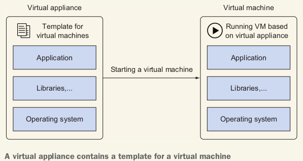
  - An AMI technically consists of a read-only filesystem including the OS, additional software, and configuration; it doesn't include the kernel of the OS.
    - The kernel is loaded from an Amazon Kernel Image (AKI).
  - AWS uses **Xen**, an open source hypervisor.
    - A *hypervisor* is responsible for isolating the guests from each other and for scheduling requests to the hardware.
- Step 2: Choose an Instance type.
  - instance type名の構成：Family Generation . Size
  - Instance StorageにEBS onlyの意味：Only network attached storage available. 意味分からないが。。

- Step 3: Configure Instance Details.
- Step 4: Add Storage.
- Step 5: Add Tags.
- Step 6: Configure Security Group.

### 3.1.2 Connecting to your virtual machine

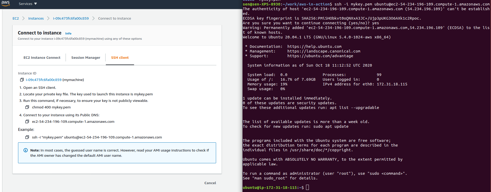

- 一番左EC2 Instance Connectにもできる、browserで：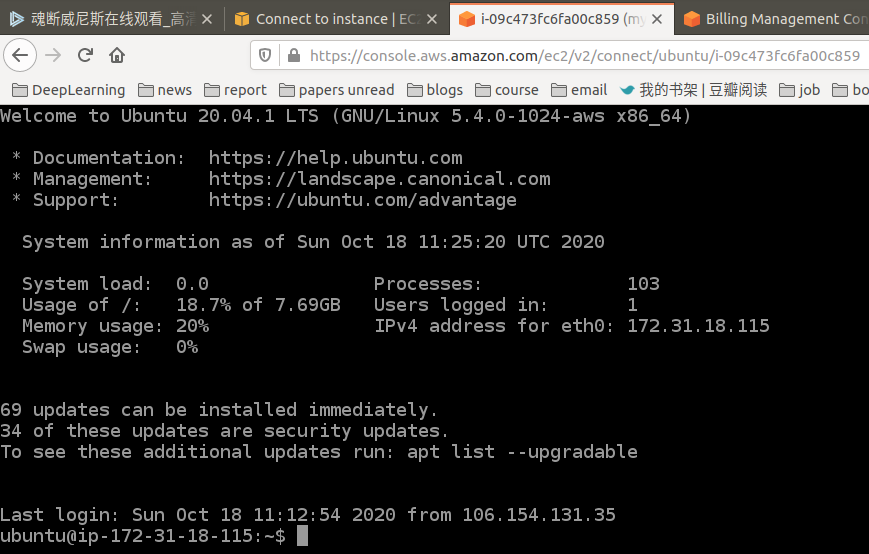

## 3.2 Monitoring and debugging a virtual machine

### 3.2.2 Monitoring the load of a virtual machine

- As AWS is looking at your VM from the outside, there is no metric indicating the memory usage.

## 3.3 Shutting down a virtual machine

- Start, Stop, Reboot, Terminate.
- A stopped virtual machine doesn't incur charges, **except for attached resources like network-attached storage**.
- terminateしたら、ssh terminalにも`packet_write_wait: Connection to 54.234.196.109 port 22: Broken pipe`エラーが出た。

## 3.4 Changing the size of a virtual machine

## 3.5 Starting a virtual machine in another data center

- EC2を起動するとき、security groupにHTTPを追加する。
- SSHでEC2にweb serverをインストールする：`sudo yum install httpd -y`, `sudo service httpd start`.
- 結果：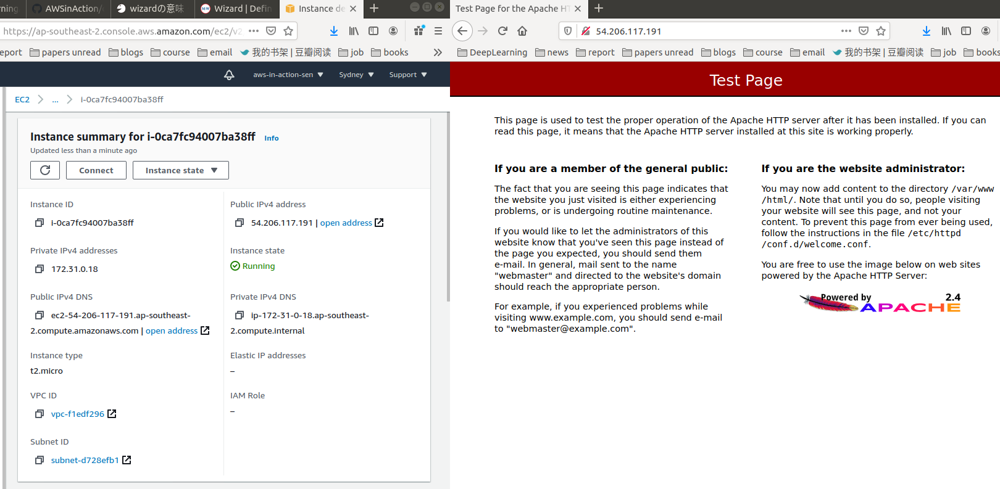

## 3.6 Allocating a public IP address

- 背景や課題：Each VM was connected to a public IP address automatically.
  - But every time you launched or stopped a VM, the public IP address changed.
- AWS offers a service called *Elastic IPs* for allocating fixed public IP addresses.

- EC2 -> Elastic IP addresses -> Allocate Elastic IP address 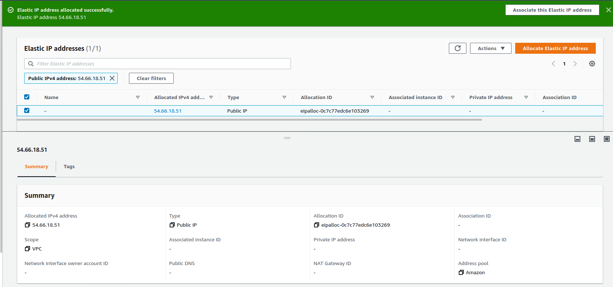
- EC2 -> Elastic IP addresses -> Associate Elastic IP address
  - InstanceやPrivate IP addressのところに１つ選択肢しかないはず、それを選ぶ。Associate.
- associateできたら、この固定IPでweb serverにアクセスできた：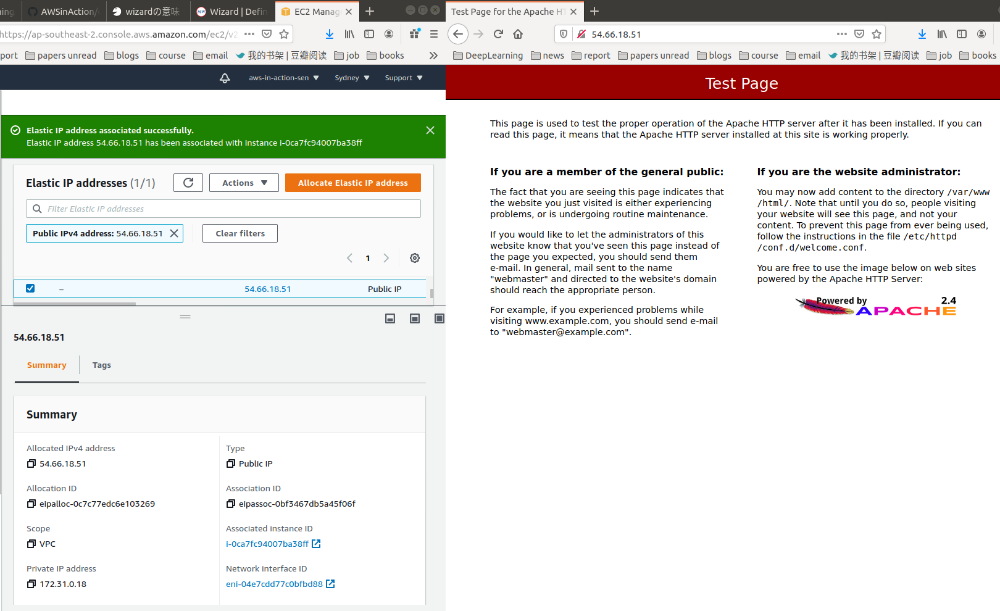

## 3.7 Adding an additional network interface to a virtual machine（大事）

- Network interfaces -> Create Network Interface 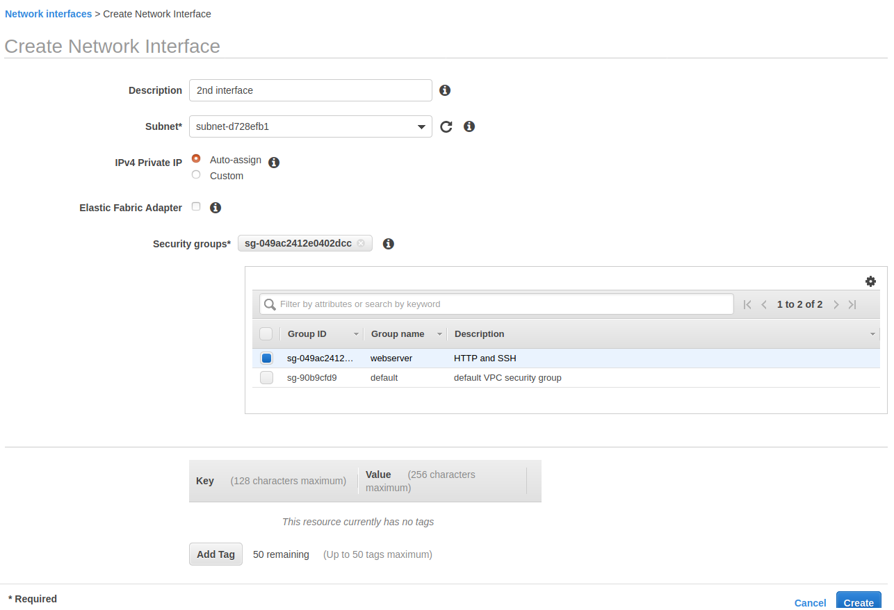
- `Attach`. 2nd interfaceのnetwork interface id: `eni-07a403d2bbb91b4f1`. 今２つnetwork interfaceは同じsubnetにつながっているけど？（事実そうです、下記の実験でも同じPCが２つpublic IPにアクセスしている）

- 新しいpublic IPをallocateして、associateするときは、resource typeにInstanceじゃなく、Network Interfaceを選ぶ。
- 今はEC2 instanceに２つnetwork interfaceがついている：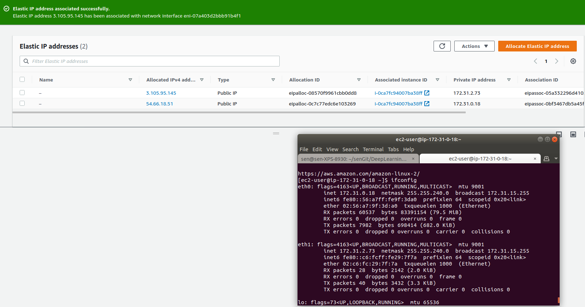
  - **Your virtual machine doesn't know anything about its public IP address**, but you can distinguish the requests based on the private IP address.

- Two websites(two html)を用意して、`/etc/httpd/conf.d`フォルダに下記の２つファイルを追加する：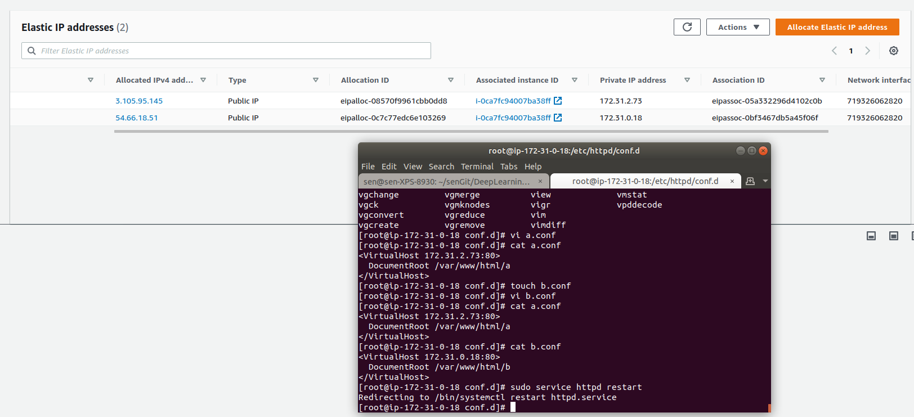
- webserverを再起動すると、２つpublic IPにアクセスすると、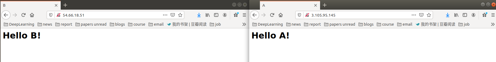

## 3.8 Optimizing costs for virtual machines

- 3種類virtual machine: 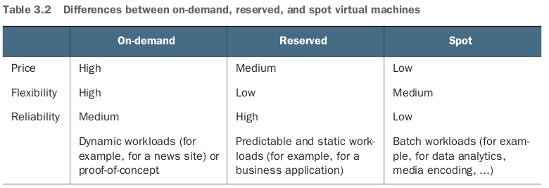
  - Spot: unused virtual machines. `Spot Requests`.