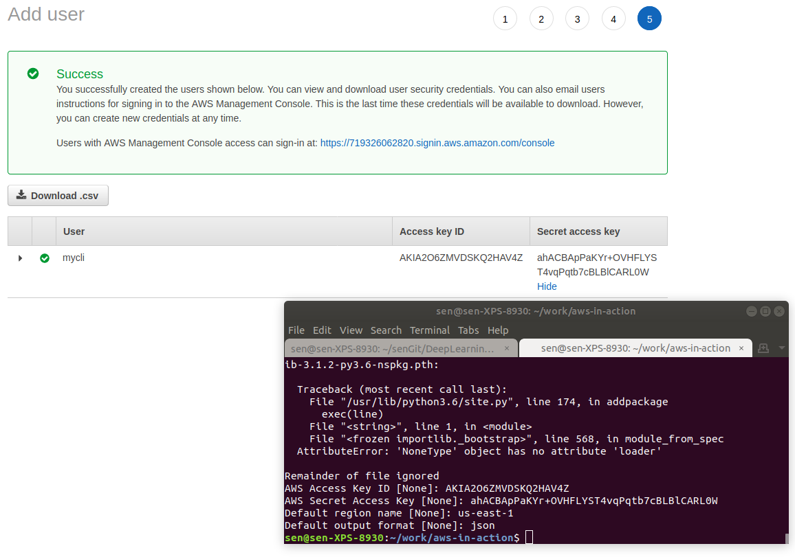
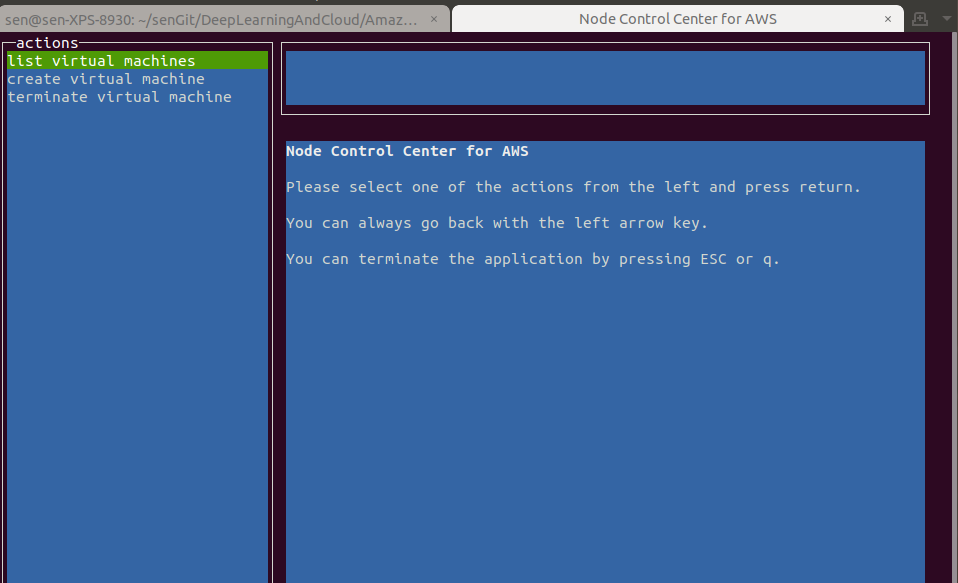
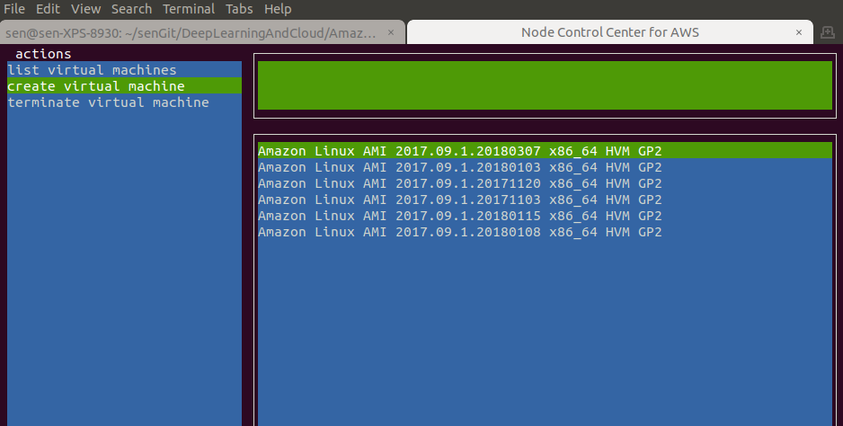
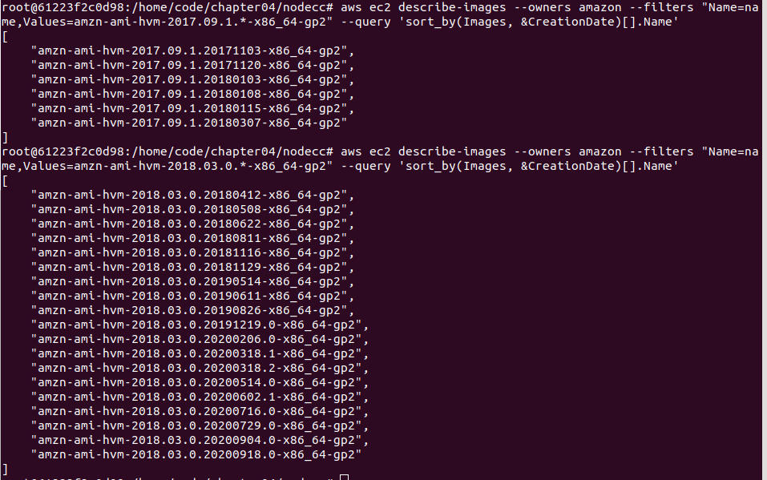
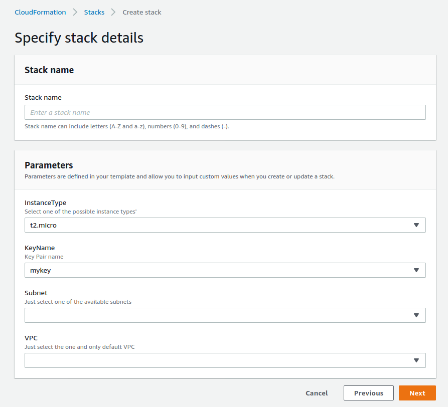
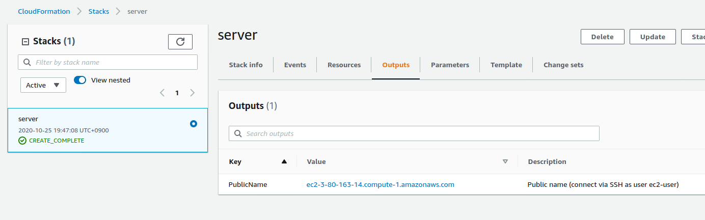
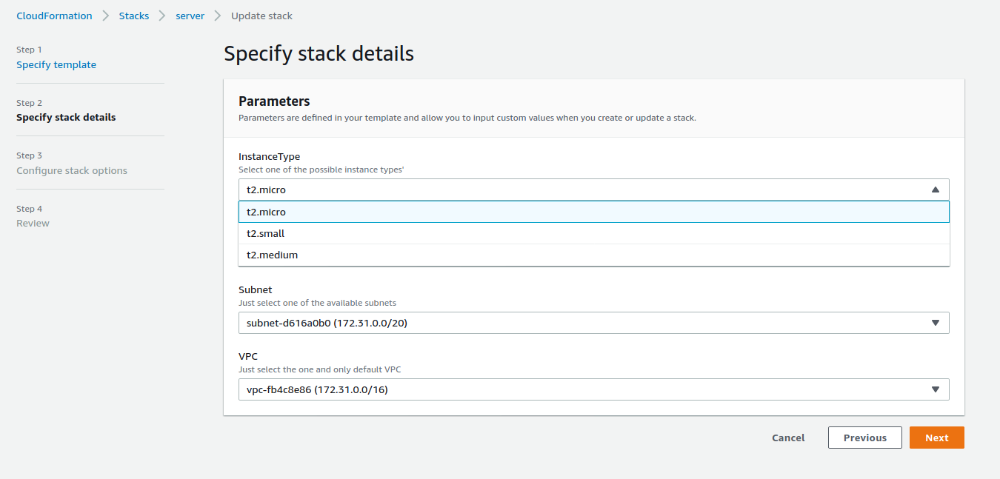

- AWS provides an API that can control every part of AWS over **HTTP**.

## 4.1 Infrastructure as Code

### 4.1.1 Automation and the DevOps movement (大事)

- **The DevOps movement aims to bring software development and operations together**.
- If you commit changes to the repository, the source code is automatically built and tested against your automated tests.
  - If the build passes the tests, it's automatically installed in your testing environment.
  - This triggers some acceptance tests.
  - After those tests have been passed, the change is propagated into production.
  - But this isn't the end of the process; now you need to carefully monitor your system and analyze the logs in real time to ensure that the change was successful.
- If your infrastructure is automated, you can **spawn a new system** for every change introduced to the code repository and run the **acceptance tests isolated** from other changes that were pushed to the repository at the same time.
  - Whenever a change is made to the code, a new system is created (virtual machine, databases, networks, and so on) to run the change in isolation.

- Infrastructure as Code: it's all about dependencies.

## 4.2 Using the command-line interface

- Written in Python.
- Unless otherwise specified, the output is by default in JSON format.

### 4.2.2 Installing the CLI

`pip install awscli`.

### 4.2.3 Configuring the CLI

- `IAM`からuserを作った。Programmatic accessにした。
- `aws configure`: 
- テスト：`aws ec2 describe-regions`.

### 4.2.4 Using the CLI

- まったくdocker CLIと一緒だそうです。`aws <service> <action> [--key value ...]`.
- docker CLIと同じだそうです。bashを書くこともできる。

## 4.3 Programming with the SDK

- Node.js is a platform for executing JavaScript in an **event-driven** environment so you can easily build network applications. `sudo apt install nodejs`.
- JavaScript is the language and Node.js is the runtime environment. ここはnode.jsを例としてあげている。

### 4.3.1 Controlling virtual machines with SDK: nodecc

- docker container内でやった：``
  - ubuntu:18.04内nodejsやnpmをinstallした。（nodeのdocker imageを使った方がいいかもけど）
  - nodeccがtextual UIなので、container内で便利に表示できる！（`npm install`, `node index.js`）
- container内`pip install awscli`, `aws configure`をやる必要がある。そうすると、`lib/listAMIs.js`はうまくいった。
- 最新imageをリストして：`aws ec2 describe-images --owners amazon --filters "Name=name,Values=amzn*" --query 'sort_by(Images, &CreationDate)[].Name'`. 
  - その中に`"amzn-ami-hvm-2018.03.0.20200918.0-x86_64-ebs","amzn-ami-hvm-2018.03.0.20200918.0-x86_64-s3","amzn-ami-hvm-2018.03.0.20200918.0-x86_64-gp2"`がある。
  - `lib/listAMIs.js`の中のValuesを2018.03.0に更新したが、何も出てこない。
- 今のcontainerをimageにcommitした。今後awsの実践用dockerとして使う！

## 4.4 Using a blueprint to start a virtual machine

- **Declarative approach**: you tell CloudFormation how your infrastructure should look. docker composeもそうだ。
  - You aren't telling CloudFormation what actions are needed to create that infrastructure, and you don't specify the sequence in which the actions need to be executed. これはまさにCLI bashやSDKの考え方だ。
  - Never try to set up complex infrastructure using scripts.
- Using CloudFormation comes at no additional charge.

### 4.4.1 Anatomy of a CloudFormation template

- 5 parts: format version, description, parameters, resources, outputs.

- １つtemplateの例のparametersの部分：

  ```yaml
  Parameters:
    KeyName:
      Description: 'Key Pair name'
      Type: 'AWS::EC2::KeyPair::KeyName'
      Default: mykey
    VPC:
      Description: 'Just select the one and only default VPC'
      Type: 'AWS::EC2::VPC::Id'
    Subnet:
      Description: 'Just select one of the available subnets'
      Type: 'AWS::EC2::Subnet::Id'
    InstanceType:
      Description: Select one of the possible instance types'
      Type: String
      Default: 't2.micro'
      AllowedValues: ['t2.micro', 't2.small', 't2.medium']
  ```

- outputsの部分：

  ```yaml
  Outputs:
    PublicName:
      Value: !GetAtt 'VM.PublicDnsName'
      Description: 'Public name (connect via SSH as user ec2-user)'
  ```

- resourcesの部分：

  ```yaml
  Resources:
    SecurityGroup:
      Type: 'AWS::EC2::SecurityGroup'
      Properties:
        GroupDescription: 'My security group'
        VpcId: !Ref VPC
        SecurityGroupIngress:
        - CidrIp: '0.0.0.0/0'
          FromPort: 22
          IpProtocol: tcp
          ToPort: 22
    VM:
      Type: 'AWS::EC2::Instance'
      Properties:
        ImageId: !FindInMap [RegionMap, !Ref 'AWS::Region', AMI]
        InstanceType: !Ref InstanceType
        KeyName: !Ref KeyName
        SecurityGroupIds: [!Ref SecurityGroup]
        SubnetId: !Ref Subnet
  ```

### 4.4.2 Creating your first template

- 以前やったようにCloudFormation->Create Stack.
- なるほど！Create Stack画面のparametersはtemplate yamlに書いた項目だ！
  - default値も表示されている。

- Stackが作られたら、outputsを見ると、確かにPublicNameが出ている！
- InstanceTypeなどのparameterを変更したい時、`Update`ボタンを押して、またParametersが出る画面にInstanceTypeを変えれば良い！
- updateはまったくdocker composeと一緒だ。