- 内容：Deploy common web apps with AWS Elastic Beanstalk; Deploy multilayer apps with AWS OpsWorks.

- Deployment: install, update, and configure the application and its dependencies.
- Deploying applications manually is no longer recommended in a flexible cloud environment.

## 5.1 Deploying applications in a flexible cloud environment

- manual deployment vs. automated deployment: 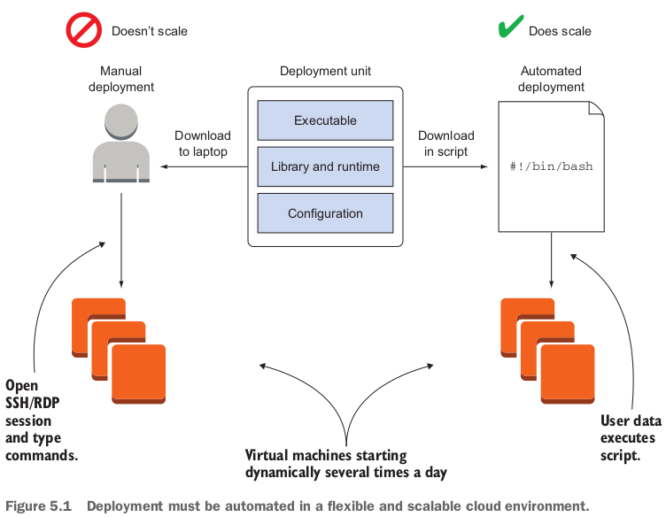

## 5.2 Comparing deployment tools

### 5.2.1 Classifying the deployment tools

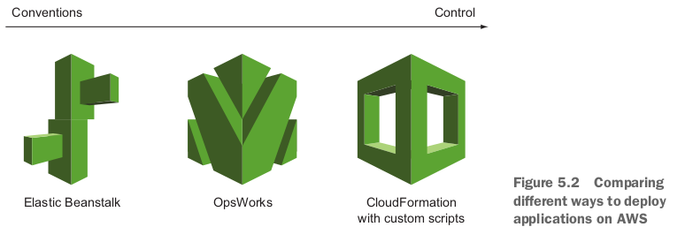

- The effort required to deploy an application using AWS Elastic Beanstalk is low.
  - To benefit from this, your application has to fit into the conventions of AWS Elastic Beanstalk.
  - For example, the application must run in one of the standardized runtime environments.

- We recommend that you use AWS CloudFormation with user data to deploy applications, because it's a flexible approach.

## 5.3 Creating a virtual machine and run a deployment script on startup with AWS CloudFormation

### 5.3.1 Using `user data` to run a script on startup

- dockerのentrypointと同じでしょう。

### 5.3.2 Deploying OpenSwan: a VPN server to a virtual machine

- If you're working over public Wi-Fi, for example using a laptop at a coffee house, you may want to tunnel your traffic through a VPN because unencrypted communication (such as HTTP instead of HTTPS) can be intercepted by an attacker. 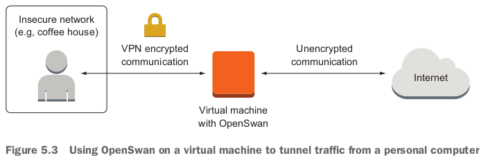

- bash script:

  ```bash
  #!/bin/bash -ex
  
  VpcId="$(aws ec2 describe-vpcs --filter "Name=isDefault, Values=true" --query "Vpcs[0].VpcId" --output text)"
  SubnetId="$(aws ec2 describe-subnets --filters "Name=vpc-id,Values=$VpcId" --query "Subnets[0].SubnetId" --output text)"
  SharedSecret="$(openssl rand -base64 30)"
  Password="$(openssl rand -base64 30)"
  
  aws cloudformation create-stack --stack-name vpn --template-url https://s3.amazonaws.com/awsinaction-code2/chapter05/vpn-cloudformation.yaml --parameters ParameterKey=KeyName,ParameterValue=mykey "ParameterKey=VPC,ParameterValue=$VpcId" "ParameterKey=Subnet,ParameterValue=$SubnetId" "ParameterKey=IPSecSharedSecret,ParameterValue=$SharedSecret" ParameterKey=VPNUser,ParameterValue=vpn "ParameterKey=VPNPassword,ParameterValue=$Password"
  
  aws cloudformation wait stack-create-complete --stack-name vpn
  
  aws cloudformation describe-stacks --stack-name vpn --query "Stacks[0].Outputs"
  ```

- 実行結果：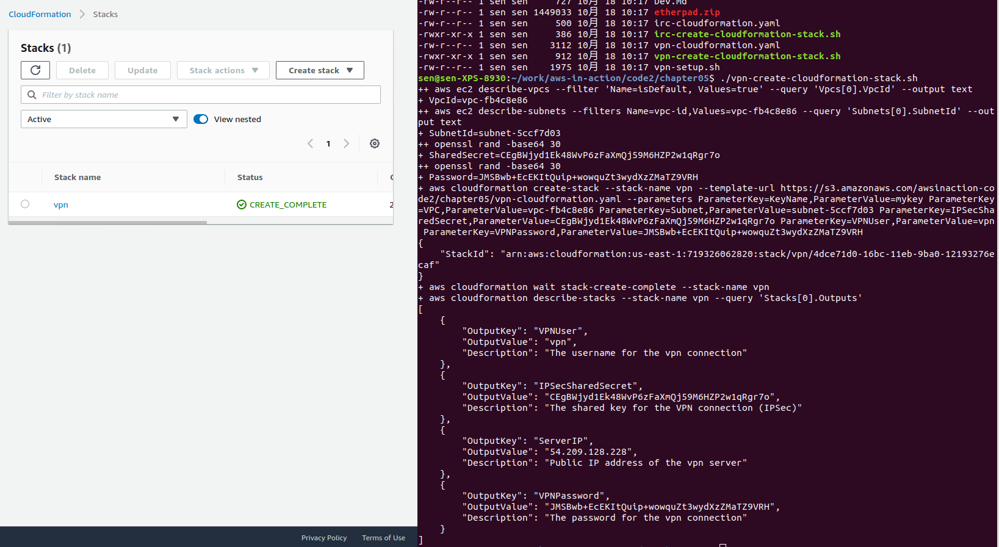
  - `openssl rand -based64 30`でSharedSecretやPasswordを生成している。

- この例で使われたtemplate yamlのResourcesのEC2Instanceに`user data`を使っている：

  ```yaml
  Resources:
    EC2Instance:
      Type: 'AWS::EC2::Instance'
      Properties:
        InstanceType: 't2.micro'
        SecurityGroupIds:
        - !Ref InstanceSecurityGroup
        KeyName: !Ref KeyName
        ImageId: !FindInMap [RegionMap, !Ref 'AWS::Region', AMI]
        SubnetId: !Ref Subnet
        UserData:
          'Fn::Base64': !Sub |
            #!/bin/bash -x
            export IPSEC_PSK="${IPSecSharedSecret}"
            export VPN_USER="${VPNUser}"
            export VPN_PASSWORD="${VPNPassword}"
            curl -s https://raw.githubusercontent.com/AWSinAction/code2/master/chapter05/vpn-setup.sh | bash -ex
            /opt/aws/bin/cfn-signal -e $? --stack ${AWS::StackName} --resource EC2Instance --region ${AWS::Region}
      CreationPolicy:
        ResourceSignal:
          Timeout: PT10M
  ```

- `user data`に実行されたbash scriptは実際のOpenSwanのインストールやconfigurationをやっている。
- vpn stackを削除：`aws cloudformation delete-stack --stack-name vpn`.

### 5.3.3 Starting from scratch instead of updating

- stackのupdateをやっていたが、softwareのinstallやconfigurationまで完全自動化できているので、updateしたいとき、新しいのを作って、OKだったら、古いのを削除する。

## 5.4 Deploying a simple web application with AWS Elastic Beanstalk

### 5.4.1 Components of AWS Elastic Beanstalk

- AWS Elastic Beanstalk applicationの構成：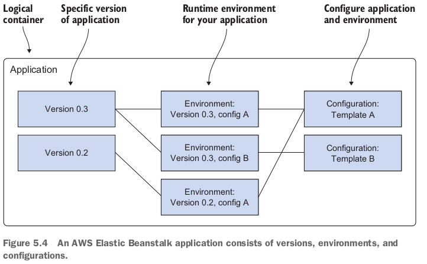
  - An application is a **logical container**.
    - If you start to use AWS Elastic Beanstalk in a region, you have to create an application first.
  - To create a new version, you have to upload your executables (packed into an archive) to Amazon S3, which stores static files.
    - A version is basically a pointer to this archive of executables.
  - You can run multiple environments for one application by using different combinations of versions and configurations.

### 5.4.2 Using AWS Elastic Beanstalk to deploy Etherpad, a Node.js application

- Etherpad is an open source online editor that lets you edit a document with many people in real time.

- 本の通りにやってこの例は失敗した。environmentを立ち上げられてなかった。(CLIで)
- でもIn our experience, the Management Console is the best way to manage AWS Elastic Beanstalk. なので、上記の失敗はとりあえずいい。AWS Management Consoleでできたら、それでもいい。

## 5.5 Deploying a multilayer application with AWS OpsWorks Stacks

- OpsWorks Stacks, OpsWorks for Chef Automate, OpsWorks for Puppet Enterprise.

### 5.5.1 Components of AWS OpsWorks Stacks

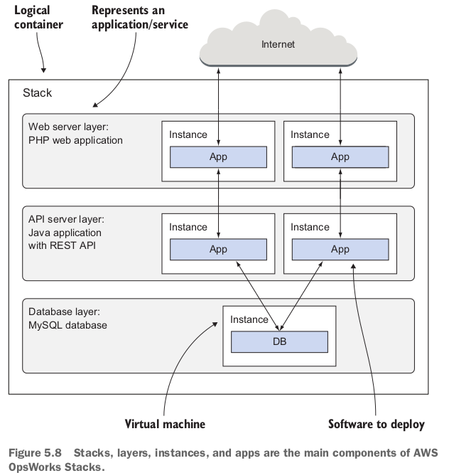

- AWS OpsWorks Stacks offers predefined layers for standard web applications like PHP and Java, but you're free to use a custom stack for any application you can think of.
- You can launch one or multiple instances for each layer.

### 5.5.2 Using AWS OpsWorks Stacks to deploy an IRC chat application

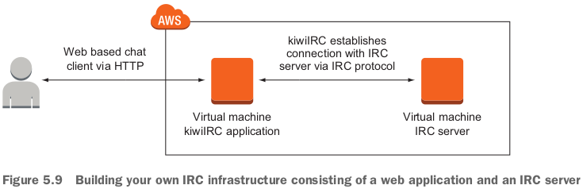

- Step 1: create a new OpsWorks Stack (ircと言う名前). 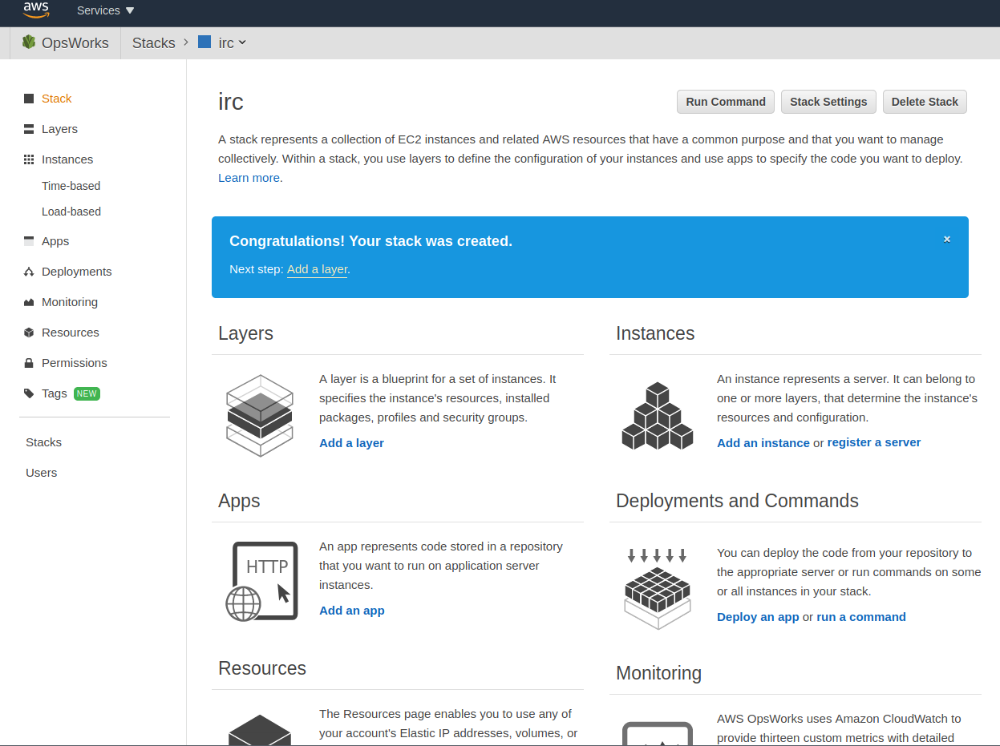

- Step 2: Create a Node.js layer (kiwiIRC is a Node.js application) for the OpsWorks Stack. 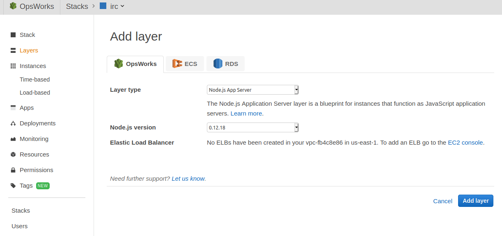

- Step 3: create a custom layer (IRC server is not a typical web application): 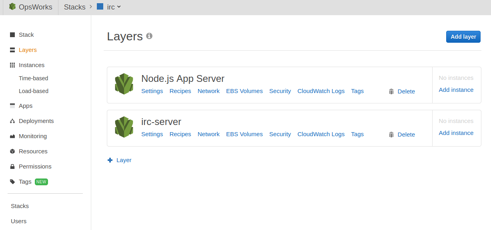

  - The IRC server needs to be reachable through port 6667. To allow access to this port, you need to define a custom firewall. (Security Groupを作ることらしい)

  - CloudFormationでSecurity Groupを作る。そのyamlは：

    ```yaml
    ---
    AWSTemplateFormatVersion: '2010-09-09'
    Description: 'AWS in Action: chapter 5 (firewall for IRC server)'
    Parameters:
      VPC:
        Description: 'Just select the one and only default VPC.'
        Type: 'AWS::EC2::VPC::Id'
    Resources:
      SecurityGroup:
        Type: 'AWS::EC2::SecurityGroup'
        Properties:
          GroupDescription: 'Enables access to IRC server'
          VpcId: !Ref VPC
          SecurityGroupIngress:
          - IpProtocol: tcp
            FromPort: 6667
            ToPort: 6667
            CidrIp: '0.0.0.0/0'
    ```

  - 下記のコマンドで上記のSecurity Groupを作る：

    ```bash
    #!/bin/bash -ex
    
    VpcId="$(aws ec2 describe-vpcs --filter "Name=isDefault, Values=true" --query "Vpcs[0].VpcId" --output text)"
    aws cloudformation create-stack --stack-name irc --template-url https://s3.amazonaws.com/awsinaction-code2/chapter05/irc-cloudformation.yaml --parameters "ParameterKey=VPC,ParameterValue=$VpcId"
    ```

  - **attach this custom firewall configuration to the custom OpsWorks layer**. 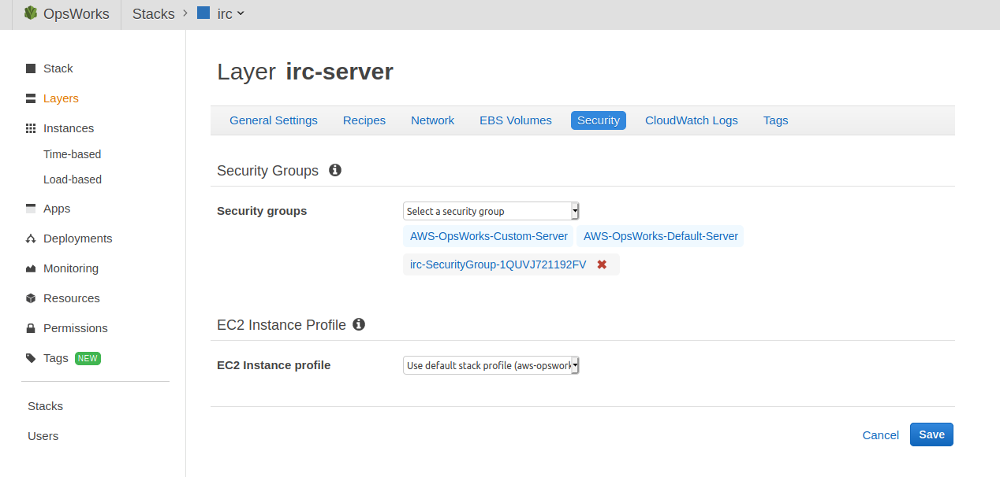
  - the layer recipes for deploying an IRC server (IRC server implementation `ircd-ircu`を追加). 

- Step 4: Add an app to the node.js layer. 

  - **Application Sourceはgit repository**を設定：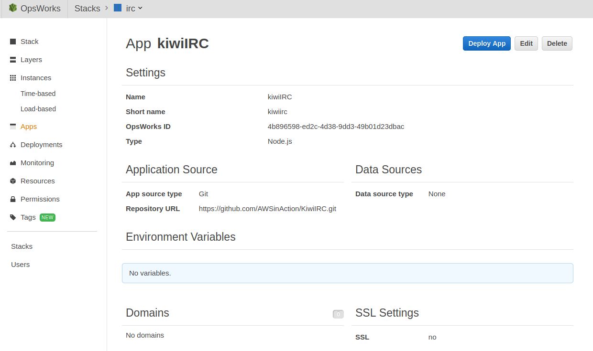

- Step 5: add instances to run the IRC client and server. (２つinstanceが必要)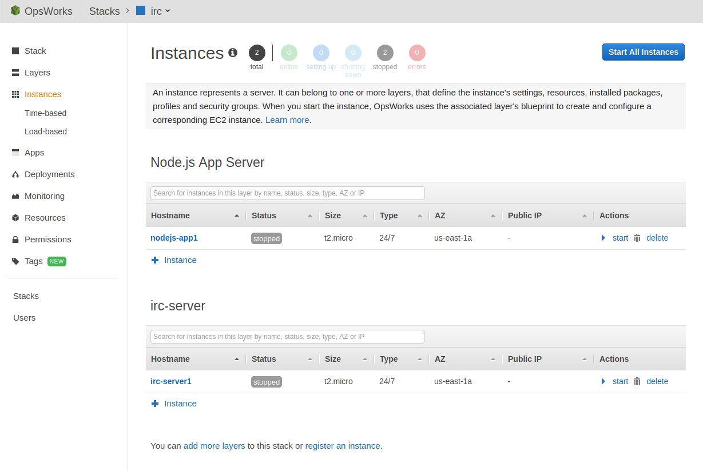

  - 起動中：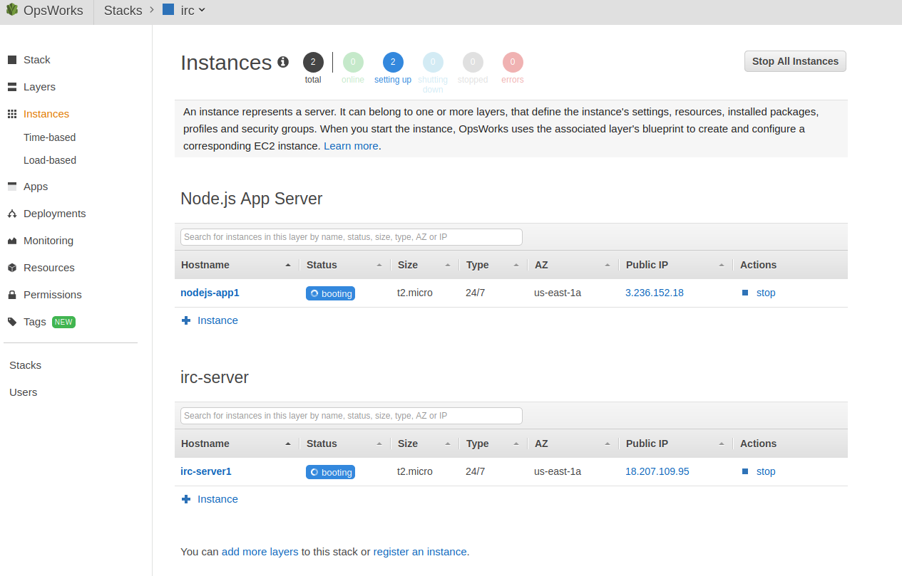
  - 起動完了：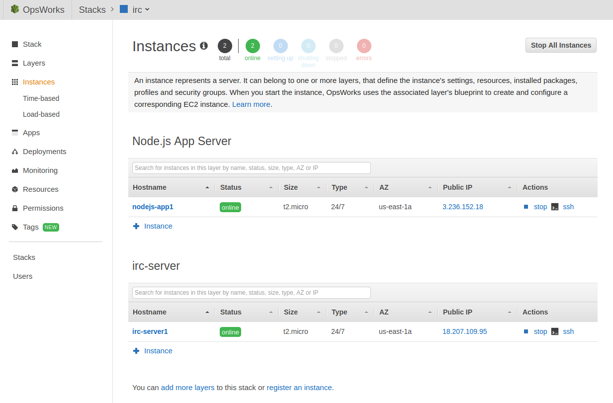
  - nodejs-app1のpublic IPをclickすると、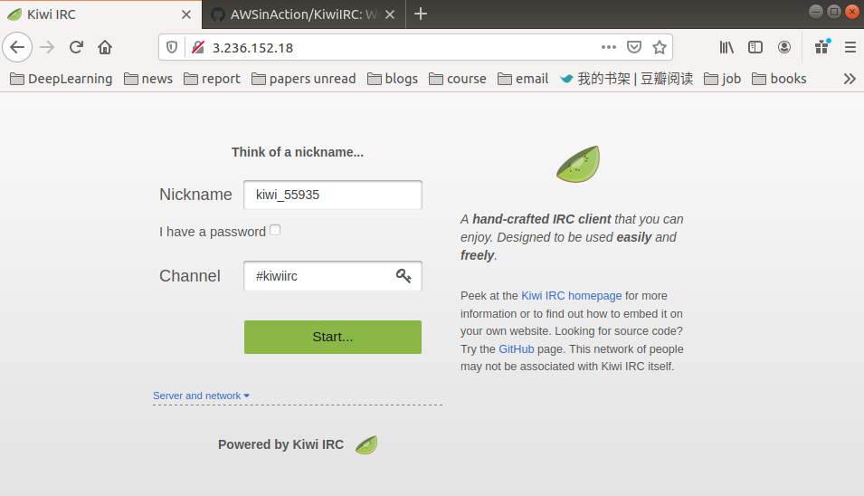
  - Server and networkのところにirc-server1のpublic ipを入力：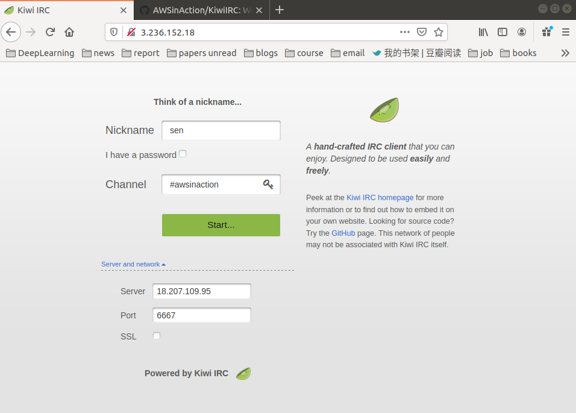
  - Startすると：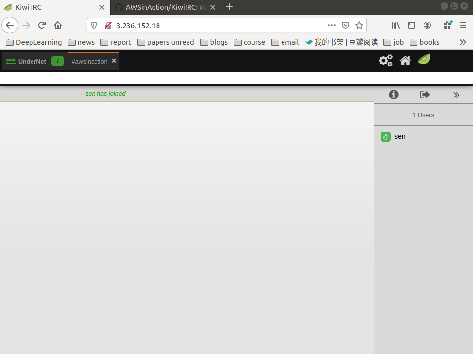

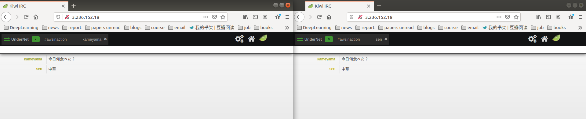

- 右のユーザーが離れると、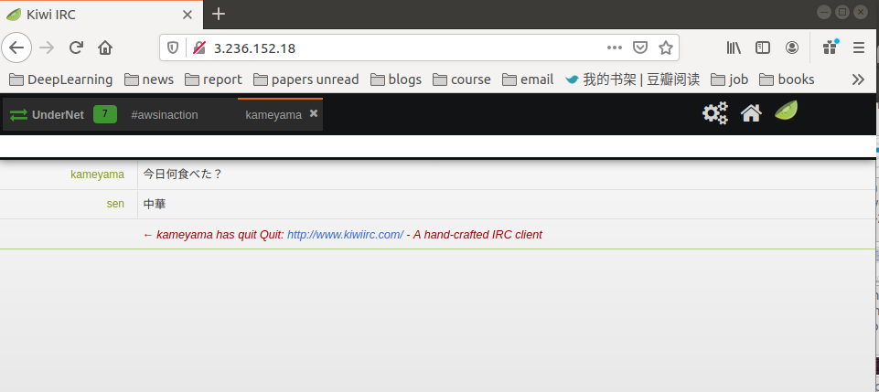

### 復習

- Injecting Bash or PowerShell scripts into a virtual machine during startup allows you to initialize virtual machines individually - for example for installing software or configuring services.
- AWS OpsWorks is good for deploying multilayer applications with the help of Chef.
- AWS Elastic Beanstalk is best suited for deploying **common web applications**.
- AWS CloudFormation gives you the most control when you're deploying more complex applications.