- Security要素：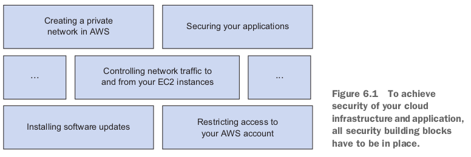

  - *Controlling network traffic to and from your EC2 instances*: 
    - If you run a web server, the only ports you need to open to the outside world are port 80 for HTTP traffic and 443 for HTTPS traffic. Close down all the other ports.

  - *Securing your applications*: 
    - For example, you need to check user input and allow only the necessary characters, don't save passwords in plain text, and use TLS/SSL to encrypt traffic **between your virtual machines and your users**.
    - If you are installing applications with a package manager for your operating system, using Amazon Inspector allows you to run automated security assessments.

## 6.1 Who's responsible for security?

- Your responsibility:
  - Implement **access management** that restricts access to AWS resources like S3 and EC2 to a minimum, using AWS **IAM**.
  - **Encrypt** network traffic to prevent attackers from reading or manipulating data (for example, using HTTPS).
  - Configure a **firewall** for your virtual network that controls **incoming and outgoing traffic** with **security groups and ACLs**.

## 6.2 Keeping your software up to date

### 6.2.3 Installing security updates on running virtual machines

```bash
#!/bin/bash -ex

PUBLICIPADDRESSESS="$(aws ec2 describe-instances --filters "Name=instance-state-name,Values=running" --query "Reservations[].Instances[].PublicIpAddress" --output text)"

for PUBLICIPADDRESS in $PUBLICIPADDRESSESS; do
  ssh -t "ec2-user@$PUBLICIPADDRESS" "sudo yum -y --security update"
done
```

- しかし、using SSH to install security updates on all your virtual machines is challenging.
  - You need to have a network connection as well as a key for each virtual machine.
  - だからAWS System Managerを利用するのがいいかも。

## 6.3 Securing your AWS account

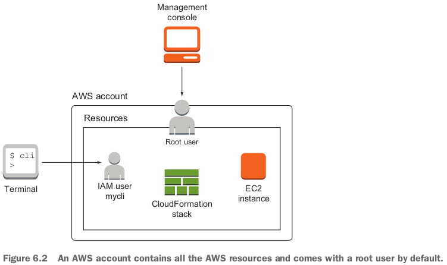

### 6.3.1 Securing your AWS account's root user

- After **MFA (multi-factor authentication**) is activated, a password and a temporary token are needed to log in as the root user.
- 多要素認証。passwordや毎回携帯に送ってくるtemporary tokenでlogin.

### 6.3.2 AWS Identity and Access Management (IAM)

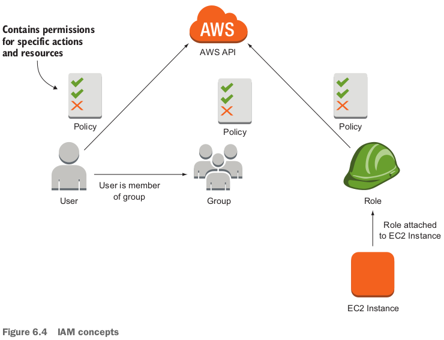

- An IAM role is used to authenticate AWS resources.

### 6.3.3 Defining permissions with an IAM policy

- If you have multiple statements that apply to the same action, `Deny` overrides `Allow`.
- Resources in AWS have an Amazon Resource Name (ARN). 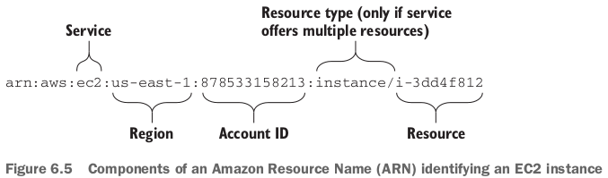
- With CloudFormation, it's easy to maintain inline policies; that's why we use inline policies most of the time in this book.

### 6.3.4 Users for authentication, and groups to organize users

- When you log in to the Management Console, you're authenticating with your user name and password.
  - When you use the CLI from your computer, you use access keys to authenticate as the `mycli` user.

- 今はIAMにCLI用の`mycli` Userしかない。Create groups and users with the CLI:

  ```bash
  aws iam create-group --group-name "admin"
  aws iam attach-group-policy --group-name "admin"
  aws iam attach-group-policy --group-name "admin" --policy-arn "arn:aws:iam::aws:policy/AdministratorAccess"
  aws iam create-user --user-name "myuser"
  aws iam add-user-to-group --group-name "admin" --user-name "myuser"
  aws iam create-login-profile --user-name "myuser" --password "sdjdfhff"
  ```

  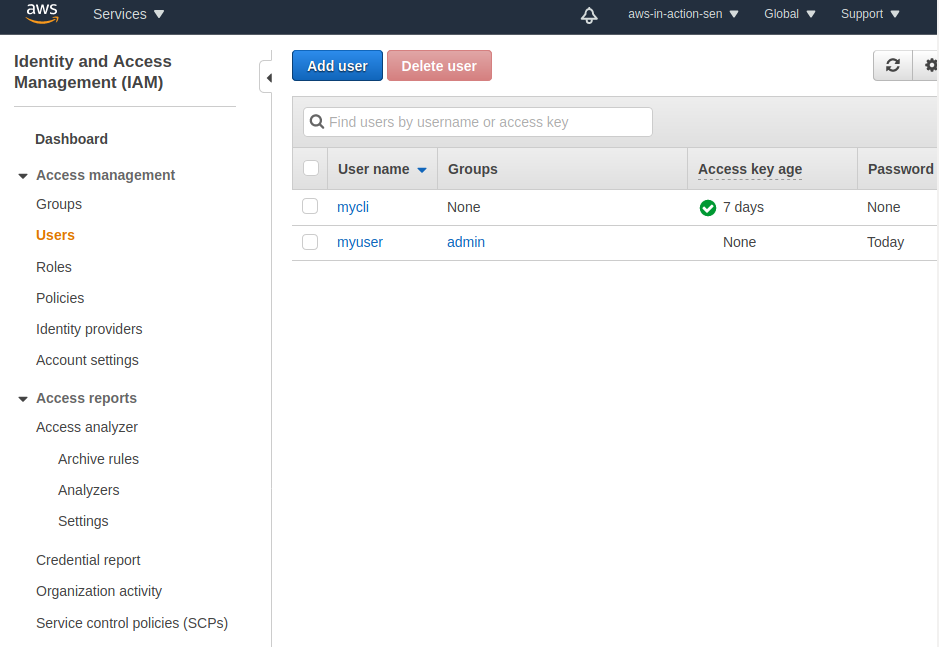

  - これは例えばGitlabのアカウント、redmineのアカウントを作ることと同じだ。

- 上記作ったアカウントにログインするとき：`https://$accountId.sig-
  nin.aws.amazon.com/console`というURLから。`$accountId`は`aws iam get-user --query "User.Arn" --output text`から取れる。このログイン画面は：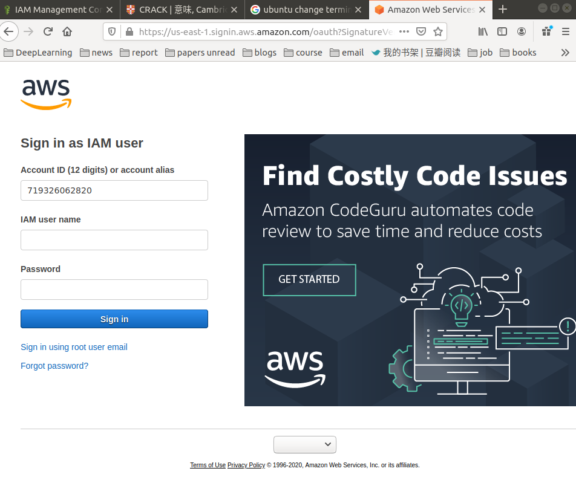
- ログインできた！右上のユーザー名を見て！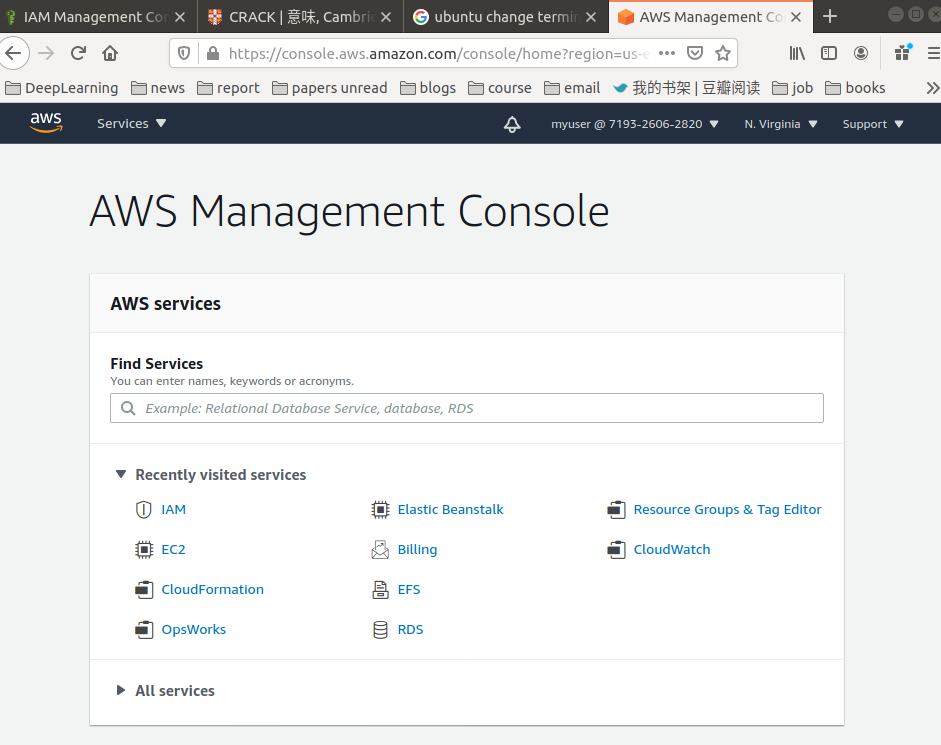
- **Enable MFA for IAM users**: `myuser`->`Security credentials`タグにAssigned MFA deviceがある。
- これからroot userでログインすることをやめた。これからずっと`myuser`でログインしていく。
  - Stop using the root user from now on. Always use `myuser` and the new link to the Management Console.

### 6.3.5 Authenticating AWS resources with roles

- 理由：To be able to access the AWS API, an EC2 instance needs to authenticate itself.
  - **You could create an IAM user with access keys and store the access keys on an EC2 instance for authentication. But doing so is a hassle, especially if you want to rotate the access keys regularly**.
- **Instead of using an IAM user for authentication, you should use an IAM role whenever you need to authenticate AWS resources like EC2 instances**.
  - When using an IAM role, your **access keys are injected into your EC2 instance automatically**.

- By default, no role is attached to an EC2 instance and therefore the EC2 instance is not allowed to make any calls to the AWS API.

- シーン：例えばEC2が自分をterminateする機能。The EC2 instance needs permission to stop itself.

- CloudFormationでRoleを定義して、InstanceProfileを定義して（Roleを参照）、最後にInstanceを定義する（InstanceProfileを参照）：template fileはここ：https://github.com/AWSinAction/code2/blob/master/chapter06/ec2-iamrole.yaml

  ```yaml
  Resources:
    SecurityGroup:
      Type: 'AWS::EC2::SecurityGroup'
      Properties:
        GroupDescription: 'My security group'
        VpcId: !Ref VPC
        SecurityGroupIngress:
        - CidrIp: '0.0.0.0/0'
          FromPort: 22
          IpProtocol: tcp
          ToPort: 22
        Tags:
        - Key: Name
          Value: 'AWS in Action: chapter 6 (IAM role)'
    InstanceProfile:
      Type: 'AWS::IAM::InstanceProfile'
      Properties:
        Roles:
        - !Ref Role
    Role:
      Type: 'AWS::IAM::Role'
      Properties:
        AssumeRolePolicyDocument:
          Version: '2012-10-17'
          Statement:
          - Effect: Allow
            Principal:
              Service:
              - 'ec2.amazonaws.com'
            Action:
            - 'sts:AssumeRole'
        Policies:
        - PolicyName: ec2
          PolicyDocument:
            Version: '2012-10-17'
            Statement:
            - Sid: Stmt1425388787000
              Effect: Allow
              Action:
              - 'ec2:StopInstances'
              Resource:
              - '*'
              Condition:
                StringEquals:
                  'ec2:ResourceTag/aws:cloudformation:stack-id': !Ref 'AWS::StackId'
    Instance:
      Type: 'AWS::EC2::Instance'
      Properties:
        IamInstanceProfile: !Ref InstanceProfile
        ImageId: !FindInMap [RegionMap, !Ref 'AWS::Region', AMI]
        InstanceType: 't2.micro'
        KeyName: !Ref KeyName
        SecurityGroupIds:
        - !Ref SecurityGroup
        SubnetId: !Ref Subnet
        UserData:
          'Fn::Base64': !Sub |
            #!/bin/bash -x
            INSTANCEID="$(curl -s http://169.254.169.254/latest/meta-data/instance-id)"
            echo "aws ec2 stop-instances --instance-ids $INSTANCEID --region ${AWS::Region}" | at now + ${Lifetime} minutes
        Tags:
        - Key: Name
          Value: 'AWS in Action: chapter 6 (IAM role)'
  ```

## 6.4 Controlling network traffic to and from your virtual machine

- You can also prevent yourself from human failure, for example you prevent accidentally sending email to customers from a test system by not opening outgoing SMTP connections for test systems.
- FirewallがSSH requestをチェックする例：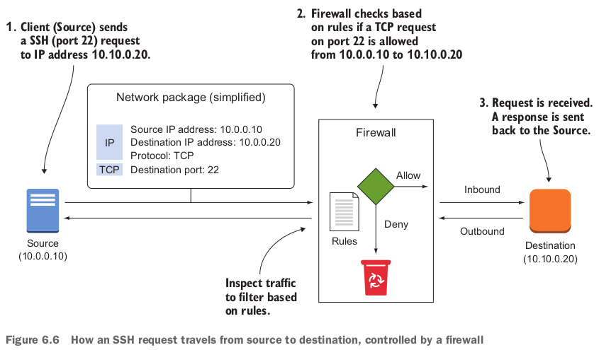
- By default, a security group does not allow any inbound traffic.
  - A security group contains a rule allowing all outbound traffic by default.

- Debug or monitor network traffic: VFC Flow Logsを使おう。

### 6.4.1 Controlling traffic to virtual machines with security groups

### 6.4.2 Allowing ICMP traffic

```yaml
Resources:
  SecurityGroup:
    Type: 'AWS::EC2::SecurityGroup'
    Properties:
      GroupDescription: 'Learn how to protect your EC2 Instance.'
      VpcId: !Ref VPC
      Tags:
      - Key: Name
        Value: 'AWS in Action: chapter 6 (firewall)'
      # allowing inbound ICMP traffic
      SecurityGroupIngress:
      - IpProtocol: icmp
        FromPort: -1
        ToPort: -1
        CidrIp: '0.0.0.0/0'
```

- ICMP does not use ports. -1 means every port.

### 6.4.3 Allowing SSH traffic

```yaml
Resources:
  SecurityGroup:
    Type: 'AWS::EC2::SecurityGroup'
    Properties:
      GroupDescription: 'Learn how to protect your EC2 Instance.'
      VpcId: !Ref VPC
      Tags:
      - Key: Name
        Value: 'AWS in Action: chapter 6 (firewall)'
      # allowing inbound ICMP traffic
      SecurityGroupIngress:
      - IpProtocol: icmp
        FromPort: -1
        ToPort: -1
        CidrIp: '0.0.0.0/0'
      # allowing inbound SSH traffic
      - IpProtocol: tcp
        FromPort: 22
        ToPort: 22
        CidrIp: '0.0.0.0/0'
```

- The firewall only controls the network layer; it doesn't replace key-based or password-based authentication.

### 6.4.4 Allowing SSH traffic from a source IP address

- 背景知識：Only my internet gateway (the box that connects to the internet) has a public IP address, and all requests are redirected by the gateway.
  - Your local network doesn't know about this public IP address.
  - My laptop and iPad only know that the internet gateway is reachable under 192.168.0.1 on the private network.
  - To find your public IP address, visit http://api.ipify.org/
  - **For most of us, our public IP address changes from time to time, usually when you reconnect to the internet**. 

- **Hard-coding the public IP address into the template isn't a good solution because your public IP address changes from time to time**.

- やり方：ParametersにIpForSSHというparameterを追加して、CloudFormationを作るとき、自分のpublic IPを入力する。

  ```yaml
  Parameters:
    IpForSSH:
      Description: 'Your public IP address to allow SSH access'
      Type: String
      AllowedPattern: '^[0-9]{1,3}\.[0-9]{1,3}\.[0-9]{1,3}\.[0-9]{1,3}$'
      ConstraintDescription: 'Enter a valid IPv4 address'
  ...
  Resources:
    SecurityGroup:
      Type: 'AWS::EC2::SecurityGroup'
      Properties:
        GroupDescription: 'Learn how to protect your EC2 Instance.'
        VpcId: !Ref VPC
        Tags:
        - Key: Name
          Value: 'AWS in Action: chapter 6 (firewall)'
        # allowing inbound ICMP traffic
        SecurityGroupIngress:
        - IpProtocol: icmp
          FromPort: -1
          ToPort: -1
          CidrIp: '0.0.0.0/0'
        # allowing inbound SSH traffic
        - IpProtocol: tcp
          FromPort: 22
          ToPort: 22
          CidrIp: !Sub '${IpForSSH}/32'
  ```

### 6.4.5 Allowing SSH traffic from a source security group

- 理由：Because of the elastic (弾性) nature of the cloud, you'll likely deal with a dynamic number of virtual machines, so rules based on source IP addresses are difficult to maintain.
  - This becomes easy if your rules are based on source security groups.

- **bastion host** (or jump box) for SSH access.
  - Only one virtual machine (**does nothing but SSH**), the bastion(要塞) host, can be accessed via SSH from the internet.
  - All other virtual machines can only be reached via SSH from the bastion host.
  - If one of your virtual machines that's running a web server, mail server, FTP server, and so on is hacked, the attacker can't jump from that machine to all the other machines. 既に内部にいても他の内部のマシンに攻撃できない。
- bastion hostを実現するために：
  - Allow SSH access to the bastion host from 0.0.0.0/0 or a specific source address. (多分0.0.0.0/0でも、インターネットからのみだ、内部は含まれない)
  - Allow SSH access to all other virtual machines **only if the traffic source is the bastion host**.

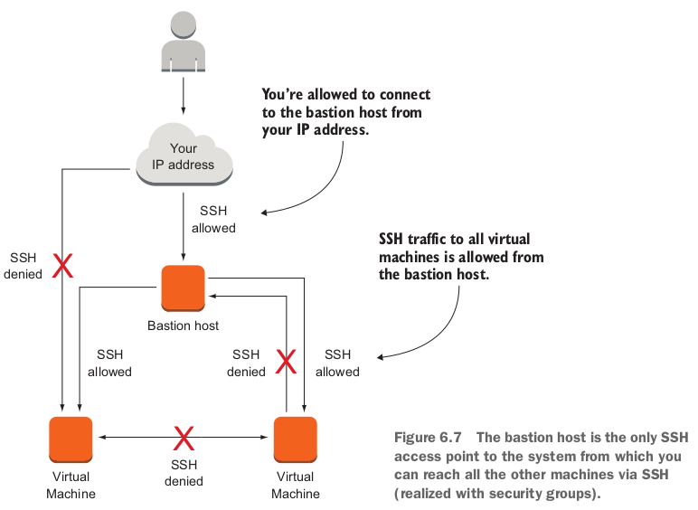

- A security group allowing incoming SSH traffic from anywhere needs to be attached to the bastion host.
- All other VMs are attached to a security group allowing SSH traffic only if the source is the bastion host's security group.

```yaml
Resources:
  SecurityGroupBastionHost:
    Type: 'AWS::EC2::SecurityGroup'
    Properties:
      GroupDescription: 'Allowing incoming SSH and ICPM from anywhere.'
      VpcId: !Ref VPC
      SecurityGroupIngress:
      - IpProtocol: icmp
        FromPort: -1
        ToPort: -1
        CidrIp: '0.0.0.0/0'
      - IpProtocol: tcp
        FromPort: 22
        ToPort: 22
        CidrIp: !Sub '${IpForSSH}/32'
      Tags:
      - Key: Name
        Value: 'Bastion Host'
  SecurityGroupInstance:
    Type: 'AWS::EC2::SecurityGroup'
    Properties:
      GroupDescription: 'Allowing incoming SSH from the Bastion Host.'
      VpcId: !Ref VPC
      SecurityGroupIngress:
      - IpProtocol: tcp
        FromPort: 22
        ToPort: 22
        SourceSecurityGroupId: !Ref SecurityGroupBastionHost
      Tags:
      - Key: Name
        Value: 'Instance'
  BastionHost:
    Type: 'AWS::EC2::Instance'
    Properties:
      ImageId: !FindInMap [RegionMap, !Ref 'AWS::Region', AMI]
      InstanceType: 't2.micro'
      KeyName: !Ref KeyName
      SecurityGroupIds:
      - !Ref SecurityGroupBastionHost
      SubnetId: !Ref Subnet
      Tags:
      - Key: Name
        Value: 'Bastion Host'
  Instance1:
    Type: 'AWS::EC2::Instance'
    Properties:
      ImageId: !FindInMap [RegionMap, !Ref 'AWS::Region', AMI]
      InstanceType: 't2.micro'
      KeyName: !Ref KeyName
      SecurityGroupIds:
      - !Ref SecurityGroupInstance
      SubnetId: !Ref Subnet
      Tags:
      - Key: Name
        Value: 'Instance 1'
  Instance2:
    Type: 'AWS::EC2::Instance'
    Properties:
      ImageId: !FindInMap [RegionMap, !Ref 'AWS::Region', AMI]
      InstanceType: 't2.micro'
      KeyName: !Ref KeyName
      SecurityGroupIds:
      - !Ref SecurityGroupInstance
      SubnetId: !Ref Subnet
      Tags:
      - Key: Name
        Value: 'Instance 2'
```

- 上記のstackを立ち上げたら、３つinstanceがOutputsに表示されている：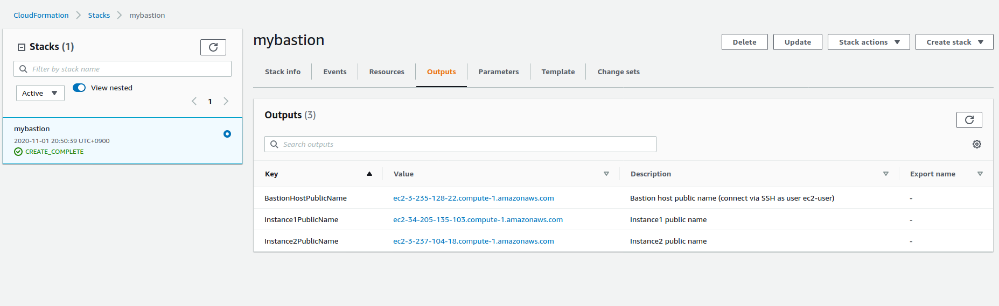
- Instance 1にアクセスするために、まずBastion Hostにssh, またそこからInstance 1にsshできるようになった：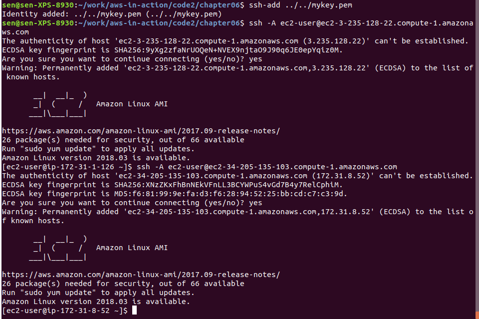
  - The `-A` option is important for enabling `AgentForwarding`; **agent forwarding lets you authenticate with the same key you used to log in to the bastion host for further SSH logins initiated from the bastion host**.

- We use the bastion-host pattern frequently to protect our clients' infrastructure.

- **Using agent forwarding is a security risk**.
  - A more secure alternative is **using the bastion host as a proxy**. 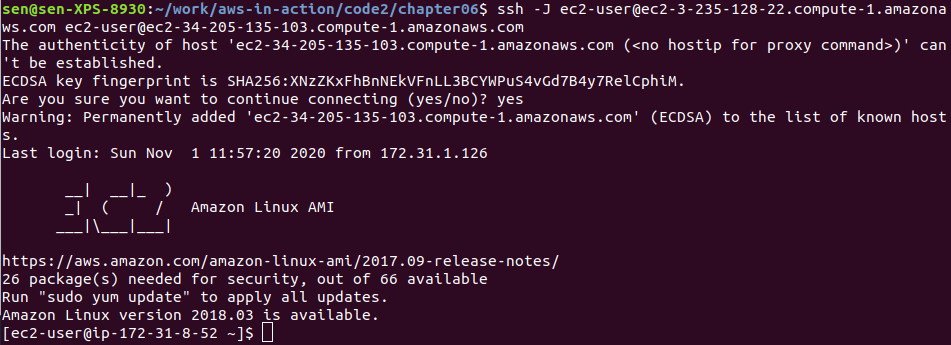

## 6.5 Creating a private network in the cloud: Amazon Virtual Private Cloud (VPC)

- You should have at least two subnets: public and private.
  - Your load balancer or web servers should be in the public subnet, and your database should reside in the private subnet.
- タスク：
  - A public subnet that contains only the bastion host server.
  - A private subnet for your web servers and one public subnet for your **proxy servers**.
- **Network ACLs restrict traffic that goes from one subnet to another**, acting as a firewall.
  - That's **an additional layer of security on top of security groups**.
- ACLs for SSH bastion host:
  - SSH from 0.0.0.0/0 to **10.0.1.0/24 (public SSH bastion host subnet)** is allowed.
  - SSH from 10.0.1.0/24 to **10.0.2.0/24 (public Varnish proxy subnet)** is allowed.
  - SSH from 10.0.1.0/24 to **10.0.3.0/24 (private Apache web server subnet)** is allowed.
- Allow traffic to the Varnish proxy and the Apache web servers:
  - **HTTP from 0.0.0.0/0 to 10.0.2.0/24 is allowed**.
  - HTTP from 10.0.2.0/24 to 10.0.3.0/24 is allowed.

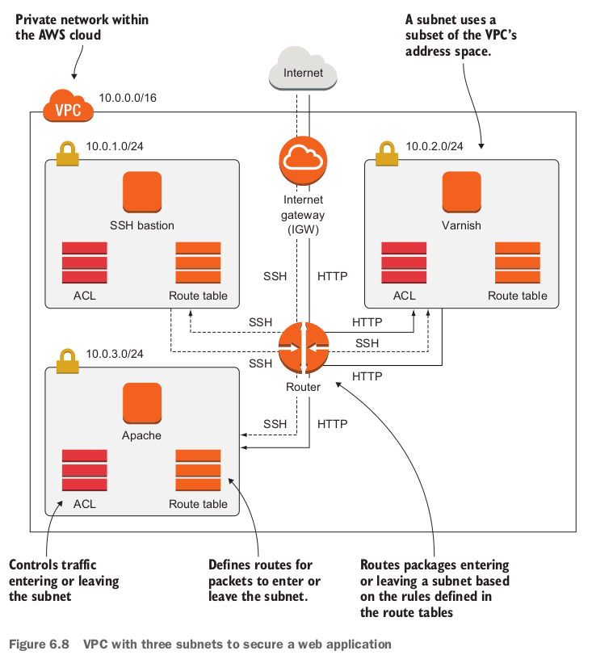

### 6.5.1 Creating the VPC and an internet gateway (IGW)

- The IGW will translate the public IP addresses of your virtual machines to their private IP addresses using network address translation (NAT).

  ```yaml
    VPC:
      Type: 'AWS::EC2::VPC'
      Properties:
        CidrBlock: '10.0.0.0/16'
        EnableDnsHostnames: true
        Tags:
        - Key: Name
          Value: 'AWS in Action: chapter 6 (VPC)'
    InternetGateway:
      Type: 'AWS::EC2::InternetGateway'
      Properties: {}
    VPCGatewayAttachment:
      Type: 'AWS::EC2::VPCGatewayAttachment'
      Properties:
        VpcId: !Ref VPC
        InternetGatewayId: !Ref InternetGateway
  ```

  - ３つsubnetは全部10.0.0.0/16に含まれている。
  - **An IGW is needed to enable traffic to and from the internet**.
  - **Attach the internet gateway to the VPC**.

### 6.5.2 Defining the public bastion host subnet

```yaml
  SubnetPublicBastionHost:
    Type: 'AWS::EC2::Subnet'
    Properties:
      AvailabilityZone: !Select [0, !GetAZs '']
      CidrBlock: '10.0.1.0/24'
      VpcId: !Ref VPC
      Tags:
      - Key: Name
        Value: 'Public Bastion Host'
  RouteTablePublicBastionHost:
    Type: 'AWS::EC2::RouteTable'
    Properties:
      VpcId: !Ref VPC
  RouteTableAssociationPublicBastionHost:
    Type: 'AWS::EC2::SubnetRouteTableAssociation'
    Properties:
      SubnetId: !Ref SubnetPublicBastionHost
      RouteTableId: !Ref RouteTablePublicBastionHost
  RoutePublicBastionHostToInternet:
    Type: 'AWS::EC2::Route'
    Properties:
      RouteTableId: !Ref RouteTablePublicBastionHost
      DestinationCidrBlock: '0.0.0.0/0'
      GatewayId: !Ref InternetGateway
    DependsOn: VPCGatewayAttachment
  NetworkAclPublicBastionHost:
    Type: 'AWS::EC2::NetworkAcl'
    Properties:
      VpcId: !Ref VPC
  SubnetNetworkAclAssociationPublicBastionHost:
    Type: 'AWS::EC2::SubnetNetworkAclAssociation'
    Properties:
      SubnetId: !Ref SubnetPublicBastionHost
      NetworkAclId: !Ref NetworkAclPublicBastionHost
```

- Typeから関係性を理解しやすい。例えばRouteはRouteTableの項目。

- ACLの定義は下記：

  ```yaml
    NetworkAclEntryInPublicBastionHostSSH:
      Type: 'AWS::EC2::NetworkAclEntry'
      Properties:
        NetworkAclId: !Ref NetworkAclPublicBastionHost
        RuleNumber: 100
        Protocol: 6
        PortRange:
          From: 22
          To: 22
        RuleAction: 'allow'
        Egress: false
        CidrBlock: '0.0.0.0/0'
    NetworkAclEntryInPublicBastionHostEphemeralPorts:
      Type: 'AWS::EC2::NetworkAclEntry'
      Properties:
        NetworkAclId: !Ref NetworkAclPublicBastionHost
        RuleNumber: 200
        Protocol: 6
        PortRange:
          From: 1024
          To: 65535
        RuleAction: 'allow'
        Egress: false
        CidrBlock: '10.0.0.0/16'
    NetworkAclEntryOutPublicBastionHostSSH:
      Type: 'AWS::EC2::NetworkAclEntry'
      Properties:
        NetworkAclId: !Ref NetworkAclPublicBastionHost
        RuleNumber: 100
        Protocol: 6
        PortRange:
          From: 22
          To: 22
        RuleAction: 'allow'
        Egress: true
        CidrBlock: '10.0.0.0/16'
    NetworkAclEntryOutPublicBastionHostEphemeralPorts:
      Type: 'AWS::EC2::NetworkAclEntry'
      Properties:
        NetworkAclId: !Ref NetworkAclPublicBastionHost
        RuleNumber: 200
        Protocol: 6
        PortRange:
          From: 1024
          To: 65535
        RuleAction: 'allow'
        Egress: true
        CidrBlock: '0.0.0.0/0'
  ```

  - NetworkAclIdが、どのACLのエントリーになっているかを示している。
  - Egressがfalseの場合はinbound.
  - 3番めエントリーはallows outbound SSH to VPC. つまりbastion subnetからのsshはVPC全域に届ける！
  - Ephemeral(一時的な) ports used for short-lived TCP/IP connections.
    - If you open inbound port 22 on an ACL for your subnet, you still may not be able to connect via SSH.
    - In addition, you need to allow outbound ephemeral ports, because **sshd (SSH daemon) accepts connections on port 22 but uses an ephemeral port for communication with the client**.
    - Ephemeral ports are selected from the range starting at 1024 and ending at 65535.
    - 同じく、If you want to make a SSH connection from within your subnet, you have to open outbound port 22 and inbound ephemeral ports as well.

- There's an important difference between security groups and ACLs: **security groups are stateful, but ACLs aren't**.
  - 上記の一時的なportを開くことは、security groupなら要らない。
- また、ACL rulesにはRuleNumberでruleの優先度を決める。
- We do recommend to start with using security groups to control traffic.
  - If you want to add an extra layer of security, you should use ACL on top.

### 6.5.3 Adding the private Apache web server subnet

```yaml
  SubnetPrivateApacheWebserver:
    Type: 'AWS::EC2::Subnet'
    Properties:
      AvailabilityZone: !Select [0, !GetAZs '']
      CidrBlock: '10.0.3.0/24'
      VpcId: !Ref VPC
      Tags:
      - Key: Name
        Value: 'Private Apache Webserver'
  RouteTablePrivateApacheWebserver:
    Type: 'AWS::EC2::RouteTable'
    Properties:
      VpcId: !Ref VPC
  RouteTableAssociationPrivateApacheWebserver:
    Type: 'AWS::EC2::SubnetRouteTableAssociation'
    Properties:
      SubnetId: !Ref SubnetPrivateApacheWebserver
      RouteTableId: !Ref RouteTablePrivateApacheWebserver
```

- private subnetだから、**No route to the IGW** (**the only difference between a public and a private subnet**). 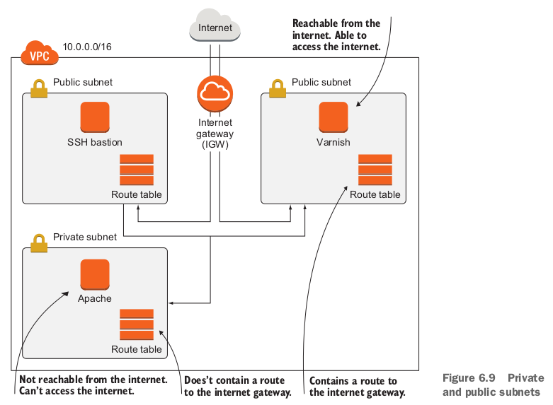
- **Traffic between subnets of a VPC is always routed by default**.
  - You can't remove the routes between subnets.
  - If you want to prevent traffic between subnets in a VPC, you need to use ACLs attached to the subnets.

### 6.5.4 Launching virtual machines in the subnets

- BastionHost:

  ```yaml
    BastionHost:
      Type: AWS::EC2::Instance
      Properties:
        ImageId: !FindInMap [RegionMap, !Ref 'AWS::Region', AMI]
        InstanceType: 't2.micro'
        KeyName: !Ref KeyName
        NetworkInterfaces:
        - AssociatePublicIpAddress: true
          DeleteOnTermination: true
          SubnetId: !Ref SubnetPublicBastionHost
          DeviceIndex: '0'
          GroupSet:
          - !Ref SecurityGroup
        Tags:
        - Key: Name
          Value: 'Bastion Host'
      DependsOn: VPCGatewayAttachment
  ```

  - public subnetだから、**Assigns a public IP address**.（AssociatePublicIpAddress）
  - This security group allows everything.
  - Launch in the bastion host subnet.

- ApacheWebserver:

  ```yaml
    ApacheWebserver:
      Type: 'AWS::EC2::Instance'
      Properties:
        ImageId: !FindInMap [RegionMap, !Ref 'AWS::Region', AMI]
        InstanceType: 't2.micro'
        KeyName: !Ref KeyName
        NetworkInterfaces:
        - AssociatePublicIpAddress: false
          DeleteOnTermination: true
          SubnetId: !Ref SubnetPrivateApacheWebserver
          DeviceIndex: '0'
          GroupSet:
          - !Ref SecurityGroup
        UserData:
          'Fn::Base64': !Sub |
            #!/bin/bash -x
            bash -ex << "TRY"
              yum -y install httpd
              service httpd start
            TRY
            /opt/aws/bin/cfn-signal -e $? --stack ${AWS::StackName} --resource ApacheWebserver --region ${AWS::Region}
        Tags:
        - Key: Name
          Value: 'Apache Webserver'
      CreationPolicy:
        ResourceSignal:
          Timeout: PT10M
      DependsOn: RoutePrivateApacheWebserverToInternet
  ```

  - No public IP address.
  - Install Apache from the internet. (**installing Apache won't work because your private subnet has no route to the internet**次section解決)

### 6.5.5 Accessing the internet from private subnets via a NAT gateway (大事)

- **Use a NAT gateway in a public subnet, and create a route from your private subnet to the NAT gateway**.

  - This way, you can reach the internet from private subnets, but the internet can't reach your private subnets.

- **To keep concerns separated**, you'll **create a subnet for the NAT gateway**.

  ```yaml
    SubnetPublicNAT:
      Type: 'AWS::EC2::Subnet'
      Properties:
        AvailabilityZone: !Select [0, !GetAZs '']
        CidrBlock: '10.0.0.0/24'
        VpcId: !Ref VPC
        Tags:
        - Key: Name
          Value: 'Public NAT'
    RouteTablePublicNAT:
      Type: 'AWS::EC2::RouteTable'
      Properties:
        VpcId: !Ref VPC
    RouteTableAssociationPublicNAT:
      Type: 'AWS::EC2::SubnetRouteTableAssociation'
      Properties:
        SubnetId: !Ref SubnetPublicNAT
        RouteTableId: !Ref RouteTablePublicNAT
    RoutePublicNATToInternet:
      Type: 'AWS::EC2::Route'
      Properties:
        RouteTableId: !Ref RouteTablePublicNAT
        DestinationCidrBlock: '0.0.0.0/0'
        GatewayId: !Ref InternetGateway
      DependsOn: VPCGatewayAttachment
    NetworkAclPublicNAT:
      Type: 'AWS::EC2::NetworkAcl'
      Properties:
        VpcId: !Ref VPC
    SubnetNetworkAclAssociationPublicNAT:
      Type: 'AWS::EC2::SubnetNetworkAclAssociation'
      Properties:
        SubnetId: !Ref SubnetPublicNAT
        NetworkAclId: !Ref NetworkAclPublicNAT
    NetworkAclEntryInPublicNATHTTP:
      Type: 'AWS::EC2::NetworkAclEntry'
      Properties:
        NetworkAclId: !Ref NetworkAclPublicNAT
        RuleNumber: 100
        Protocol: 6
        PortRange:
          From: 80
          To: 80
        RuleAction: 'allow'
        Egress: false
        CidrBlock: '10.0.0.0/16'
    NetworkAclEntryInPublicNATHTTPS:
      Type: 'AWS::EC2::NetworkAclEntry'
      Properties:
        NetworkAclId: !Ref NetworkAclPublicNAT
        RuleNumber: 110
        Protocol: 6
        PortRange:
          From: 443
          To: 443
        RuleAction: 'allow'
        Egress: false
        CidrBlock: '10.0.0.0/16'
    NetworkAclEntryInPublicNATEphemeralPorts:
      Type: 'AWS::EC2::NetworkAclEntry'
      Properties:
        NetworkAclId: !Ref NetworkAclPublicNAT
        RuleNumber: 200
        Protocol: 6
        PortRange:
          From: 1024
          To: 65535
        RuleAction: 'allow'
        Egress: false
        CidrBlock: '0.0.0.0/0'
    NetworkAclEntryOutPublicNATHTTP:
      Type: 'AWS::EC2::NetworkAclEntry'
      Properties:
        NetworkAclId: !Ref NetworkAclPublicNAT
        RuleNumber: 100
        Protocol: 6
        PortRange:
          From: 80
          To: 80
        RuleAction: 'allow'
        Egress: true
        CidrBlock: '0.0.0.0/0'
    NetworkAclEntryOutPublicNATHTTPS:
      Type: 'AWS::EC2::NetworkAclEntry'
      Properties:
        NetworkAclId: !Ref NetworkAclPublicNAT
        RuleNumber: 110
        Protocol: 6
        PortRange:
          From: 443
          To: 443
        RuleAction: 'allow'
        Egress: true
        CidrBlock: '0.0.0.0/0'
    NetworkAclEntryOutPublicNATEphemeralPorts:
      Type: 'AWS::EC2::NetworkAclEntry'
      Properties:
        NetworkAclId: !Ref NetworkAclPublicNAT
        RuleNumber: 200
        Protocol: 6
        PortRange:
          From: 1024
          To: 65535
        RuleAction: 'allow'
        Egress: true
        CidrBlock: '0.0.0.0/0'
  ```

  - The NAT subnet is public with a route to the internet.
  - HTTP, HTTPS, ephemeral portsの3種類portsが開いている。

- part 2:

  ```yaml
    EIPNatGateway:
      Type: 'AWS::EC2::EIP'
      Properties:
        Domain: 'vpc'
    NatGateway:
      Type: 'AWS::EC2::NatGateway'
      Properties:
        AllocationId: !GetAtt 'EIPNatGateway.AllocationId'
        SubnetId: !Ref SubnetPublicNAT
  ```

  - EIPNatGatewayのところ：A static public IP address is used for the NAT gateway.

- part 3, Apache webserverにNatGatewayを経由するrouteを持っている：

  ```yaml
    RoutePrivateApacheWebserverToInternet:
      Type: 'AWS::EC2::Route'
      Properties:
        RouteTableId: !Ref RouteTablePrivateApacheWebserver
        DestinationCidrBlock: '0.0.0.0/0'
        NatGatewayId: !Ref NatGateway
  ```

  - Route from the Apache subnet to the NAT gateway.

- このtemplateでstackを作ると、下記のoutputsを出している：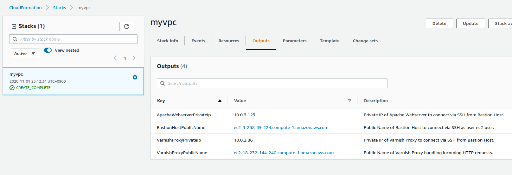
  - VarnishProxyPublicNameをクリックすると、Apache test pageにいけた！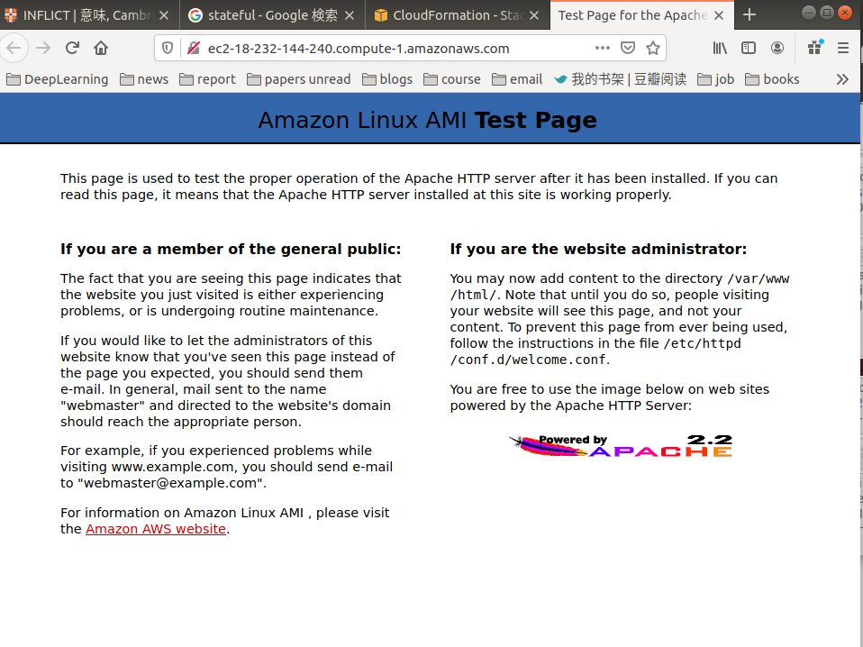
  - 上記のstackが起動中は既にNATを使った、Apache webserverをインストールした時。（多分初めてお金かかったw）

### 復習

- The Identity and Access Management (IAM) service provides everything needed for authentication and authorization with the AWS API.
  - **Every request you make to the AWS API goes through IAM to check whether the request is allowed**.
- Traffic to or from AWS resources like EC2 instances can be filtered based on protocol, port, and source or destination.
- A bastion host is a well-defined single point of access to your system.
  - **Implementation can be done with security groups or ACLs**.
- A VPC is a private network in AWS where **you have full control**.
  - With VPCs, you can control routing, subnets, ACLs, and gateways to the internet or **your company network via VPN**.
  - A NAT gateway enables access to the internet from private subnets.

- Keep every system in a private subnet that doesn't need to be accessed from the public internet, to reduce your attackable surface.