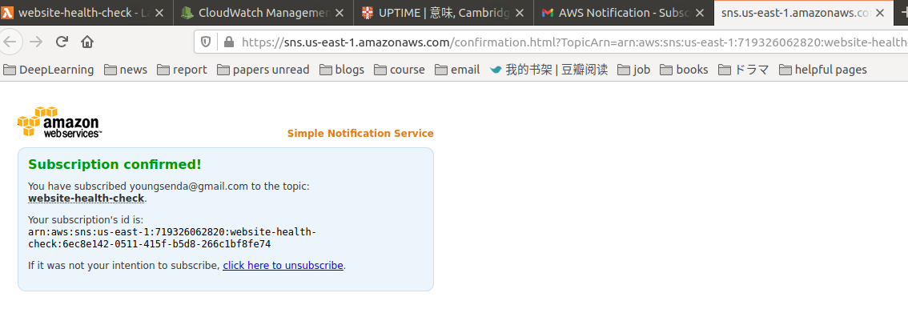

- Trigger a Lambda function with CloudWatch events; Monitor Lambda functions with CloudWatch alarms; **Configure IAM roles so Lambda functions can access other services**; **Web application, data processing, and IoT with AWS Lambda**;

- You don't need a virtual machine to run your own code anymore, as AWS Lambda offers execution environments for Java, Node.js, C#, Python, and Go.
- All you have to do is to **implement a function, upload your code, and configure the execution environment**.
  - Afterwards, your code is executed within a fully managed computing environment.
- AWS Lambda is well-integrated with all parts of AWS, enabling you to easily automate **operations tasks** within your infrastructure.
  - For example, we use it to add and remove instances to a container cluster based on a custom algorithm, and to process and analyze log files.

## 7.1 Executing your code with AWS Lambda

- Computing capacity is available at different layers of abstraction on AWS: **virtual machines, containers, and functions**.
  - Containers offer another layer of abstraction on top of virtual machines. この本には無い。多分Docker, Kubernetesにいくでしょう。

- AWS Lambda provides computing power as well but in a fine-grained manner: an execution environment for **small functions**, rather than a full-blown(満開の、成熟仕切った) operating system or container.

### 7.1.1 What is serverless?

- serverlessの定義：**No need to manage and maintain virtual machines**; fully managed service offering scalability and high availability; billed per request and by resource consumption; **invoke the function to execute your code in the cloud**.

### 7.1.2 Running your code on AWS Lambda


### 7.1.3 Comparing AWS Lambda with virtual machines (Amazon EC2)

- AWS Lambda is billed **per execution**, and not per second a virtual machine is running.
  - For example, running a script to check the health of a website every 5 minutes on a virtual machine would cost you a minimum of $4 USD.
  - Executing the same health check with AWS Lambda is free: you don't even exceed the monthly Free Tier of AWS Lambda.

## 7.2 Building a website health check with AWS Lambda

- Lambda functions publish metrics to CloudWatch by default.
- Website health checkの構成：

### 7.2.1 Creating a Lambda function

- `Lambda`->`Functions`->`Create function`. 

### 7.2.2 Use CloudWatch to search through your Lambda function's logs

- `/aws/lambda/website-health-check`というCloudWatch Log groupが自動的に作られた。
- When using Python, you can use `print` statements or use the `logging` module to send log messages to CloudWatch out-of-the-box.

### 7.2.3 Monitoring a Lambda function with CloudWatch metrics and alarms

- Lambdaが下記のmetricsをCloudWatchにpublishしている：
  - 多分情報古いけど。

- CloudWatch alarmを作って、Lambdaを監視する場合。metricを選ぶ：
- alarmに自分のemailを入れて、alarmを立ち上げて、emailからsubscriptionをconfirmする：
- Alarmメールがすぐ来た: 
  - unsubscribeもいつでもできる。

### 7.2.4 Accessing endpoints within a VPC

- By default, Lambdaはinternetと繋がって、VPCの外にある。
- Deploy a Lambda in VPC, so that it can access internal services in the VPC (https://docs.aws.amazon.com/lambda/latest/dg/configuration-vpc.html): 
  - We have been using the ability to access resources within a VPC to access databases in various projects.
  - AWS recommends placing a Lambda function in a VPC only when absolutely necessary to reach a resource that is not accessible otherwise.

## 7.3 Adding a tag containing the owner of an EC2 instance automatically

### 7.3.1 Event-driven: Subscribing to CloudWatch events

- Whenever something changes in your infrastructure, an event is generated in near real-time.
- We execute a function for every event that indicates the launch of a new EC2 instance.
- **To trigger a Lambda function whenever such an event occurs, you need a rule**. 
- A rule consists of an event **pattern** for selecting events, along with a definition of one or multiple targets.

### 7.3.2 Implementing the Lambda function in Python

```python
def lambda_handler(event, context):
    # Insert your code
    return
```

- The event parameter is used to pass the CloudWatch event and the context parameter includes runtime information.

- returnするとき、it is not useful to hand over a value in this scenario, as the Lambda function is invoked asynchronously by a CloudWatch event. つまりreturn値を待ってないから。

  ```python
  import boto3
  ec2 = boto3.client('ec2') # create an AWS SDK client to manage the EC2 service.
  
  def lambda_handler(event, context):
    print(event)
    if "/" in event['detail']['userIdentity']['arn']:
    	userName = event['detail']['userIdentity']['arn'].split('/')[1]
    else:
    	userName = event['detail']['userIdentity']['arn']
    instanceId = event['detail']['responseElements']['instancesSet']['items'][0]['instanceId']    
    print("Adding owner tag " + userName + " to instance " + instanceId + ".")
    ec2.create_tags(Resources=[instanceId,],Tags=[{'Key': 'Owner', 'Value': userName},])
    return
  ```

### 7.3.3 Setting up a Lambda function with the Serverless Application Model (SAM)

- **SAM provides a framework for serverless applications, extending plain CloudFormation templates to make it easier to deploy Lambda functions**.

- A SAM special resource allows us to define a Lambda function in a simplified way.

  - CloudFormation will generate multiple resources out of this declaration during the transformation phase. つまり同じくtemplateファイルを使って、中には簡単にlambda functionを定義できる。

  ```yaml
  Resources:
    EC2OwnerTagFunction:
      Type: AWS::Serverless::Function
      Properties:
        Handler: lambda_function.lambda_handler
        Runtime: python3.6
        CodeUri: '.'
        Policies:
        - Version: '2012-10-17'
          Statement:
          - Effect: Allow
            Action: 'ec2:CreateTags'
            Resource: '*'
        Events:
          CloudTrail:
            Type: CloudWatchEvent
            Properties:
              Pattern:
                detail-type:
                - 'AWS API Call via CloudTrail'
                source:
                - 'aws.ec2'
                detail:
                  eventName:
                  - 'RunInstances'
  ```

### 7.3.4 Authorizing a Lambda function to use other AWS services with an IAM role

- これは既にやっていたよ。Management Consoleでlambdaを作る時、自動的にそのlambda用のroleを作ってたよ。
- 上記yamlのPoliciesのところの話：The statement allows creating tags for all resources.

### 7.3.5 Deploying a Lambda function with SAM

- Step 1: create an S3 bucket to store your deployment packages.
- Step 2: create the deployment package and upload the package to S3.
- Step 3: deploy lambda function. 
- EC2 instanceを立ち上げて、テストする。自動的にtagがつけられるか。
- 10分ぐらい待ったが、まだtagが出てこない。でももう一回新しいEC2 instanceを立ち上げると、すぐtagが出た！

## 7.4 What else can you do with AWS Lambda?

### 7.4.1 What are the limitations of AWS Lambda?

- Each invocation of your Lambda function needs to complete within a maximum of 300 seconds.
- Lambdaのexecution contextを作るのはcold-startという。Therefore, applications with very strict requirements concerning response times are not good candidates for AWS Lambda.
- Max memory: 3008MB.

### 7.4.2 Impacts of the serverless pricing model

- Lambda pricing model詳細：
  - 例えば1536MB, 216,000sは、331776 (GB * s)になるので、400000 (GB * s)以下で、無料か。

### 7.4.3 Use case: Web application

- A common use case for AWS Lambda is building a back end for a web or mobile application. 

### 7.4.4 Use case: Data processing

- Another popular use case for AWS Lambda is event-driven data processing.
  - Whenever new data is available, an event is generated. 

### 7.4.5 Use case: IoT back end

- The **AWS IoT** service provides building blocks needed to communicate with various devices (things) and build event-driven applications. 

### 復習

- By using a schedule expression, you can trigger a Lambda function periodically. 例えば`rate(1 hour)`.
  - This is comparable to triggering a script with the help of a cron job.

- The Serverless Application Model (SAM) enables you to deploy a Lambda function in an automated way with AWS CloudFormation.
- There are many **event sources** for using Lambda functions in an event-driven way.
  - For example, you can subscribe to events triggered by CloudTrail for every request you send to the AWS API.