## 1.1 What is cloud computing?

- cloud computing servicesの3種類：Infrastructure as a service (IaaS, resourcesを提供), Platform as a service (PaaS, AWS Elastic Beanstalk), Software as a service (SaaS: Amazon Workspace, Microsoft Office 365).

## 1.2 What can you do with AWS?

### 1.2.1 Hosting a web shop

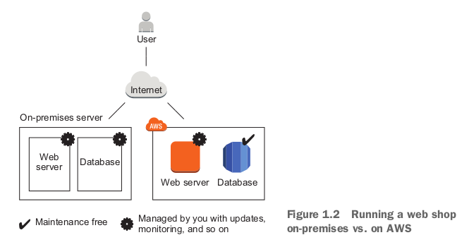

- AWSがさらに良い機能を提供できる：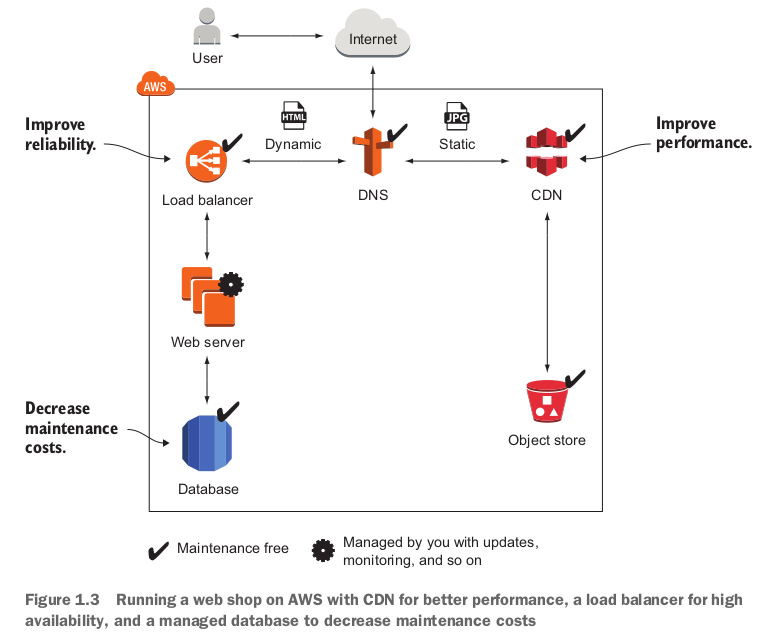
  - dynamicやstatic内容を分ける。static contentはCDNでdeliver.

### 1.2.2 Running a Jave EE application in your private network

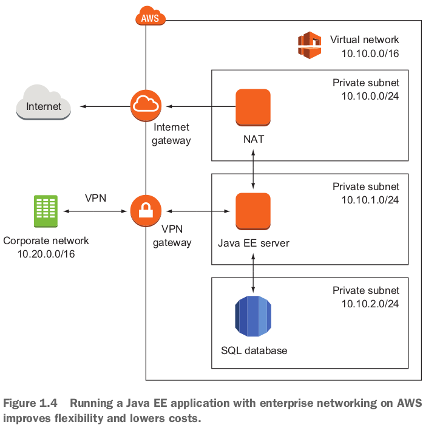

- for system architect.

### 1.2.3 Implementing a highly available system

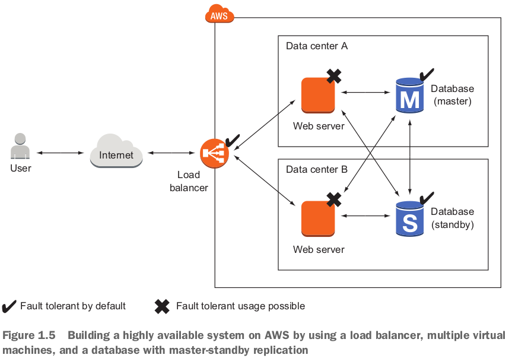

- A load balancer checks the health of the web servers and forwards requests to healthy machines.

### 1.2.4 Profiting from low costs for batch processing infrastructure

- For data scientist.
- Batch jobs are run on a schedule and store aggregated results in a database.
- A business intelligence (BI) tool is used to generate reports based on the data stored in the database.
- AWSのpay-per-use price model: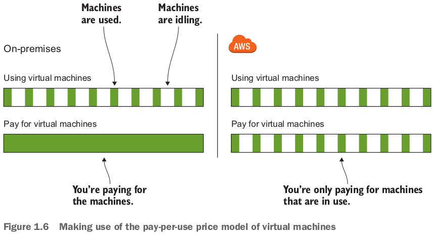

- もう1点low costになるチャンス：AWS offers **spare capacity** in their data centers at substantial discount.

## 1.3 How you can benefit from using AWS

### 1.3.2 Services solve common problems

- Common problems such as load balancer, queuing, sending email, and storing files are solved for you by services.

### 1.3.3 Enabling automation

- Because AWS has an API, you can **automate everything**: write code to create networks, start virtual machine clusters, or deploy a relational database.
- Setting up an environment in the cloud based on your blueprints can be automated with the help of **infrastructure as code**. (Chapter 4)

### 1.3.4 Flexible capacity (scalability)

- **You no longer need to predict your future capacity needs for the coming months and years**.

### 1.4 How much does it cost?

- ３つbill種類（web shopの例）：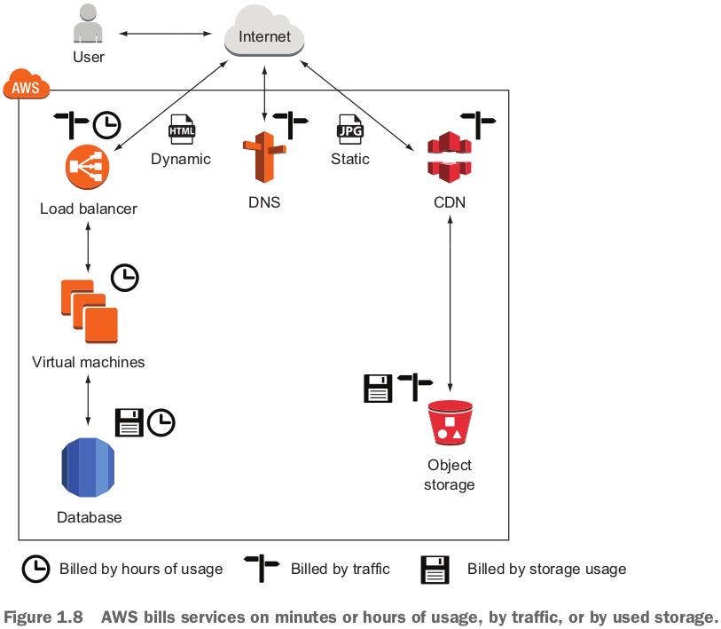

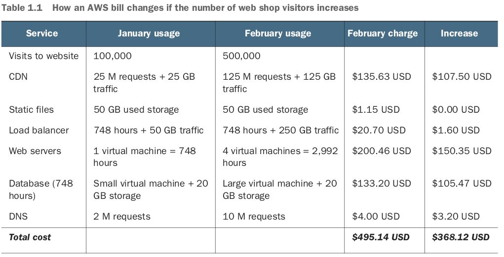

- With AWS, you can achieve a linear relationship between **traffic** and costs.

## 1.6 Exploring AWS services

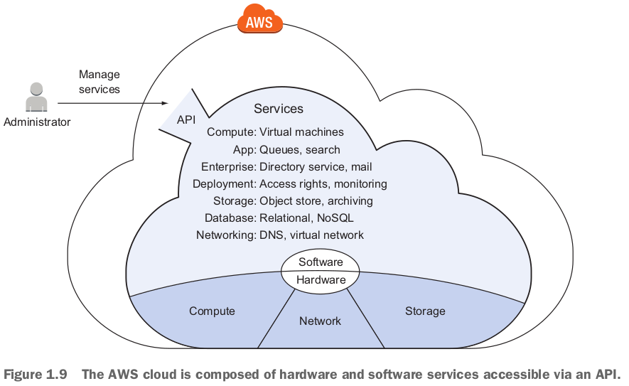

- **Manage services** by sending requests to the API manually via a web-based UI like the Management Console, a command-line interface (CLI), or programmatically via an SDK.
- **Virtual machines** have a special feature: you can connect to virtual machines through SSH, for example, and gain administrator access.

- custom applicationやapplicationが依頼するserviceを管理する例：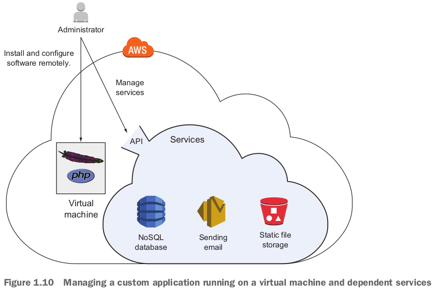

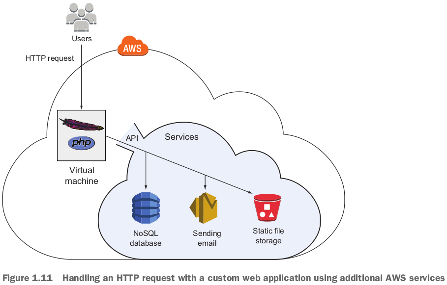

- この本に紹介されるservice: EC2 (virtual machine), ELB (load balancer), Lambda (executing functions), Elastic Beanstalk (deploying web applications), S3 (object store), EFS (network filesystem), Glacier (**archiving data**), RDS (SQL database), DynamoDB (NoSQL database), ElastiCache (in-memory key-value store), VPC (**private network**), CloudWatch (**monitoring and logging**), CloudFormation (**automating your infrastructure**), OpsWorks (deploying web application), IAM (**restricting access to your cloud resources**), Simple Queue Service (distributed queues).
- continuous delivery, Docker / containers, Big Dataは紹介されていない。

## 1.7 Interacting with AWS

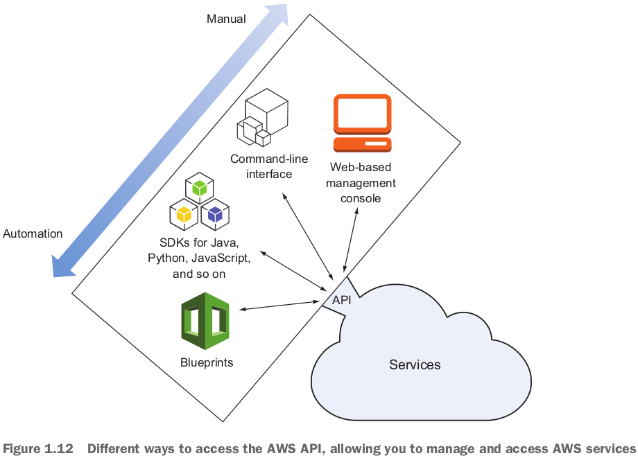

- If you want to automate parts of your infrastructure with the help of a **continuous integration server, like Jenkins**, the CLI is the right tool for the job.

### 1.7.3 SDKs

- AWS offers SDKs for the following platforms and languages: Android, .NET, Ruby, Browsers (JavaScript), Node.js (JavaScript), Go, iOS, PHP, C++, Java, Python.
- SDKs are typically used to **integrate AWS services into applications**.
- If you're doing software development and want to integrate an AWS service like a NoSQL database or a push-notification service, an SDK is the right choice for the job.

### 1.7.4 Blueprints

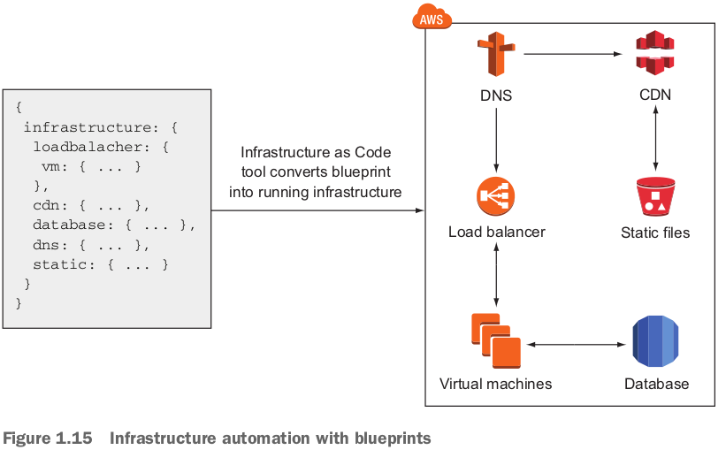

- An Infrastructure as Code tool compares your blueprint with the current system, and calculates the steps to create, update, or delete your cloud infrastructure. これはdocker composeと同じでしょう。

## 1.8 Creating an AWS account

### 1.8.3 Creating a key pair

- pemファイルがダウンロードされた。EC2にloginするために使う。

## 1.9 Create a billing alarm to keep track of your AWS bill

- **Billing alarms are available in N. Virginia only**. 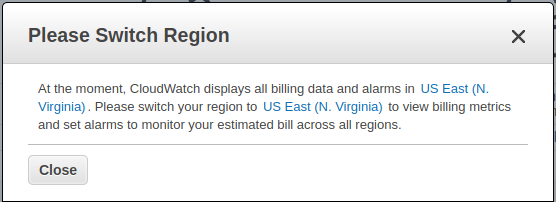

