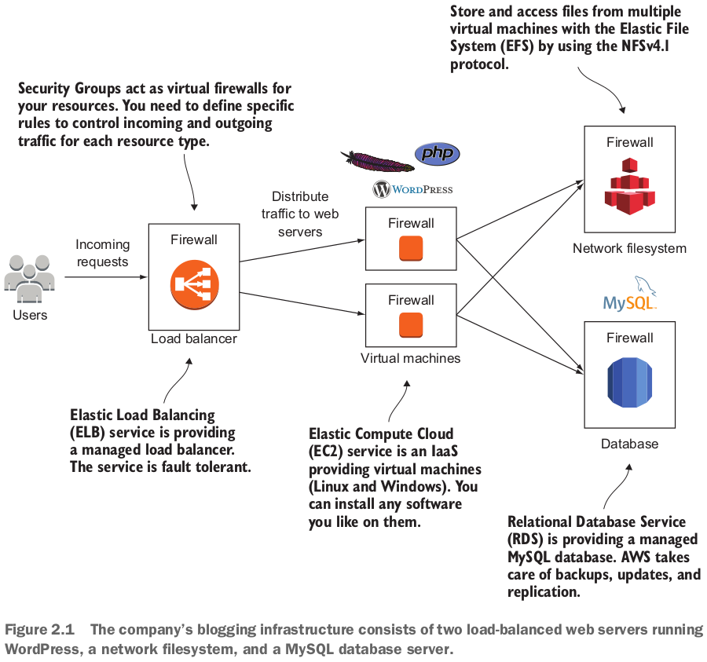
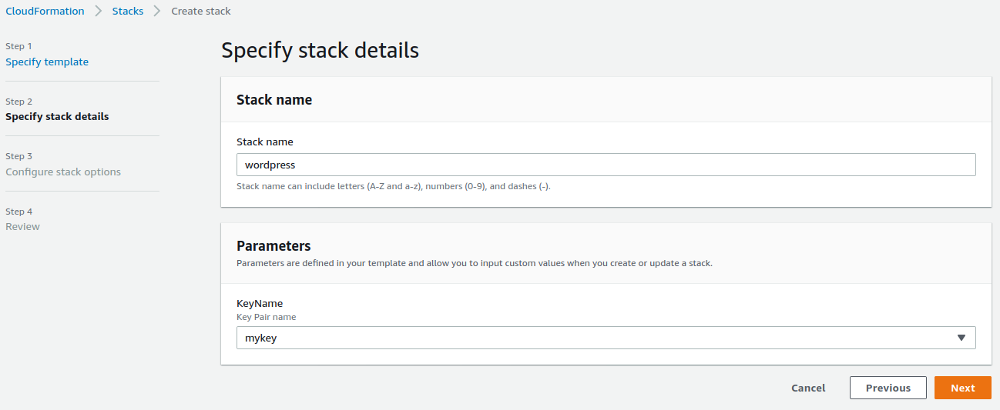
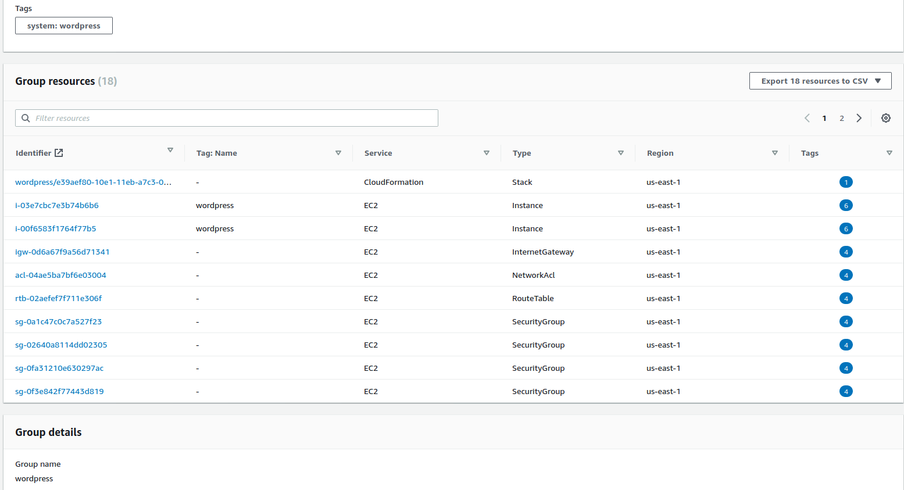
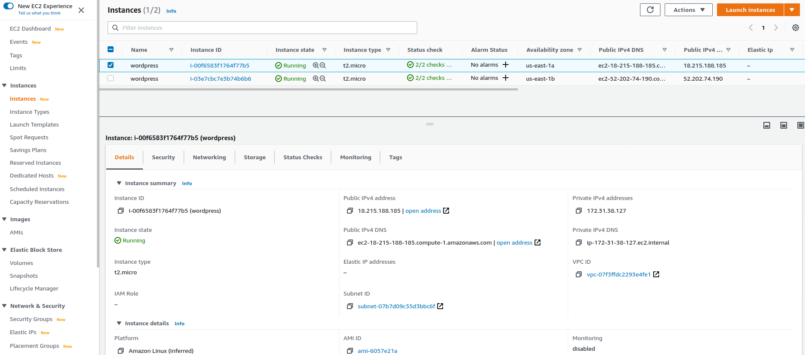
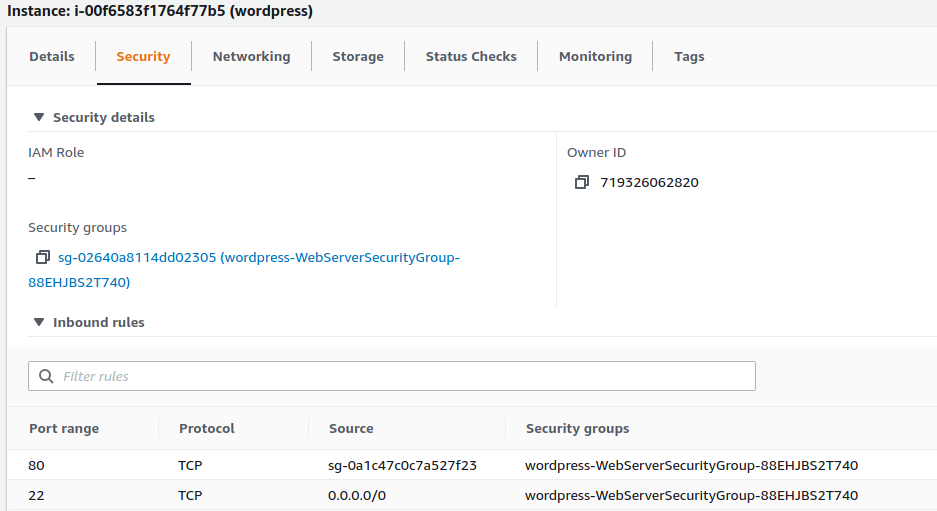
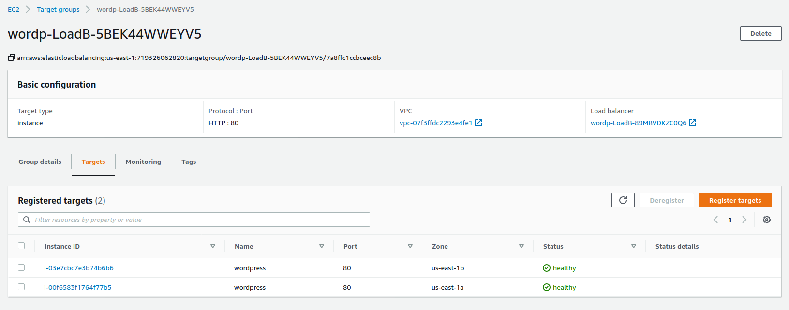
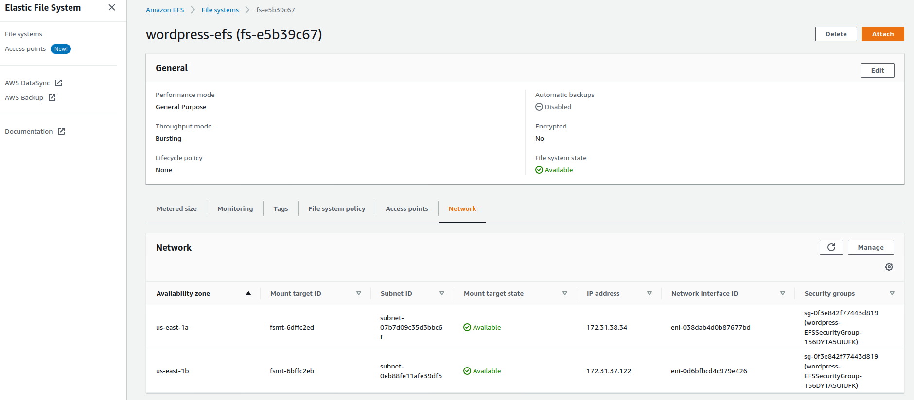

- WordPress is written in PHP and uses a MySQL database to store data.
  - Apache is used as the web server to serve the pages.

## 2.1 Creating your infrastructure

5種類サービスを使う必要がある：

- *Elastic Load Balancing (ELB)*.
  - Use the Application Load Balancer (ALB) which operates on Layer 7 (HTTP and HTTPS).
- *Elastic Compute Cloud (EC2)*.
- *Relational Database Service (RDS) for MySQL*.
- *Elastic File System (EFS)*.
  - WordPress itself consists of PHP and other application files.
  - User uploads, for example images added to an article, are stored as files as well.
  - By using a **network file system**, your virtual machines can access these files.

- *Security groups*.
  - Control incoming and outgoing traffic to your virtual machine, database, or load balancer with a firewall.
  - For example, use a security group allowing incoming HTTP traffic from the internet to port 80 of the load balancer.
  - Or restrict network access to your database on port 3306 to the virtual machines running your web pages.

- **CloudFormation**サービスを利用する。
- 違うRegionで作ったkey pairは共用できない。Stackを作る時、他のRegionで作られたkey pairは指定できない。下記のステップで：
  - templateはyamlファイル、まるでdocker composeファイルだね。

## 2.2 Exploring your infrastructure

### 2.2.1 Resource groups

- **Management & Governance: Resource Groups & Tag Editor**サービスを使う。
- Stackを作る時定義したsystem:wordpressタグを利用して、wordpress stackが使ったresourceを表示できる：
  - Wordpress stackが２つEC2 instanceを使っている。

### 2.2.2 Virtual machines

- EC2サービス画面に使われている２つEC2 instanceを見れる：
  - *Instance type*: `t2.micro`.
  - *Public IPv4 address*: `18.215.188.185`.
    - The IP address is reachable over the internet.
    - Can **use this IP address to connect to the virtual machine via SSH**.
  - *Security groups*: Inbound rules, Outbound rules. 

### 2.2.3 Load balancer

- EC2のnavigationの中の*Load Balancing*にある*Load Balancers*や*Target Groups*.
- Target Groupsはtarget EC2 instancesを記録する：

### 2.2.4 MySQL database

- RDS -> Databases.

### 2.2.5 Network filesystem

- EFSサービスから。EFSのmount targets: 

## 2.4 Deleting your infrastructure

- `CloudFormation`にやる。

### 復習

- Creating a blogging infrastructure can be fully automated.
- Infrastructure can be deleted with one click. The process is powered by automation.