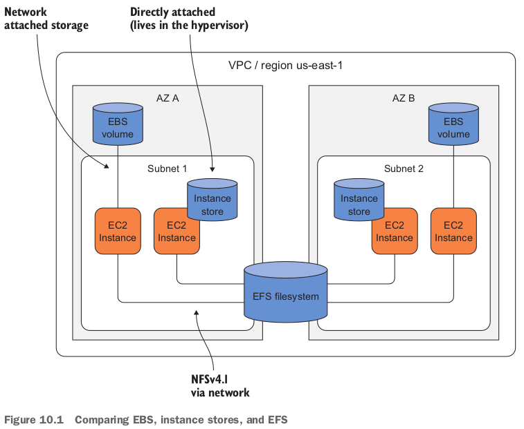
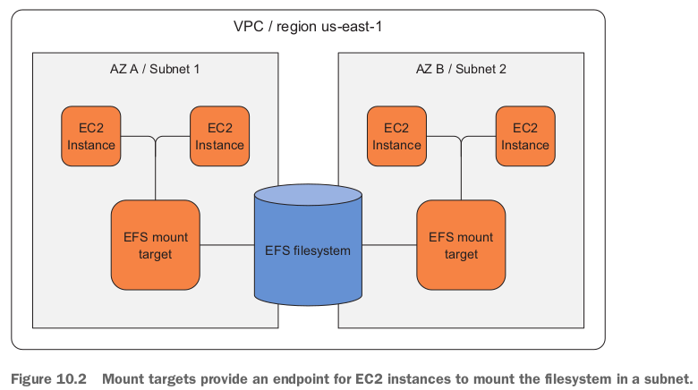
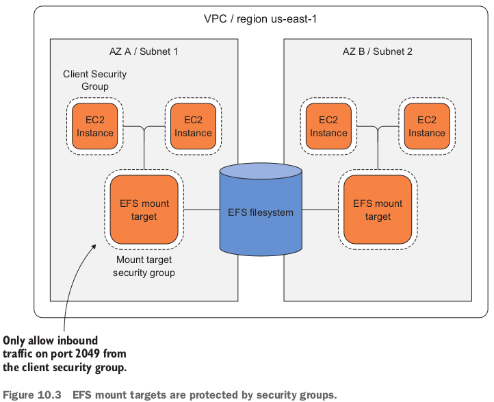
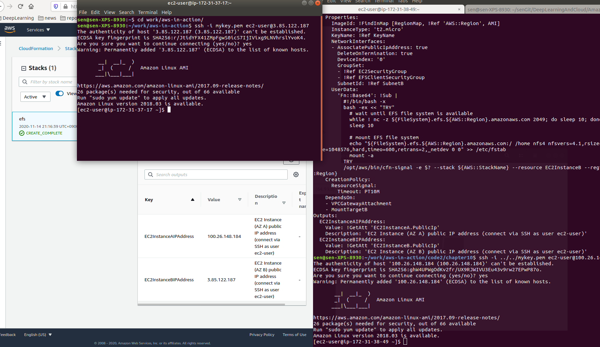
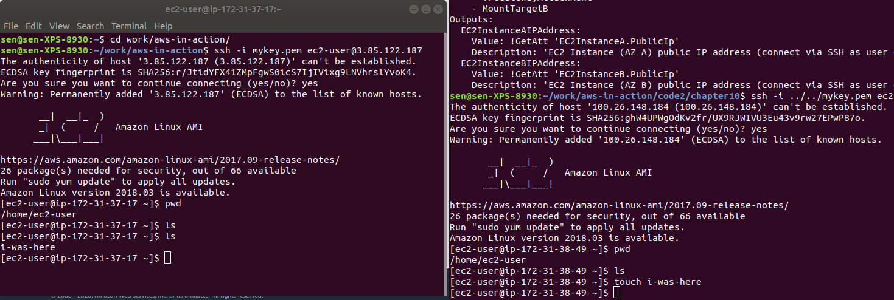
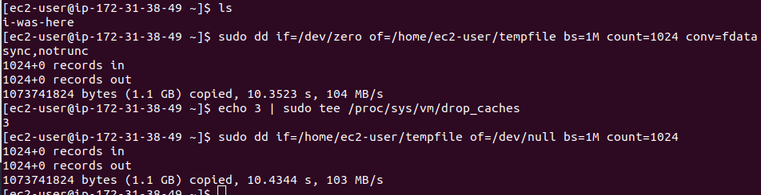
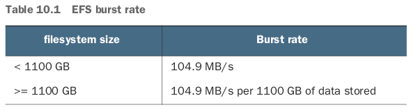

Mount your shared filesystem on multiple EC2 instances; Share files between EC2 instances.

- EFS is based on the NFSv4.1 protocol, so you can mount it like any other filesystem.
- EBS, instance storeとの比較：
  - **An EBS volume is tied to a data center (also called an AZ)** and can only be attached over the network to a single EC2 instance **from the same data center**.
  - **Typically EBS volumes are used as the root volumes that contain the operating system, or for relational database systems to store the state**.
  - An instance store can be regarded as ephemeral storage, and is therefore used for caching or **for NoSQL databases with embedded data replication only**.
  - EFSはdata centerを跨げる。
- EFSの構成：Filesystem, Mount target.
  - The EC2 instance must be in the same subnet as the EFS mount target, but you can create mount targets in multiple subnets. 

## 10.1 Creating a filesystem

### 10.1.1 Using CloudFormation to describe a filesystem

```yaml
Resources:
  FileSystem:
    Type: 'AWS::EFS::FileSystem'
    Properties: {}
```

## 10.2 Creating a mount target



- 今回の例では、２つsecurity groupsを作る：
  - The client security group will be attached to all EC2 instances that want to mount the filesystem.
  - The mount target security group allows inbound traffic on port 2049 only for traffic that comes from the client security group.

- ２つsecurity groupsや２つmount targetの定義：

  ```yaml
    FileSystem:
      Type: 'AWS::EFS::FileSystem'
      Properties: {}
    EFSClientSecurityGroup:
      Type: 'AWS::EC2::SecurityGroup'
      Properties:
        GroupDescription: 'EFS Mount target client'
        VpcId: !Ref VPC
    MountTargetSecurityGroup:
      Type: 'AWS::EC2::SecurityGroup'
      Properties:
        GroupDescription: 'EFS Mount target'
        SecurityGroupIngress:
        - FromPort: 2049
          IpProtocol: tcp
          SourceSecurityGroupId: !Ref EFSClientSecurityGroup
          ToPort: 2049
        VpcId: !Ref VPC
    MountTargetA:
      Type: 'AWS::EFS::MountTarget'
      Properties:
        FileSystemId: !Ref FileSystem
        SecurityGroups:
        - !Ref MountTargetSecurityGroup
        SubnetId: !Ref SubnetA
    MountTargetB:
      Type: 'AWS::EFS::MountTarget'
      Properties:
        FileSystemId: !Ref FileSystem
        SecurityGroups:
        - !Ref MountTargetSecurityGroup
        SubnetId: !Ref SubnetB
  ```

  - The client security group needs no rules. It's just used to mark traffic.
  - mount targetはfilesystemにもsubnetにも繋がっているよ！

## 10.3 Mounting the EFS share on EC2 instances

- Each EC2 instance should be placed in a different subnet and mount the filesystem to `/home`.

- Instance A, Bの定義：

  ```yaml
   EC2SecurityGroup: # security group to allow SSH traffic from the internet.
      Type: 'AWS::EC2::SecurityGroup'
      Properties:
        GroupDescription: 'EC2 instance'
        SecurityGroupIngress:
        - CidrIp: '0.0.0.0/0'
          FromPort: 22
          IpProtocol: tcp
          ToPort: 22
        VpcId: !Ref VPC
    EC2InstanceA:
      Type: 'AWS::EC2::Instance'
      Properties:
        ImageId: !FindInMap [RegionMap, !Ref 'AWS::Region', AMI]
        InstanceType: 't2.micro'
        KeyName: !Ref KeyName
        NetworkInterfaces:
        - AssociatePublicIpAddress: true
          DeleteOnTermination: true
          DeviceIndex: '0'
          GroupSet:
          - !Ref EC2SecurityGroup # attach the security group to allow SSH.
          - !Ref EFSClientSecurityGroup
          SubnetId: !Ref SubnetA
        UserData:
          'Fn::Base64': !Sub |
            #!/bin/bash -x
            bash -ex << "TRY"
              # wait until EFS file system is available
              while ! nc -z ${FileSystem}.efs.${AWS::Region}.amazonaws.com 2049; do sleep 10; done
              sleep 10
  
              # copy existing /home to /oldhome
              mkdir /oldhome
              cp -a /home/. /oldhome
  
              # mount EFS file system
              echo "${FileSystem}.efs.${AWS::Region}.amazonaws.com:/ /home nfs4 nfsvers=4.1,rsize=1048576,wsize=1048576,hard,timeo=600,retrans=2,_netdev 0 0" >> /etc/fstab
              mount -a
  
              # copy /oldhome to new /home
              cp -a /oldhome/. /home
            TRY
            /opt/aws/bin/cfn-signal -e $? --stack ${AWS::StackName} --resource EC2InstanceA --region ${AWS::Region}
      CreationPolicy:
        ResourceSignal:
          Timeout: PT10M
      DependsOn:
      - VPCGatewayAttachment
      - MountTargetA
    EC2InstanceB:
      Type: 'AWS::EC2::Instance'
      Properties:
        ImageId: !FindInMap [RegionMap, !Ref 'AWS::Region', AMI]
        InstanceType: 't2.micro'
        KeyName: !Ref KeyName
        NetworkInterfaces:
        - AssociatePublicIpAddress: true
          DeleteOnTermination: true
          DeviceIndex: '0'
          GroupSet:
          - !Ref EC2SecurityGroup
          - !Ref EFSClientSecurityGroup
          SubnetId: !Ref SubnetB
        UserData:
          'Fn::Base64': !Sub |
            #!/bin/bash -x
            bash -ex << "TRY"
              # wait until EFS file system is available
              while ! nc -z ${FileSystem}.efs.${AWS::Region}.amazonaws.com 2049; do sleep 10; done
              sleep 10
  
              # mount EFS file system
              echo "${FileSystem}.efs.${AWS::Region}.amazonaws.com:/ /home nfs4 nfsvers=4.1,rsize=1048576,wsize=1048576,hard,timeo=600,retrans=2,_netdev 0 0" >> /etc/fstab
              mount -a
            TRY
            /opt/aws/bin/cfn-signal -e $? --stack ${AWS::StackName} --resource EC2InstanceB --region ${AWS::Region}
      CreationPolicy:
        ResourceSignal:
          Timeout: PT10M
      DependsOn:
      - VPCGatewayAttachment
      - MountTargetB
  ```

- 整理すると、CloudFormation templateに４つ部分がある：
  - Filesystem (EFS); 2 EFS mount targets in Subnet A and Subnet B; Security groups to control traffic to the mount targets; EC2 instances in both subnets, including a `UserData` script to mount the filesystem.

## 10.4 Sharing files between EC2 instances（面白い！）

- 上記のstackを作ったら、SSHでそれぞれのEC2に入る
- ２つterminalは今同じく`/home/ec2-user`にいる。今１つの中にfileを新規すると、もう１つの中にすぐ出る！
- **You can apply the same mechanism to share files between a fleet of web servers** (for example, the `var/www/html` folder), or to **design a highly available Jenkins server** (such as `/var/lib/jenkins`). 

## 10.5 Tweaking performance



- Comparing these numbers to the `dd` results on EBS and instance store is only of limited informative value.

### 10.5.1 Performance mode

- For data analytics, latency is not important. Throughput is the metric you want to optimize instead.
- Optimizing for throughput can be achieved using the Max I/O performance mode.
- The performance mode being used by an EFS filesystem cannot be changed - you set it when the filesystem is created.

### 10.5.2 Expected throughput

- EFS also allows for **bursting**, because many workloads require high performance for a short period of time and are idle for most of the rest of the time.
- EFSのburst rate: 
  - **The burst rate is exactly the rate we measured in the simple performance test!**

## 10.6 Monitoring a filesystem

### 10.6.1 Should you use Max I/O Performance mode?

- If `PercentIOLimit` metric is at 100% for more than half of the time, you should consider creating a new filesystem with Max I/O performance mode enabled.

- このmetricにCloudWatch alarmを作れる。例えば15分間の`PercentIOLimit`平均値が95%以上。CloudFormation templateの中にも定義できる。

- またmonitor `PermittedThroughput`. (CloudWatch alarm)

## 10.7 Backing up your data(未実践)

- If you need a cost effective way to back up the history of changes to EFS, we recommend you use an EBS volume and snapshots.
  - One disadvantage of this solution is that your data must be small enough to fit on a single EBS volume.
  - If it's not, consider using a second EFS filesystem for your backups.

- To implement the EBS backup strategy, you need to add an EBS volume, and attach it to one of the EC2 instances.
  - Finally, implement the logic to synchronize the mounted filesystem with EBS and trigger a snapshot.

### 10.7.1 Using CloudFormation to describe an EBS volume

- 上記のtemplate yamlにbackup用EBSを追加する：

  ```yaml
    EBSBackupVolumeA:
      Type: 'AWS::EC2::Volume'
      Properties:
        AvailabilityZone: !Select [0, !GetAZs '']
        Size: !Ref EBSBackupVolumeSize
        VolumeType: gp2
    EBSBackupVolumeAttachmentA:
      Type: 'AWS::EC2::VolumeAttachment'
      Properties:
        Device: '/dev/xvdf'
        InstanceId: !Ref EC2InstanceA
        VolumeId: !Ref EBSBackupVolumeA
  ```

### 10.7.2 Using the EBS volume

- EC2 InstanceAの中に15分間隔でefsをebsにコピー、freezeして、snapshotを作る作業を定義する：

  ```yaml
        UserData:
          'Fn::Base64': !Sub |
            #!/bin/bash -x
            bash -ex << "TRY"
              # wait until EFS file system is available
              while ! nc -z ${FileSystem}.efs.${AWS::Region}.amazonaws.com 2049; do sleep 10; done
              sleep 10
  
              # copy existing /home to /oldhome
              mkdir /oldhome
              cp -a /home/. /oldhome
  
              # mount EFS file system
              echo "${FileSystem}.efs.${AWS::Region}.amazonaws.com:/ /home nfs4 nfsvers=4.1,rsize=1048576,wsize=1048576,hard,timeo=600,retrans=2,_netdev 0 0" >> /etc/fstab
              mount -a
  
              # copy /oldhome to new /home
              cp -a /oldhome/. /home
            TRY
            /opt/aws/bin/cfn-signal -e $? --stack ${AWS::StackName} --resource EC2InstanceA --region ${AWS::Region}
  
            # wait until EBS volume is attached
            while ! [ "`fdisk -l | grep '/dev/xvdf' | wc -l`" -ge "1" ]; do sleep 10; done
  
            # format EBS volume if needed
            if [[ "`file -s /dev/xvdf`" != *"ext4"* ]]; then mkfs -t ext4 /dev/xvdf; fi
  
            # mount EBS volume
            mkdir /mnt/backup
            echo "/dev/xvdf /mnt/backup ext4 defaults,nofail 0 2" >> /etc/fstab
            mount -a
  
            # install backup cron
            cat > /etc/cron.d/backup << EOF
            SHELL=/bin/bash
            PATH=/sbin:/bin:/usr/sbin:/usr/bin:/opt/aws/bin
            MAILTO=root
            HOME=/
            */15 * * * * root rsync -av --delete /home/ /mnt/backup/ ; fsfreeze -f /mnt/backup/ ; aws --region ${AWS::Region} ec2 create-snapshot --volume-id ${EBSBackupVolumeA} --description "EFS backup" ; fsfreeze -u /mnt/backup/
            EOF
  ```

  - cron jobのところが15分間隔の作業内容。

- またEC2 Aがsnapshotを作れるように、`ec2:CreateSnapshot` ActionができるIAM Roleを定義して、EC2にひもづける：

  ```yaml
    InstanceProfile:
      Type: 'AWS::IAM::InstanceProfile'
      Properties:
        Roles:
        - !Ref Role
    Role:
      Type: 'AWS::IAM::Role'
      Properties:
        AssumeRolePolicyDocument:
          Version: '2012-10-17'
          Statement:
          - Effect: Allow
            Principal:
              Service: 'ec2.amazonaws.com'
            Action: 'sts:AssumeRole'
        Policies:
        - PolicyName: ec2
          PolicyDocument:
            Version: '2012-10-17'
            Statement:
            - Effect: Allow
              Action: 'ec2:CreateSnapshot'
              Resource: '*'
  ```

  ```yaml
    EC2InstanceA:
      Type: 'AWS::EC2::Instance'
      Properties:
        IamInstanceProfile: !Ref InstanceProfile
  ```

- SnapshotsやVolumeはEC2 Dashboardから見れる。

### 復習

- EFS mount targets are bound to an availability zone and are protected by security groups.

- You need at least two mount targets in different AZs for high availability.
- Data that is stored in EFS is replicated across multiple AZs.