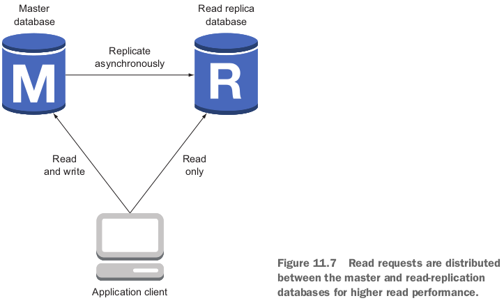

- AWSにrelational databaseを使う道は２つ：RDSかOperate a relational database yourself on top of virtual machines. 2つ道の比較：
- RDS offers ready-to-use relational databases such as PostgreSQL, MySQL, MariaDB, Oracle Database, and Microsoft SQL Server.
  - If your application supports one of these relational database systems, the migration to Amazon RDS is easy.

## 11.1 Starting a MySQL database

### 11.1.1 Launching a WordPress platform with an RDS database

- 2 steps: launch a database instance; connect an application to the database endpoint.

- wordpress templateの中のdatabaseの部分：

  ```yaml
    DatabaseSecurityGroup:
      Type: 'AWS::EC2::SecurityGroup'
      Properties:
        GroupDescription: 'awsinaction-db-sg'
        VpcId: !Ref VPC
        SecurityGroupIngress:
        - IpProtocol: tcp
          FromPort: 3306 # the default MySQL port is 3306
          ToPort: 3306
          SourceSecurityGroupId: !Ref WebServerSecurityGroup
    Database:
      Type: 'AWS::RDS::DBInstance'
      DeletionPolicy: Delete # For AWS::RDS::DBInstance resources that don't specify the DBClusterIdentifier property, the default policy is Snapshot which can cause unwanted costs. However, for production setups, we highly recommend to stay with the default to avoid data loss.
      Properties:
        AllocatedStorage: '5'
        BackupRetentionPeriod: 0
        DBInstanceClass: 'db.t2.micro'
        DBName: wordpress
        Engine: MySQL
        MasterUsername: wordpress
        MasterUserPassword: wordpress
        VPCSecurityGroups:
        - !Sub ${DatabaseSecurityGroup.GroupId}
        DBSubnetGroupName: !Ref DBSubnetGroup
      DependsOn: VPCGatewayAttachment
    DBSubnetGroup:
      Type: 'AWS::RDS::DBSubnetGroup'
      Properties:
        DBSubnetGroupDescription: DB subnet group
        SubnetIds:
        - Ref: SubnetA
        - Ref: SubnetB
  ```

  - An RDS instance should only be accessible within the VPC.
  - To connect to an RDS instance, you need an EC2 instance running in the same VPC.
  - First, connect to the EC2 instance; from there, connect to the RDS instance.

- wordpress stackが立ち上がったら、Outputsにwordpress blogging platformのURLがでる：

## 11.2 Importing data into a database

- タスク：import a MySQL database dump to an RDS database with a MySQL engine.

- Step 1: 上記stackの１つEC2に入る：僕は直接にEC2 dashboardからEC2のpublic IPをみつける。

- Step 2: 著者が用意してくれたMySQL dumpをdownload.

  ```bash
  [ec2-user@ip-172-31-38-197 ~]$ pwd
  /home/ec2-user
  [ec2-user@ip-172-31-38-197 ~]$ wget https://s3.amazonaws.com/awsinaction-code2/chapter11/wordpress-import.sql
  --2020-11-15 08:30:19--  https://s3.amazonaws.com/awsinaction-code2/chapter11/wordpress-import.sql
  Resolving s3.amazonaws.com (s3.amazonaws.com)... 52.216.145.45
  Connecting to s3.amazonaws.com (s3.amazonaws.com)|52.216.145.45|:443... connected.
  HTTP request sent, awaiting response... 200 OK
  Length: 6497184 (6.2M) [binary/octet-stream]
  Saving to: ‘wordpress-import.sql’
  
  wordpress-import.sql       100%[=====================================>]   6.20M  --.-KB/s    in 0.08s   
  
  2020-11-15 08:30:19 (76.4 MB/s) - ‘wordpress-import.sql’ saved [6497184/6497184]
  
  [ec2-user@ip-172-31-38-197 ~]$ ls
  wordpress-import.sql
  ```

- Step 3: RDSにimportするとき、RDSのendpoint addressが必要：

  ```bash
  sen@sen-XPS-8930:~$ aws rds describe-db-instances --query "DBInstances[0].Endpoint"
  {
      "Address": "wd1i2le19iaybgz.chmy4uypfl5w.us-east-1.rds.amazonaws.com",
      "Port": 3306,
      "HostedZoneId": "Z2R2ITUGPM61AM"
  }
  ```

  ```bash
  [ec2-user@ip-172-31-38-197 ~]$ mysql --host wd1i2le19iaybgz.chmy4uypfl5w.us-east-1.rds.amazonaws.com --user wordpress -p < wordpress-import.sql 
  Enter password: 
  ```

- そうすると、wordpress siteにnew posts and commentsが出た！

## 11.3 Backing up and restoring your database

- RDS offers manual and automated snapshots for recovering RDS database instances.

### 11.3.1 Configuring automated snapshots(update失敗)

- wordpress-snapshot.yamlを使って、上記のstackをupdate. 変更点は、RDSの`BackupRetentionPeriod`や`PreferredBackupWindow`だけ。

  ```yaml
    Database:
      Type: 'AWS::RDS::DBInstance'
      DeletionPolicy: Delete # For AWS::RDS::DBInstance resources that don't specify the DBClusterIdentifier property, the default policy is Snapshot which can cause unwanted costs. However, for production setups, we highly recommend to stay with the default to avoid data loss.
      Properties:
        AllocatedStorage: '5'
        BackupRetentionPeriod: 3 # keep snapshots for 3 days
        PreferredBackupWindow: '05:00-06:00' # create snapshots at this window (UTC)
        DBInstanceClass: 'db.t2.micro'
        DBName: wordpress
        Engine: MySQL
        MasterUsername: wordpress
        MasterUserPassword: wordpress
        VPCSecurityGroups:
        - !Sub ${DatabaseSecurityGroup.GroupId}
        DBSubnetGroupName: !Ref DBSubnetGroup
      DependsOn: VPCGatewayAttachment
  ```

  - 以前のwordpress templateには`BackupRetentionPeriod`を0にした。つまり自動backupを無効。

- **Automated snapshots are deleted when the RDS database instance is deleted. Manual snapshots stay**.

### 11.3.2 Creating snapshots manually

- cliでRDS snapshotを作って、状態を確認：

  ```bash
  sen@sen-XPS-8930:~/work/aws-in-action/code2/chapter11$ aws rds describe-db-instances --output text --query "DBInstances[0].DBInstanceIdentifier"
  wd1i2le19iaybgz
  sen@sen-XPS-8930:~/work/aws-in-action/code2/chapter11$ aws rds create-db-snapshot --db-snapshot-identifier wordpress-manual-snapshot --db-instance-identifier wd1i2le19iaybgz
  {
      "DBSnapshot": {
          "DBSnapshotIdentifier": "wordpress-manual-snapshot",
          "DBInstanceIdentifier": "wd1i2le19iaybgz",
          "Engine": "mysql",
          "AllocatedStorage": 5,
          "Status": "creating",
          "Port": 3306,
          "AvailabilityZone": "us-east-1b",
          "VpcId": "vpc-0b29c2ee29d40f865",
          "InstanceCreateTime": "2020-11-15T03:49:57.215Z",
          "MasterUsername": "wordpress",
          "EngineVersion": "8.0.20",
          "LicenseModel": "general-public-license",
          "SnapshotType": "manual",
          "OptionGroupName": "default:mysql-8-0",
          "PercentProgress": 0,
          "StorageType": "standard",
          "Encrypted": false,
          "DBSnapshotArn": "arn:aws:rds:us-east-1:719326062820:snapshot:wordpress-manual-snapshot",
          "IAMDatabaseAuthenticationEnabled": false,
          "ProcessorFeatures": [],
          "DbiResourceId": "db-GDGHPWJ4POUPN6SMICA4DWRUSY",
          "TagList": []
      }
  }
  sen@sen-XPS-8930:~/work/aws-in-action/code2/chapter11$ aws rds describe-db-snapshots --db-snapshot-identifier wordpress-manual-snapshot
  {
      "DBSnapshots": [
          {
              "DBSnapshotIdentifier": "wordpress-manual-snapshot",
              "DBInstanceIdentifier": "wd1i2le19iaybgz",
              "SnapshotCreateTime": "2020-11-15T08:59:13.767Z",
              "Engine": "mysql",
              "AllocatedStorage": 5,
              "Status": "available",
              "Port": 3306,
              "AvailabilityZone": "us-east-1b",
              "VpcId": "vpc-0b29c2ee29d40f865",
              "InstanceCreateTime": "2020-11-15T03:49:57.215Z",
              "MasterUsername": "wordpress",
              "EngineVersion": "8.0.20",
              "LicenseModel": "general-public-license",
              "SnapshotType": "manual",
              "OptionGroupName": "default:mysql-8-0",
              "PercentProgress": 100,
              "StorageType": "standard",
              "Encrypted": false,
              "DBSnapshotArn": "arn:aws:rds:us-east-1:719326062820:snapshot:wordpress-manual-snapshot",
              "IAMDatabaseAuthenticationEnabled": false,
              "ProcessorFeatures": [],
              "DbiResourceId": "db-GDGHPWJ4POUPN6SMICA4DWRUSY",
              "TagList": []
          }
      ]
  }
  ```

### 11.3.3 Restoring a database


```bash
sen@sen-XPS-8930:~/work/aws-in-action/code2/chapter11$ aws cloudformation describe-stack-resource --stack-name wordpress --logical-resource-id DBSubnetGroup --query "StackResourceDetail.PhysicalResourceId" --output text
wordpress-dbsubnetgroup-jyafd96je6tj
sen@sen-XPS-8930:~/work/aws-in-action/code2/chapter11$ aws rds restore-db-instance-from-db-snapshot --db-instance-identifier awsinaction-db-restore --db-snapshot-identifier wordpress-manual-snapshot --db-subnet-group-name wordpress-dbsubnetgroup-jyafd96je6tj
{
    "DBInstance": {
        "DBInstanceIdentifier": "awsinaction-db-restore",
        "DBInstanceClass": "db.t2.micro",
        "Engine": "mysql",
        "DBInstanceStatus": "creating",
        "MasterUsername": "wordpress",
        "DBName": "wordpress",
        "AllocatedStorage": 5,
        "PreferredBackupWindow": "04:45-05:15",
        "BackupRetentionPeriod": 0,
        "DBSecurityGroups": [],
        "VpcSecurityGroups": [
            {
                "VpcSecurityGroupId": "sg-0528b4408e7ebcb64",
                "Status": "active"
            }
        ],
        "DBParameterGroups": [
            {
                "DBParameterGroupName": "default.mysql8.0",
                "ParameterApplyStatus": "in-sync"
            }
        ],
        "DBSubnetGroup": {
            "DBSubnetGroupName": "wordpress-dbsubnetgroup-jyafd96je6tj",
            "DBSubnetGroupDescription": "DB subnet group",
            "VpcId": "vpc-0b29c2ee29d40f865",
            "SubnetGroupStatus": "Complete",
            "Subnets": [
                {
                    "SubnetIdentifier": "subnet-043bccac122659d9a",
                    "SubnetAvailabilityZone": {
                        "Name": "us-east-1b"
                    },
                    "SubnetOutpost": {},
                    "SubnetStatus": "Active"
                },
                {
                    "SubnetIdentifier": "subnet-0e2637b4b98fe4968",
                    "SubnetAvailabilityZone": {
                        "Name": "us-east-1a"
                    },
                    "SubnetOutpost": {},
                    "SubnetStatus": "Active"
                }
            ]
        },
        "PreferredMaintenanceWindow": "thu:05:54-thu:06:24",
        "PendingModifiedValues": {},
        "MultiAZ": false,
        "EngineVersion": "8.0.20",
        "AutoMinorVersionUpgrade": true,
        "ReadReplicaDBInstanceIdentifiers": [],
        "LicenseModel": "general-public-license",
        "OptionGroupMemberships": [
            {
                "OptionGroupName": "default:mysql-8-0",
                "Status": "pending-apply"
            }
        ],
        "PubliclyAccessible": false,
        "StorageType": "standard",
        "DbInstancePort": 0,
        "StorageEncrypted": false,
        "DbiResourceId": "db-GQ3QSP2GJANXICQPAC46XW737A",
        "CACertificateIdentifier": "rds-ca-2019",
        "DomainMemberships": [],
        "CopyTagsToSnapshot": false,
        "MonitoringInterval": 0,
        "DBInstanceArn": "arn:aws:rds:us-east-1:719326062820:db:awsinaction-db-restore",
        "IAMDatabaseAuthenticationEnabled": false,
        "PerformanceInsightsEnabled": false,
        "DeletionProtection": false,
        "AssociatedRoles": [],
        "TagList": []
    }
}
```

- 同じVPCにrestoreしているので、できたら、you can **switch the WordPress application to the new endpoint**.

### 11.3.4 Copying a database to another region

- Scenarios: Disaster recovery; Relocating.

```bash
sen@sen-XPS-8930:~/work/aws-in-action/code2/chapter11$ aws iam get-user --query "User.Arn" --output text
arn:aws:iam::719326062820:user/mycli
sen@sen-XPS-8930:~/work/aws-in-action/code2/chapter11$ aws rds copy-db-snapshot --source-db-snapshot-identifier arn:aws:rds:us-east-1:719326062820:snapshot:wordpress-manual-snapshot --target-db-snapshot-identifier wordpress-manual-snapshot --region eu-west-1
{
    "DBSnapshot": {
        "DBSnapshotIdentifier": "wordpress-manual-snapshot",
        "DBInstanceIdentifier": "wd1i2le19iaybgz",
        "Engine": "mysql",
        "AllocatedStorage": 5,
        "Status": "pending",
        "Port": 3306,
        "InstanceCreateTime": "2020-11-15T03:49:57.215Z",
        "MasterUsername": "wordpress",
        "EngineVersion": "8.0.20",
        "LicenseModel": "general-public-license",
        "SnapshotType": "manual",
        "PercentProgress": 0,
        "SourceRegion": "us-east-1",
        "SourceDBSnapshotIdentifier": "arn:aws:rds:us-east-1:719326062820:snapshot:wordpress-manual-snapshot",
        "StorageType": "standard",
        "Encrypted": false,
        "DBSnapshotArn": "arn:aws:rds:eu-west-1:719326062820:snapshot:wordpress-manual-snapshot",
        "IAMDatabaseAuthenticationEnabled": false,
        "ProcessorFeatures": [],
        "TagList": []
    }
}
```

- rds instanceやsnapshotを削除：

  ```bash
  aws rds delete-db-instance --db-instance-identifier awsinaction-db-restore --skip-final-snapshot
  aws rds delete-db-snapshot --db-snapshot-identifier wordpress-manual-snapshot
  aws --region eu-west-1 rds delete-db-snapshot --db-snapshot-identifier wordpress-manual-snapshot
  ```

## 11.4 Controlling access to a database


### 11.4.1 Controlling access to the configuration of an RDS database

### 11.4.2 Controlling network access to an RDS database

### 11.4.3 Controlling data access

## 11.5 Relying on a highly available database

- Compared to a default database consisting of a single database instance, an HA RDS database consists of two database instances: a master and a standby database. 
- **We strongly recommend using high-availability deployment for all databases that handle production workloads**.
  - If you want to save money, you can turn the HA feature off for your test systems.

- **failover process**: 
- **RDS detects the need for a failover automatically and executes it without human intervention**.

- Aurora is different.
  - Aurora stores data on a cluster volume.

### 11.5.1 Enabling high-availability deployment for an RDS database(未実践)

```yaml
  Database:
    Type: 'AWS::RDS::DBInstance'
    DeletionPolicy: Delete # For AWS::RDS::DBInstance resources that don't specify the DBClusterIdentifier property, the default policy is Snapshot which can cause unwanted costs. However, for production setups, we highly recommend to stay with the default to avoid data loss.
    Properties:
      AllocatedStorage: '5'
      BackupRetentionPeriod: 3
      PreferredBackupWindow: '05:00-06:00'
      DBInstanceClass: 'db.t2.micro'
      DBName: wordpress
      Engine: MySQL
      MasterUsername: wordpress
      MasterUserPassword: wordpress
      VPCSecurityGroups:
      - !Sub ${DatabaseSecurityGroup.GroupId}
      DBSubnetGroupName: !Ref DBSubnetGroup
      MultiAZ: true # Enables high-availability deployment for the RDS database
    DependsOn: VPCGatewayAttachment
```

- Each AWS region is split into multiple independent data centers, also called ***availability zones***.
- **The master and standby databases are launched into two different availability zones**. (HA deployment is only for RDS)

## 11.6 Tweaking database performance

- The easiest way to scale a RDS database, or a SQL database in general, is to **scale vertically**.
  - Scaling a database vertically means increasing the resources of your database instance: faster CPU; more memory; faster storage.
- You can't scale vertically without limits.
- In comparison, **an object store like S3 or a NoSQL database like DynamoDB can be scaled horizontally without limits, as they add more machines to the cluster** if additional resources are needed.

### 11.6.1 Increasing database resources

- DatabaseのPropertiesのDBInstanceClassを変更。

- またI/O performanceも大事で、RDSは3種類storageを提供：General purpose (SSD); Provisioned IOPS (SSD); Magnetic (low cost). (EBSと似てる)
- DababaseのPropertiesのStorageTypeで`gp2`を指定すれば、general purpose storageを使う。

### 11.6.2 Using read replication to increase read performance(未実践)



- Only make sense if the application generates **many read requests and few write requests**.
  - Fortunately, most applications read more than they write.

- Amazon RDS supports read replication for MySQL, MariaDB, and PostgreSQL databases.

- **The application using the SQL database must support the use of read-replication databases**.
  - **WordPress, for example, doesn't support read replicas by default**, but you can use a plugin called HyperDB to do so; the configuration is tricky.

- read-replication databaseをmaster databaseにすることもできる。`promote-read-replica`.
  - つまりaccept write requests after promotion.

## 11.7 Monitoring a database


- alarmのベースになるmetricはFreeStorageSpace, CPUUtilization, FreeableMemory, DiskQueueDepth (disk訪問のキューに並んでいるrequests数でしょう), SwapUsage.

### 復習

- The fastest way to import data into an RDS database is to copy it to a virtual machine in the same region and pump it into the RDS database from there.
- You can restore an RDS database to any time in the retention(保持、保留) period (a maximum of 35 days).
- RDS databases can be highly available.
  - You should launch RDS databases in Multi-AZ mode for production workloads.