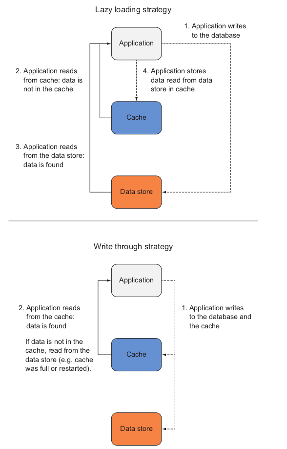
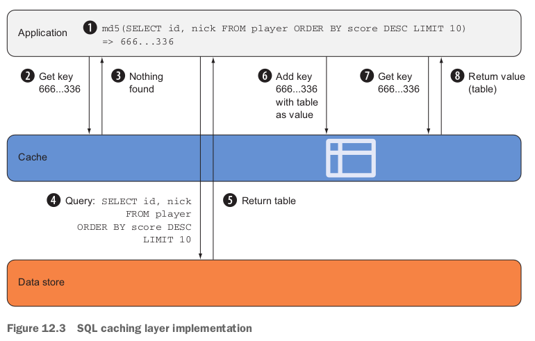
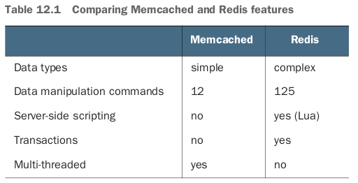
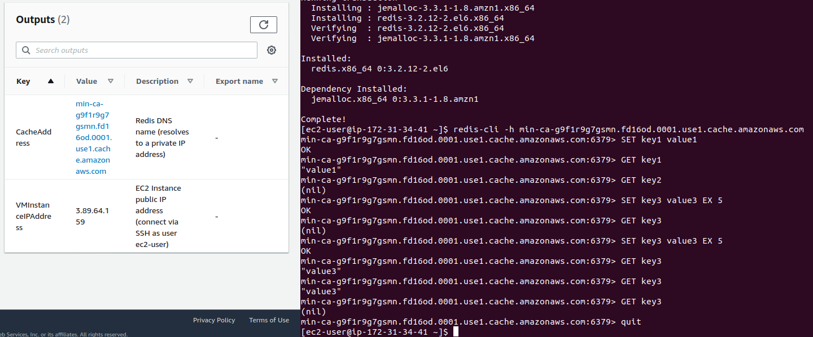
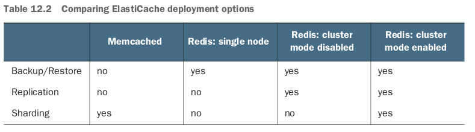
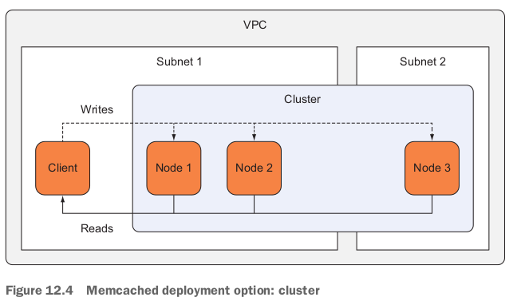
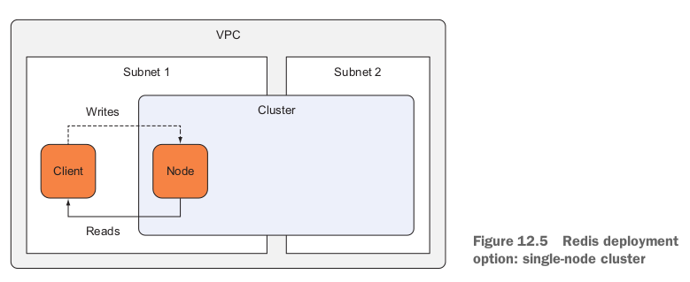
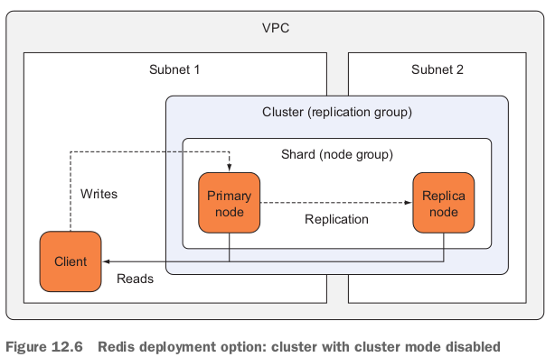
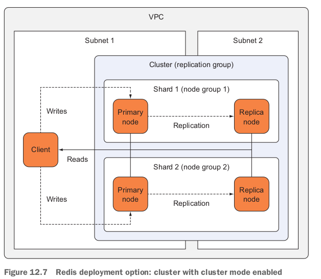
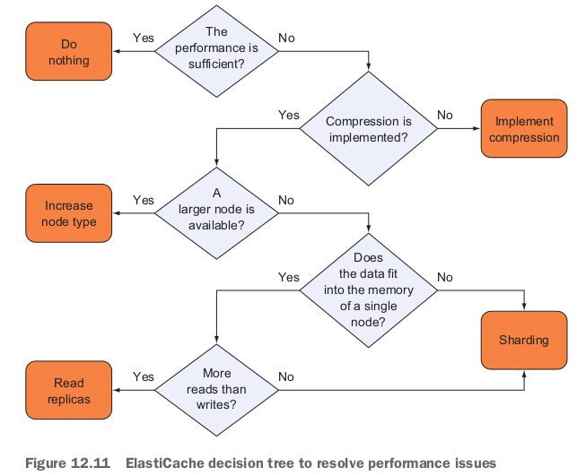

Benefits of a **caching layer between your application and data store**; Terminology like cache cluster, node, shard(破片), replication group, and node group; Using/Operating an **in-memory key-value store**; Performance tweaking and monitoring **ElastiCache clusters**.

- 背景の例：read and write pressure to the database in mobile game.
  - A proven solution used by many gaming companies is leveraging an **in-memory data store such as Redis** for both caching and ranking player and game metadata.

- Cache sits between the application and the database (Data store).

- ２つcaching strategies: 全然OSのCaching strategyと同じ。

  - lazy-loading strategy (getting data on demand). 書き込みはdata storeへだけ。なのでcacheとdata storeの齟齬がでる。
    - The shorter the TTL, the more load you have on your underlying data store.
    - The higher the TTL, the more out of sync the data gets.

  - **write-through** strategy (caching data up front). 書き込みはdata storeやcache両方へ。なのでcacheはいつも最新データを持っている。
    - 課題：What if the cache is not big enough to contain all your data?
    - LRU (least recently used) evictionをやる必要がある。

- **Caches are usually implemented using key-value stores**.

- どんなCacheを使う？(With Redis)
  - Store the result of your SQL query as a String value and the SQL statement as your key name. 
  - Store the data in other data structures such as a **Redis SortedSet**.
    - **If the data is stored in a Redis SortedSet, retrieving the ranked data will be very efficient**.

- **The two most popular implementations of in-memory key-value stores are Memcached and Redis**.
  - Amazon ElastiCache offers both options. 

## 12.1 Creating a cache cluster

### 12.1.1 Minimal CloudFormation template

```yaml
Resources: # minimal.yaml
  CacheSecurityGroup:
    Type: 'AWS::EC2::SecurityGroup'
    Properties:
      GroupDescription: cache
      VpcId: !Ref VPC
      SecurityGroupIngress:
      - IpProtocol: tcp
        FromPort: 6379
        ToPort: 6379
        CidrIp: '0.0.0.0/0'
  CacheSubnetGroup:
    Type: 'AWS::ElastiCache::SubnetGroup'
    Properties:
      Description: cache
      SubnetIds: # list of subnets that can be used by the cluster
      - Ref: SubnetA
      - Ref: SubnetB
  Cache:
    Type: 'AWS::ElastiCache::CacheCluster'
    Properties:
      CacheNodeType: 'cache.t2.micro'
      CacheSubnetGroupName: !Ref CacheSubnetGroup
      Engine: redis
      NumCacheNodes: 1
      VpcSecurityGroupIds:
      - !Ref CacheSecurityGroup
```

- To test the Redis cluster, you can create an EC2 instance **in the same VPC** as the cluster.

### 12.1.2 Test the Redis cluster

```yaml
  VMSecurityGroup: # security group to allow SSH access
    Type: 'AWS::EC2::SecurityGroup'
    Properties:
      GroupDescription: 'vm'
      SecurityGroupIngress:
      - IpProtocol: tcp
        FromPort: 22
        ToPort: 22
        CidrIp: '0.0.0.0/0'
      VpcId: !Ref VPC
  VMInstance:
    Type: 'AWS::EC2::Instance'
    Properties:
      ImageId: !FindInMap [RegionMap, !Ref 'AWS::Region', AMI]
      InstanceType: 't2.micro'
      KeyName: !Ref KeyName
      NetworkInterfaces:
      - AssociatePublicIpAddress: true
        DeleteOnTermination: true
        DeviceIndex: '0'
        GroupSet:
        - !Ref VMSecurityGroup
        SubnetId: !Ref SubnetA
Outputs:
  VMInstanceIPAddress:
    Value: !GetAtt 'VMInstance.PublicIp'
    Description: 'EC2 Instance public IP address (connect via SSH as user ec2-user)'
  CacheAddress:
    Value: !GetAtt 'Cache.RedisEndpoint.Address'
    Description: 'Redis DNS name (resolves to a private IP address)'
```

- 上記のstackを作ったら、sshでEC2に入って：

  - EC2にredis-cliをinstallする必要もある：

    ```bash
    sen@sen-XPS-8930:~/work/aws-in-action/code2/chapter12$ ssh -i ../../mykey.pem ec2-user@3.89.64.159
    [ec2-user@ip-172-31-34-41 ~]$ sudo yum -y install --enablerepo=epel redis
    ```

## 12.2 Cache deployment options

- **Sharding: If the data does not fit on a single node, can you add nodes to increase capacity?** 

### 12.2.1 Memcached: cluster

- An Amazon ElastiCache for a Memcached cluster consists of 1-20 nodes.
- **Sharding is implemented by the Memcached client, typically utilizing a consistent hashing algorithm which arranges keys into partitions in a ring distributed across the nodes**.
- **If a node fails, the node is replaced but the data is lost**. 
- The SQL cache example could be implemented using Memcached.
  - Since the data is always available in the relational database, you can tolerate a node loss, and you only need simple commands (GET, SET) to implement the query cache.

### 12.2.2 Redis: Single-node cluster



### 12.2.3 Redis: Cluster with cluster mode disabled

- There is only one shard consisting of one primary and up to 5 replica nodes. 
- You can use a Redis cluster with cluster mode disabled when you need data replication and **all your cached data fits into the memory of a single node**.

### 12.2.4 Redis: Cluster with cluster mode enabled

- You can have up to **15 shards** per cluster.
- You can use a Redis cluster with cluster node enabled when you need data replication and **your data is too large to fit into the memory of a single node**.
- ElastiCache provides up to 437GB of memory per node, which totals to a maximum cluster capacity of 6.5TB (15 * 437GB). 

## 12.3 Controlling cache access

- 4つlayerで考えられる：IAM (ElastiCache serviceの使用権限だけらしい、cache nodeの訪問権限はcontrolしない), Security groups, cache engine (Redis has the AUTH command, Memcached does not handle authentication. Neither engine supports authorization.), encryption.

### 12.3.1 Controlling access to the configuration

### 12.3.2 Controlling network access

- You create 2 security groups.
  - The client security group will be attached to all EC2 instances communicating with the cache cluster (your web servers).
  - The cache cluster security group allows inbound traffic on port 6379 only for traffic that comes from the client security group.
  - This way you can have **a dynamic fleet of clients** who is allowed to send traffic to the cache cluster.

```yaml
  VMSecurityGroup:
    Type: 'AWS::EC2::SecurityGroup'
    Properties:
      GroupDescription: 'vm'
      SecurityGroupIngress:
      - CidrIp: '0.0.0.0/0'
        FromPort: 22
        IpProtocol: tcp
        ToPort: 22
      - CidrIp: '0.0.0.0/0'
        FromPort: 80
        IpProtocol: tcp
        ToPort: 80
      VpcId: !Ref VPC
  CacheSecurityGroup:
    Type: 'AWS::EC2::SecurityGroup'
    Properties:
      GroupDescription: cache
      VpcId: !Ref VPC
  CacheSecurityGroupIngress:
    Type: 'AWS::EC2::SecurityGroupIngress'
    Properties:
      GroupId: !Ref CacheSecurityGroup
      IpProtocol: tcp
      FromPort: 6379
      ToPort: 6379
      SourceSecurityGroupId: !Ref VMSecurityGroup
```

- Attach the `VMSecurityGroup` to all EC2 instances that need access to the cache cluster.

### 12.3.3 Controlling cluster and data access

## 12.4 Installing the sample application Discourse with CloudFormation

- Discourse is open-source software for providing modern forums for your community.

- Discourse is written in Ruby using the Rails framework.
- Discourse requires PostgreSQL as main data store and uses Redis to cache data and process transient data.
- 構成は４つ：VPC, cache, database, virtual machine.

### 12.4.1 VPC: Network configuration

```yaml
  ##########################################################################
  #                                                                        #
  #                       VPC with two public subnets                      #
  #                                                                        #
  ##########################################################################
  VPC: # create a VPC in the address range 172.31.0.0/16
    Type: 'AWS::EC2::VPC'
    Properties:
      CidrBlock: '172.31.0.0/16'
      EnableDnsHostnames: true
  InternetGateway: # want to access Discourse from internet, so need an internet gateway
    Type: 'AWS::EC2::InternetGateway'
    Properties: {}
  VPCGatewayAttachment: # attach the internet gateway to the VPC.
    Type: 'AWS::EC2::VPCGatewayAttachment'
    Properties:
      VpcId: !Ref VPC
      InternetGatewayId: !Ref InternetGateway
  SubnetA:
    Type: 'AWS::EC2::Subnet'
    Properties:
      AvailabilityZone: !Select [0, !GetAZs '']
      CidrBlock: '172.31.38.0/24'
      VpcId: !Ref VPC
  SubnetB:
    Type: 'AWS::EC2::Subnet'
    Properties:
      AvailabilityZone: !Select [1, !GetAZs '']
      CidrBlock: '172.31.37.0/24'
      VpcId: !Ref VPC
  RouteTable: # create a route table that contains the default route, which routes all subnets in a VPC.
    Type: 'AWS::EC2::RouteTable'
    Properties:
      VpcId: !Ref VPC
  SubnetRouteTableAssociationA: # associate the first subnet with the route table
    Type: 'AWS::EC2::SubnetRouteTableAssociation'
    Properties:
      SubnetId: !Ref SubnetA
      RouteTableId: !Ref RouteTable
  SubnetRouteTableAssociationB:
    Type: 'AWS::EC2::SubnetRouteTableAssociation'
    Properties:
      SubnetId: !Ref SubnetB
      RouteTableId: !Ref RouteTable
  RouteToInternet: # add a route to the internet via the internet gateway
    Type: 'AWS::EC2::Route'
    Properties:
      RouteTableId: !Ref RouteTable
      DestinationCidrBlock: '0.0.0.0/0'
      GatewayId: !Ref InternetGateway
    DependsOn: VPCGatewayAttachment
  NetworkAcl: # create an empty network ACL.
    Type: AWS::EC2::NetworkAcl
    Properties:
      VpcId: !Ref VPC
  SubnetNetworkAclAssociationA: # associate the first subnet with the network ACL.
    Type: 'AWS::EC2::SubnetNetworkAclAssociation'
    Properties:
      SubnetId: !Ref SubnetA
      NetworkAclId: !Ref NetworkAcl
  SubnetNetworkAclAssociationB:
    Type: 'AWS::EC2::SubnetNetworkAclAssociation'
    Properties:
      SubnetId: !Ref SubnetB
      NetworkAclId: !Ref NetworkAcl
  NetworkAclEntryIngress: # allow all incoming traffic on the Network ACL.
    Type: 'AWS::EC2::NetworkAclEntry'
    Properties:
      NetworkAclId: !Ref NetworkAcl
      RuleNumber: 100
      Protocol: -1
      RuleAction: allow
      Egress: false
      CidrBlock: '0.0.0.0/0'
  NetworkAclEntryEgress: # allow all outgoing traffic on the Network ACL.
    Type: 'AWS::EC2::NetworkAclEntry'
    Properties:
      NetworkAclId: !Ref NetworkAcl
      RuleNumber: 100
      Protocol: -1
      RuleAction: allow
      Egress: true
      CidrBlock: '0.0.0.0/0'
```

- **Network ACLs restrict traffic that goes from one subnet to another, acting as a firewall**. (p190)
- route tableはpackageをどうやってrouteするかを決める。ACLはどこからどこまでどのport経由のtrafficが許されるかを決める。

### 12.4.2 Cache: Security group, subnet group, cache cluster

```yaml
  ##########################################################################
  #                                                                        #
  #                                 Cache                                  #
  #                                                                        #
  ##########################################################################
  CacheSecurityGroup: # the security group to control incoming and outgoing traffic to/from the cache
    Type: 'AWS::EC2::SecurityGroup'
    Properties:
      GroupDescription: cache
      VpcId: !Ref VPC
  CacheSecurityGroupIngress:
    Type: 'AWS::EC2::SecurityGroupIngress'
    Properties:
      GroupId: !Ref CacheSecurityGroup
      IpProtocol: tcp
      FromPort: 6379
      ToPort: 6379
      SourceSecurityGroupId: !Ref VMSecurityGroup
  Cache:
    Type: 'AWS::ElastiCache::CacheCluster'
    Properties:
      CacheNodeType: 'cache.t2.micro'
      CacheSubnetGroupName: !Ref CacheSubnetGroup
      Engine: redis
      EngineVersion: '3.2.4'
      NumCacheNodes: 1
      VpcSecurityGroupIds:
      - !Ref CacheSecurityGroup
  CacheSubnetGroup: # the cache subnet group references the VPC subnets.
    Type: 'AWS::ElastiCache::SubnetGroup'
    Properties:
      Description: cache
      SubnetIds:
      - Ref: SubnetA
      - Ref: SubnetB
```

### 12.4.3 Database: Security group, subnet group, database instance

```yaml
  ##########################################################################
  #                                                                        #
  #                                Database                                #
  #                                                                        #
  ##########################################################################
  DatabaseSecurityGroup: # traffic to/from the RDS instance is protected by a security group
    Type: 'AWS::EC2::SecurityGroup'
    Properties:
      GroupDescription: database
      VpcId: !Ref VPC
  DatabaseSecurityGroupIngress:
    Type: 'AWS::EC2::SecurityGroupIngress'
    Properties:
      GroupId: !Ref DatabaseSecurityGroup
      IpProtocol: tcp
      FromPort: 5432
      ToPort: 5432
      SourceSecurityGroupId: !Ref VMSecurityGroup
  Database:
    Type: 'AWS::RDS::DBInstance'
    DeletionPolicy: Delete # For AWS::RDS::DBInstance resources that don't specify the DBClusterIdentifier property, the default policy is Snapshot which can cause unwanted costs. However, for production setups, we highly recommend to stay with the default to avoid data loss.
    Properties:
      AllocatedStorage: '5'
      BackupRetentionPeriod: 0
      DBInstanceClass: 'db.t2.micro'
      DBName: discourse
      Engine: postgres
      EngineVersion: '9.5.6'
      MasterUsername: discourse
      MasterUserPassword: discourse
      VPCSecurityGroups:
      - !Sub ${DatabaseSecurityGroup.GroupId}
      DBSubnetGroupName: !Ref DatabaseSubnetGroup
    DependsOn: VPCGatewayAttachment
  DatabaseSubnetGroup: # RDS also uses a subnet group to reference the VPC subnets.
    Type: 'AWS::RDS::DBSubnetGroup'
    Properties:
      DBSubnetGroupDescription: database
      SubnetIds:
      - Ref: SubnetA
      - Ref: SubnetB
```

### 12.4.4 Virtual machine - security group, EC2 instance

```yaml
  ##########################################################################
  #                                                                        #
  #                            Virtual machine                             #
  #                                                                        #
  ##########################################################################
  VMSecurityGroup:
    Type: 'AWS::EC2::SecurityGroup'
    Properties:
      GroupDescription: 'vm'
      SecurityGroupIngress:
      - CidrIp: '0.0.0.0/0'
        FromPort: 22
        IpProtocol: tcp
        ToPort: 22
      - CidrIp: '0.0.0.0/0' # allow HTTP traffic from the public internet.
        FromPort: 80
        IpProtocol: tcp
        ToPort: 80
      VpcId: !Ref VPC
  VMInstance: # the virtual machine that runs Discourse
    Type: 'AWS::EC2::Instance'
    Properties:
      ImageId: !FindInMap [RegionMap, !Ref 'AWS::Region', AMI]
      InstanceType: 't2.micro'
      KeyName: !Ref KeyName
      NetworkInterfaces:
      - AssociatePublicIpAddress: true
        DeleteOnTermination: true
        DeviceIndex: '0'
        GroupSet:
        - !Ref VMSecurityGroup
        SubnetId: !Ref SubnetA
      UserData:
        'Fn::Base64': !Sub |
          #!/bin/bash -x
          bash -ex << "TRY"
            # t2.micro may not have enough memory, so we add a 512MB swapfile
            dd if=/dev/zero of=/swapfile1 bs=1024 count=524288
            chmod 0600 /swapfile1
            mkswap /swapfile1
            swapon /swapfile1
            echo "/swapfile1 none swap sw 0 0" >> /etc/fstab

            # get public IP address of this EC2 instance
            PUBLICIP="$(curl -s -m 60 http://169.254.169.254/latest/meta-data/public-ipv4)"

            # install packages
            yum -y group install "Development Tools"
            yum -y install git zlib-devel postgresql95-devel libyaml-devel ImageMagick ruby23-devel nginx
            yum -y install --enablerepo=epel optipng jhead jpegoptim gifsicle libjpeg-turbo-utils
            update-alternatives --set ruby /usr/bin/ruby2.3
            gem install bundler -v "< 2.0, >= 1.3.0" --no-ri --no-rdoc

            # download Discourse
            useradd discourse
            mkdir /opt/discourse
            git clone https://github.com/AWSinAction/discourse.git /opt/discourse

            # configure Discourse
            echo "gem 'psych', '~> 3.1'" >> /opt/discourse/Gemfile
            echo "gem 'json', '~> 2.3'" >> /opt/discourse/Gemfile
            echo "gem 'bigdecimal', '~> 1.4', '>= 1.4.4'" >> /opt/discourse/Gemfile
            echo "db_host = \"${Database.Endpoint.Address}\"" > /opt/discourse/config/discourse.conf
            echo "db_password = \"discourse\"" >> /opt/discourse/config/discourse.conf
            echo "redis_host = \"${Cache.RedisEndpoint.Address}\"" >> /opt/discourse/config/discourse.conf
            echo "hostname = \"$PUBLICIP\"" >> /opt/discourse/config/discourse.conf
            echo "serve_static_assets = true" >> /opt/discourse/config/discourse.conf
            echo "developer_emails = \"${AdminEmailAddress}\"" >> /opt/discourse/config/discourse.conf
            echo "notification_email = \"${AdminEmailAddress}\"" >> /opt/discourse/config/discourse.conf
            echo "smtp_address = \"localhost\"" >> /opt/discourse/config/discourse.conf
            echo "smtp_port = 25" >> /opt/discourse/config/discourse.conf
            echo "smtp_enable_start_tls = false" >> /opt/discourse/config/discourse.conf
            echo "smtp_openssl_verify_mode = none" >> /opt/discourse/config/discourse.conf
            sed -i 's/development:/production:/g' /opt/discourse/config/sidekiq.yml
            chown -R discourse:discourse /opt/discourse

            # prepare Discourse
            runuser -l discourse -c 'cd /opt/discourse && bundle install'
            runuser -l discourse -c 'cd /opt/discourse && RAILS_ENV=production bundle exec rake db:migrate'
            runuser -l discourse -c 'cd /opt/discourse && RAILS_ENV=production bundle exec rake assets:precompile'

            # start Discourse
            runuser -l discourse -c 'cd /opt/discourse && RAILS_ENV=production bundle exec sidekiq -L log/sidekiq.log -e production -d'
            runuser -l discourse -c 'cd /opt/discourse && RAILS_ENV=production bundle exec rails s -d'

            # configure Nginx to forward port 80 to 3000
            echo "server {" > /etc/nginx/conf.d/discourse.conf
            echo "  listen 80;" >> /etc/nginx/conf.d/discourse.conf
            echo "  server_name $PUBLICIP;" >> /etc/nginx/conf.d/discourse.conf
            echo "  location / {" >> /etc/nginx/conf.d/discourse.conf
            echo "    proxy_pass http://127.0.0.1:3000;" >> /etc/nginx/conf.d/discourse.conf
            echo "  }" >> /etc/nginx/conf.d/discourse.conf
            echo "}" >> /etc/nginx/conf.d/discourse.conf

            # start Nginx
            service nginx start
          TRY
          /opt/aws/bin/cfn-signal -e $? --stack ${AWS::StackName} --resource VMInstance --region ${AWS::Region}
    CreationPolicy:
      ResourceSignal:
        Timeout: PT15M # wait up to 15 minutes for the signal from the install script in UserData.
    DependsOn:
    - VPCGatewayAttachment
```

### 12.4.5 Testing the CloudFormation template for Discourse

- 上記stackを作って、EC2のpublic IPにアクセスすると：
- activationメール来ない。。。

## 12.5 Monitoring a cache

- 大事なmetricは`CPUUtilization`, `SwapUsage`, `Evictions` (The number of **non-expired** items the cache evicted due to the memory limit), `ReplicationLag`.

### 12.5.1 Monitoring host-level metrics

- Queuing theory: why 80-90%?
  - It turns out that wait time is exponential to the utilization of a resource.
  - Assume an M/D/1 queuing system: Markovian arrivals (exponentially distributed arrival times), deterministic service times (fixed), one service center.
  - 0% -> 60% (double) -> 80% (triple) -> 90% (six times).

### 12.5.2 Is my memory sufficient?

- Usually, high eviction rates are a sign that you either aren't using a TTL to expire keys after some time, or that your cache is too small.

### 12.5.3 Is my Redis replication up-to-date?

- **read replica**の場合だけ問題になる。つまりprimary nodeやreplica node共にread requestを担当する。

- The `ReplicationLag` is 600, which means that the replication node looks like the primary node looked 10 minutes before.

## 12.6 Tweaking cache performance



### 12.6.1 Selecting the right cache node type

- Keep in mind that **Redis is single-threaded and will not use all cores**.
- As a rule of thumb: for production traffic, select a cache node type with at least 2 vCPUs for real concurrency, enough memory to hold your data set with some space to grow (say 20%; this also avoids memory fragmentation), and at least high network performance.

### 12.6.2 Selecting the right deployment option

- Replication also increases the availability at the same time (at no extra costs).

### 12.6.3 Compressing your data

### 復習

- To keep the cache in sync with the database, items usually expire after some time, or a write-through strategy is used.
- Memcached and Redis are open source, but AWS added engine-level enhancements.