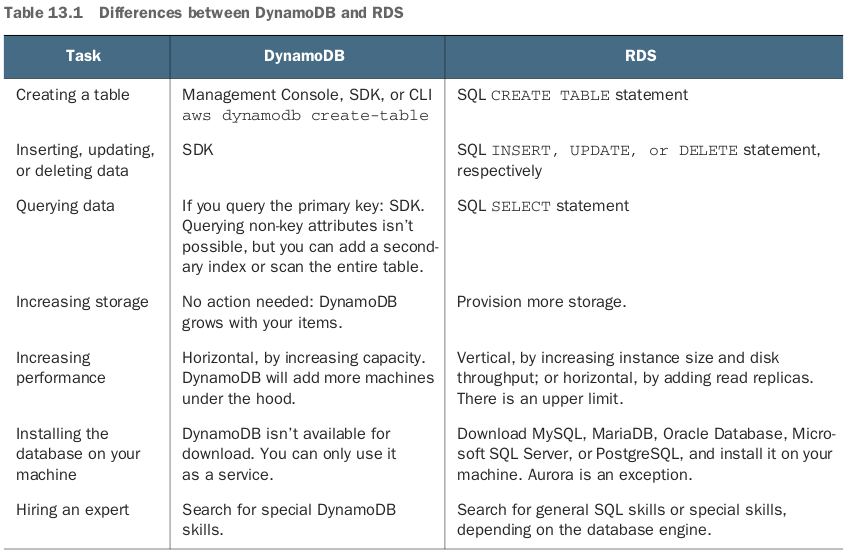
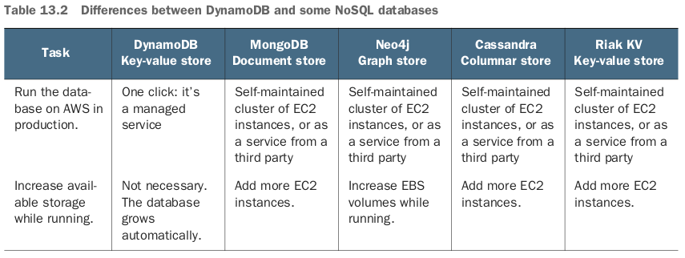
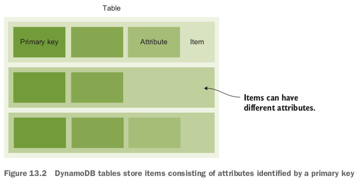
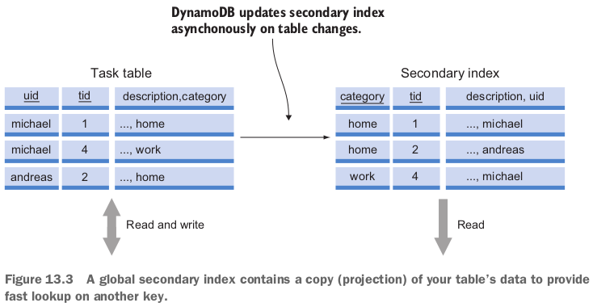
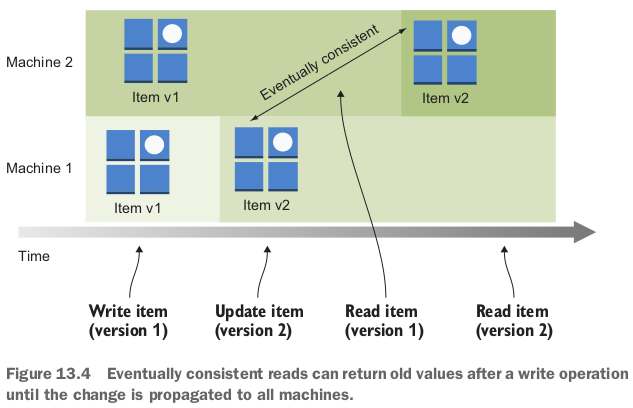
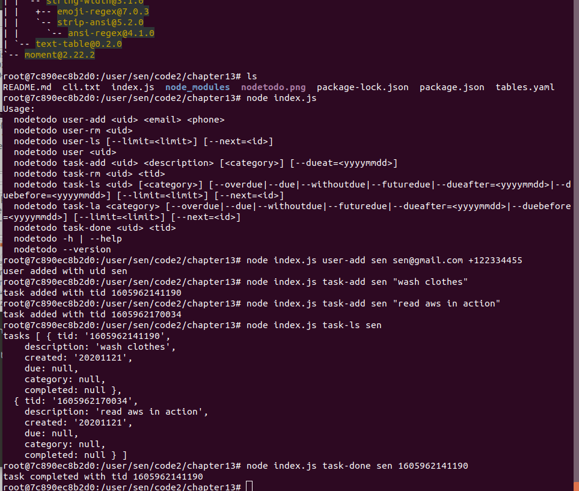

**Adding secondary indexes to optimize data retrieval**; Designing a data model optimized for a key-value database.

- Horizontal scalingの課題：transaction guaranteeが難しい。
  - 2フェーズコミット：コミット要求フェーズ、コミットフェーズ。（Wikipediaから）
  - 2フェーズコミット：コンピュータネットワークやデータベースにおいて、分散システム内の全ノードがトランザクションのコミットに合意するための分散アルゴリズムあるいはプロトコルである。
  - コミットフェーズ：
    - 調整者が全参加者から「合意」メッセージを受け取った場合：調整者は全参加者に「コミットせよ」というメッセージを送る。
    - 「停止」メッセージで応答した参加者がいた場合：調整者は全参加者に「ロールバックせよ」というメッセージを送る。
  - 2フェーズコミットの最大の欠点は、ブロックする可能性があることである。

- つまりコミットは全nodesに対して行うよね？

- The problem is that the more nodes you add, the slower your database becomes, because more nodes must coordinate transactions between each other.
  - The way to tackle this has been to **use databases that don't adhere to these guarantees**.
  - **They're called *NoSQL* databases**.

- There are 4 types of NoSQL databases - **document, graph, columnar, and key-value store** - each with its own uses and applications.
  - Amazon provides a NoSQL database service called DynamoDB, a key-value store **with document support**.

## 13.1 Operating DynamoDB

### 13.1.3 Networking

- DynamoDB does not run in your VPC.
  - It is only accessible via the AWS API.
  - You need internet access to talk to the AWS API.

- 良いapproach: set up a VPC endpoint for DynamoDB and use that to access DynamoDB from private subnets without needing a NAT gateway at all. https://docs.aws.amazon.com/amazondynamodb/latest/developerguide/vpc-endpoints-dynamodb.html

### 13.1.4 RDS comparison



### 13.1.5 NoSQL comparison



## 13.2 DynamoDB for developers

### 13.2.1 Tables, items, and attributes



- If you plan to run multiple applications that use DynamoDB, it's good practice to prefix your tables with the name of your application.
  - Keep in mind that your can't change the name of a table or its key schema later.
  - But you can add attribute definitions and change the throughput at any time.

### 13.2.2 Primary key (大事な知識)

- You can use a single attribute as the primary key.
  - DynamoDB calls this a partition key.

- You can also use two attributes as the primary key.
  - In this case, one of the attributes is the partition key, and the other is called the **sort key**.
  - To look up an item, you need to know its exact partition key, but you don't need to know the sort key.
  - The partition key can only be queried using exact matches (=).
  - The sort key can be queried using =, >, <, >=, <=, and BETWEEN x AND y operators.
  - You cannot query only the sort key - you must always specify the partition key.

### 13.2.3 DynamoDB Local

## 13.3 Programming a to-do application

- To implement an intuitive CLI, nodetodo uses *docopt*, a command-line interface description language, to describe the CLI interface.

- You'll access DynamoDB with an SDK to call the HTTPS REST API.

- To use DynamoDB, you need to write code.

- command-line interfaceの設計：

  ```bash
  sen@sen-XPS-8930:~/work/aws-in-action/code2/chapter13$ cat cli.txt 
  nodetodo
  
  Usage:
    nodetodo user-add <uid> <email> <phone>
    nodetodo user-rm <uid>
    nodetodo user-ls [--limit=<limit>] [--next=<id>]
    nodetodo user <uid>
    nodetodo task-add <uid> <description> [<category>] [--dueat=<yyyymmdd>] 
    nodetodo task-rm <uid> <tid>
    nodetodo task-ls <uid> [<category>] [--overdue|--due|--withoutdue|--futuredue|--dueafter=<yyyymmdd>|--duebefore=<yyyymmdd>] [--limit=<limit>] [--next=<id>]
    nodetodo task-la <category> [--overdue|--due|--withoutdue|--futuredue|--dueafter=<yyyymmdd>|--duebefore=<yyyymmdd>] [--limit=<limit>] [--next=<id>]
    nodetodo task-done <uid> <tid>
    nodetodo -h | --help
    nodetodo --version
  
  Options:
    -h --help        Show this screen.
    --version        Show version.
    --limit=<limit>  Maximum number of results [default: 10].
  ```

## 13.4 Creating tables

### 13.4.1 Users are identified by a partition key

- To choose a primary key, you have to think about the queries you'll make in the future and whether there is something unique about your data items.

- Users will have a unique ID, called `uid`, so it makes sense to choose the `uid` attribute as the partition key.

- user tableを作る：

  ```bash
  sen@sen-XPS-8930:~/work/aws-in-action/code2/chapter13$ aws dynamodb create-table --table-name todo-user --attribute-definitions AttributeName=uid,AttributeType=S --key-schema AttributeName=uid,KeyType=HASH --provisioned-throughput ReadCapacityUnits=5,WriteCapacityUnits=5
  {
      "TableDescription": {
          "AttributeDefinitions": [
              {
                  "AttributeName": "uid",
                  "AttributeType": "S"
              }
          ],
          "TableName": "todo-user",
          "KeySchema": [
              {
                  "AttributeName": "uid",
                  "KeyType": "HASH"
              }
          ],
          "TableStatus": "CREATING",
          "CreationDateTime": 1605933211.324,
          "ProvisionedThroughput": {
              "NumberOfDecreasesToday": 0,
              "ReadCapacityUnits": 5,
              "WriteCapacityUnits": 5
          },
          "TableSizeBytes": 0,
          "ItemCount": 0,
          "TableArn": "arn:aws:dynamodb:us-east-1:719326062820:table/todo-user",
          "TableId": "8e1d7131-3db5-42ea-905f-10cc32de589a"
      }
  }
  sen@sen-XPS-8930:~/work/aws-in-action/code2/chapter13$ aws dynamodb describe-table --table-name todo-user{
      "Table": {
          "AttributeDefinitions": [
              {
                  "AttributeName": "uid",
                  "AttributeType": "S"
              }
          ],
          "TableName": "todo-user",
          "KeySchema": [
              {
                  "AttributeName": "uid",
                  "KeyType": "HASH"
              }
          ],
          "TableStatus": "ACTIVE",
          "CreationDateTime": 1605933211.324,
          "ProvisionedThroughput": {
              "NumberOfDecreasesToday": 0,
              "ReadCapacityUnits": 5,
              "WriteCapacityUnits": 5
          },
          "TableSizeBytes": 0,
          "ItemCount": 0,
          "TableArn": "arn:aws:dynamodb:us-east-1:719326062820:table/todo-user",
          "TableId": "8e1d7131-3db5-42ea-905f-10cc32de589a"
      }
  }
  ```

### 13.4.2 Tasks are identified by a partition key and sort key

- Because all interactions with tasks require the user's ID, you can choose `uid` as the partition key and a task ID (`tid`), the timestamp of creation, as the sort key.

- task tableを作る：

  ```bash
  sen@sen-XPS-8930:~/work/aws-in-action/code2/chapter13$ aws dynamodb create-table --table-name todo-task --attribute-definitions AttributeName=uid,AttributeType=S AttributeName=tid,AttributeType=N --key-schema AttributeName=uid,KeyType=HASH AttributeName=tid,KeyType=RANGE --provisioned-throughput ReadCapacityUnits=5,WriteCapacityUnits=5
  {
      "TableDescription": {
          "AttributeDefinitions": [
              {
                  "AttributeName": "tid",
                  "AttributeType": "N"
              },
              {
                  "AttributeName": "uid",
                  "AttributeType": "S"
              }
          ],
          "TableName": "todo-task",
          "KeySchema": [
              {
                  "AttributeName": "uid",
                  "KeyType": "HASH"
              },
              {
                  "AttributeName": "tid",
                  "KeyType": "RANGE"
              }
          ],
          "TableStatus": "CREATING",
          "CreationDateTime": 1605934705.904,
          "ProvisionedThroughput": {
              "NumberOfDecreasesToday": 0,
              "ReadCapacityUnits": 5,
              "WriteCapacityUnits": 5
          },
          "TableSizeBytes": 0,
          "ItemCount": 0,
          "TableArn": "arn:aws:dynamodb:us-east-1:719326062820:table/todo-task",
          "TableId": "332bc897-8f94-452d-a88b-4ca51db665b4"
      }
  }
  ```

## 13.5 Adding data

- またnode.jsを使う。以前作ったnode.jsのdocker imageをまた使えるぞ！

- Node.jsにdocoptを使う（command-line interfaceを利用するため）：

  ```javascript
  const fs = require('fs');
  const docopt = require('docopt');
  const moment = require('moment');
  const AWS = require('aws-sdk');
  const db = new AWS.DynamoDB({
    region: 'us-east-1'
  });
  
  const cli = fs.readFileSync('./cli.txt', {encoding: 'utf8'});
  const input = docopt.docopt(cli, {
    version: '1.0',
    argv: process.argv.splice(2)
  });
  ```

- DynamoDBの`putItem`関数でadd data, 例えば`user-add` commandの実現に:

  ```javascript
  if (input['user-add'] === true) {
    const params = {
      Item: {
        uid: {S: input['<uid>']},
        email: {S: input['<email>']},
        phone: {S: input['<phone>']}
      },
      TableName: 'todo-user',
      ConditionExpression: 'attribute_not_exists(uid)'
    };
    db.putItem(params, (err) => {
      if (err) {
        console.error('error', err);
      } else {
        console.log('user added with uid ' + input['<uid>']);
      }
    });
  }
  ```

### 13.5.1 Adding a user

`nodetodo user-add <uid> <email> <phone>`. 上のコード。

- `ConditionExpression`の部分の意味：allow the putItem only if the key isn't yet present.
- When you make a call to the AWS API, you always do the following:
  - Create a JavaScript object (map) filled with the needed parameters (the params variable).
  - Invoke the function on the AWS SDK.
  - Check whether the response contains an error, and if not, process the returned data.

### 13.5.2 Adding a task

`nodetodo task-add <uid> <description> [<category>] [--dueat=<yyyymmdd>]`.

```javascript
else if (input['task-add'] === true) {
  const tid = Date.now();
  const params = {
    Item: {
      uid: {S: input['<uid>']},
      tid: {N: tid.toString()},
      description: {S: input['<description>']},
      created: {N: moment(tid).format('YYYYMMDD')}
    },
    TableName: 'todo-task',
    ConditionExpression: 'attribute_not_exists(uid) and attribute_not_exists(tid)'
  };
  if (input['--dueat'] !== null) {
    params.Item.due = {N: input['--dueat']};
  }
  if (input['<category>'] !== null) {
    params.Item.category = {S: input['<category>']};
  }
  db.putItem(params, (err) => {
    if (err) {
      console.error('error', err);
    } else {
      console.log('task added with tid ' + tid);
    }
  });
} 
```

## 13.6 Retrieving data

- If you can use only one key to look up data, you'll sooner or later experience difficulties.
  - Luckily, DynamoDB provides 2 other ways to look up items: a secondary index key lookup, and the scan operation.

### 13.6.1 Getting an item by key

`user <uid>`.

```javascript
const mapUserItem = (item) => {
  return {
    uid: item.uid.S,
    email: item.email.S,
    phone: item.phone.S
  };
};

else if (input['user'] === true) {
  const params = {
    Key: {
      uid: {S: input['<uid>']}
    },
    TableName: 'todo-user'
  };
  db.getItem(params, (err, data) => {
    if (err) {
      console.error('error', err);
    } else {
      if (data.Item) {
        console.log('user with uid ' + input['<uid>'], mapUserItem(data.Item));
      } else {
        console.error('user with uid ' + input['<uid>'] + ' not found');
      }
    }
  });
}
```

### 13.6.2 Querying items by key and filter

`nodetodo task-ls <uid> [<category>] [--overdue|--due|--withoutdue|--futuredue|--dueafter=<yyyymmdd>|--duebefore=<yyyymmdd>] [--limit=<limit>] [--next=<id>]`.

- If you want to retrieve **a collection of items** rather than a single item, such as all tasks for a user, you must query DynamoDB. つまり`GetItem`は使えなくなる。
- The syntax of `FilterExpression` works like `KeyConditionExpression`, but no index is used for filters. indexというのは多分keyのことだよね？key以外のattributeを使うということ？
  - Filters are applied to all matches that `KeyConditionExpression` returns.

```javascript
const getValue = (attribute, type) => {
  if (attribute === undefined) {
    return null;
  }
  return attribute[type];
};

const mapTaskItem = (item) => {
  return {
    tid: item.tid.N,
    description: item.description.S,
    created: item.created.N,
    due: getValue(item.due, 'N'),
    category: getValue(item.category, 'S'),
    completed: getValue(item.completed, 'N')
  };
};

else if (input['task-ls'] === true) {
  const yyyymmdd = moment().format('YYYYMMDD');
  const params = {
    KeyConditionExpression: 'uid = :uid',
    ExpressionAttributeValues: {
      ':uid': {S: input['<uid>']}
    },
    TableName: 'todo-task',
    Limit: input['--limit']
  };
  if (input['--next'] !== null) {
    params.KeyConditionExpression += ' AND tid > :next';
    params.ExpressionAttributeValues[':next'] = {N: input['--next']};
  }
  if (input['--overdue'] === true) {
    // Filtering uses no index; it's applied over all elements returned from the primary key query.
    params.FilterExpression = 'due < :yyyymmdd';
    params.ExpressionAttributeValues[':yyyymmdd'] = {N: yyyymmdd};
  } else if (input['--due'] === true) {
    params.FilterExpression = 'due = :yyyymmdd';
    params.ExpressionAttributeValues[':yyyymmdd'] = {N: yyyymmdd};
  } else if (input['--withoutdue'] === true) {
    params.FilterExpression = 'attribute_not_exists(due)';
  } else if (input['--futuredue'] === true) {
    params.FilterExpression = 'due > :yyyymmdd';
    params.ExpressionAttributeValues[':yyyymmdd'] = {N: yyyymmdd};
  } else if (input['--dueafter'] !== null) {
    params.FilterExpression = 'due > :yyyymmdd';
    params.ExpressionAttributeValues[':yyyymmdd'] = {N: input['--dueafter']};
  } else if (input['--duebefore'] !== null) {
    params.FilterExpression = 'due < :yyyymmdd';
    params.ExpressionAttributeValues[':yyyymmdd'] = {N: input['--duebefore']};
  }
  if (input['<category>'] !== null) {
    if (params.FilterExpression === undefined) {
      params.FilterExpression = '';
    } else {
      params.FilterExpression += ' AND ';
    }
    params.FilterExpression += 'category = :category';
    params.ExpressionAttributeValues[':category'] = {S: input['<category>']};
  }
  db.query(params, (err, data) => {
    if (err) {
      console.error('error', err);
    } else {
      console.log('tasks', data.Items.map(mapTaskItem));
      if (data.LastEvaluatedKey !== undefined) {
        console.log('more tasks available with --next=' + data.LastEvaluatedKey.tid.N);
      }
    }
  });
}
```

- 上記queryの課題：
  - Depending on the result size from the primary key query, filtering may be slow.
  - You can only query the primary key. 
    - Returning a list of all tasks that belong to a certain category for all users isn't possible, because you can't query the `category` attribute.

- You can solve these problems with secondary indexes.

### 13.6.3 Using global secondary indexes for more flexible queries (大事な知識)

- A *global secondary index* is a **projection** of your original table that is automatically maintained by DynamoDB.
  - **Items in an index don't have a primary key, just a key**.
  - **This key is not necessarily unique within the index**.
  - Imagine a table of users where each user has a country attribute. You then create a global secondary index where the country is the new partition key. As you can see, many users can live in the same country, so that key is not unique in the index.

- You can imagine a global secondary index as a **read-only DynamoDB table** that is automatically maintained by DynamoDB: **whenever you change the parent table, all indexes are asynchronously (eventually consistent!) updated** as well. 
- You must provision additional write-capacity units for the index as well, because a write to your table will cause a write to the global secondary index as well.

- Local secondary indexも存在。
  - A local secondary index must use the same partition key as the table.
  - You can only vary on the attribute that is used as the sort key.

- **To implement the retrieval of tasks by category, you'll add a secondary index to the `todo-task` table**.

  - **A partition key and sort key are used: the partition key is the `category` attribute, and the sort key is the `tid` attribute**.

  - **The index also needs a name: `category-index`**.

    ```bash
    root@7c890ec8b2d0:/user/sen/code2/chapter13# aws dynamodb update-table --table-name todo-task --attribute-definitions AttributeName=uid,AttributeType=S AttributeName=tid,AttributeType=N AttributeName=category,AttributeType=S --global-secondary-index-updates '[{"Create": {"IndexName": "category-index", "KeySchema": [{"AttributeName": "category", "KeyType": "HASH"}, {"AttributeName": "tid", "KeyType": "RANGE"}], "Projection": {"ProjectionType": "ALL"}, "ProvisionedThroughput": {"ReadCapacityUnits": 5, "WriteCapacityUnits": 5}}}]'
    {
        "TableDescription": {
            "TableArn": "arn:aws:dynamodb:us-east-1:719326062820:table/todo-task", 
            "AttributeDefinitions": [
                {
                    "AttributeName": "category", 
                    "AttributeType": "S"
                }, 
                {
                    "AttributeName": "tid", 
                    "AttributeType": "N"
                }, 
                {
                    "AttributeName": "uid", 
                    "AttributeType": "S"
                }
            ], 
            "GlobalSecondaryIndexes": [
                {
                    "IndexSizeBytes": 0, 
                    "IndexName": "category-index", 
                    "Projection": {
                        "ProjectionType": "ALL"
                    }, 
                    "ProvisionedThroughput": {
                        "NumberOfDecreasesToday": 0, 
                        "WriteCapacityUnits": 5, 
                        "ReadCapacityUnits": 5
                    }, 
                    "IndexStatus": "CREATING", 
                    "Backfilling": false, 
                    "KeySchema": [
                        {
                            "KeyType": "HASH", 
                            "AttributeName": "category"
                        }, 
                        {
                            "KeyType": "RANGE", 
                            "AttributeName": "tid"
                        }
                    ], 
                    "IndexArn": "arn:aws:dynamodb:us-east-1:719326062820:table/todo-task/index/category-index", 
                    "ItemCount": 0
                }
            ], 
            "ProvisionedThroughput": {
                "NumberOfDecreasesToday": 0, 
                "WriteCapacityUnits": 5, 
                "ReadCapacityUnits": 5
            }, 
            "TableSizeBytes": 0, 
            "TableName": "todo-task", 
            "TableStatus": "UPDATING", 
            "TableId": "332bc897-8f94-452d-a88b-4ca51db665b4", 
            "KeySchema": [
                {
                    "KeyType": "HASH", 
                    "AttributeName": "uid"
                }, 
                {
                    "KeyType": "RANGE", 
                    "AttributeName": "tid"
                }
            ], 
            "ItemCount": 0, 
            "CreationDateTime": 1605934705.904
        }
    }
    ```

- `nodetodo task-la <category> [--overdue|--due|--withoutdue|--futuredue|--dueafter=<yyyymmdd>|--duebefore=<yyyymmdd>] [--limit=<limit>] [--next=<id>]`.

  ```javascript
  else if (input['task-la'] === true) {
    const yyyymmdd = moment().format('YYYYMMDD');
    const params = {
      // A query against an index works the same as a query against a table...
      KeyConditionExpression: 'category = :category',
      ExpressionAttributeValues: {
        ':category': {S: input['<category>']}
      },
      TableName: 'todo-task',
      // ...but you must specify the index you want to use.
      IndexName: 'category-index',
      Limit: input['--limit']
    };
    if (input['--next'] !== null) {
      params.KeyConditionExpression += ' AND tid > :next';
      params.ExpressionAttributeValues[':next'] = {N: input['--next']};
    }
    if (input['--overdue'] === true) {
      params.FilterExpression = 'due < :yyyymmdd';
      params.ExpressionAttributeValues[':yyyymmdd'] = {N: yyyymmdd};
    } else if (input['--due'] === true) {
      params.FilterExpression = 'due = :yyyymmdd';
      params.ExpressionAttributeValues[':yyyymmdd'] = {N: yyyymmdd};
    } else if (input['--withoutdue'] === true) {
      params.FilterExpression = 'attribute_not_exists(due)';
    } else if (input['--futuredue'] === true) {
      params.FilterExpression = 'due > :yyyymmdd';
      params.ExpressionAttributeValues[':yyyymmdd'] = {N: yyyymmdd};
    } else if (input['--dueafter'] !== null) {
      params.FilterExpression = 'due > :yyyymmdd';
      params.ExpressionAttributeValues[':yyyymmdd'] = {N: input['--dueafter']};
    } else if (input['--duebefore'] !== null) {
      params.FilterExpression = 'due < :yyyymmdd';
      params.ExpressionAttributeValues[':yyyymmdd'] = {N: input['--duebefore']};
    }
    db.query(params, (err, data) => {
      if (err) {
        console.error('error', err);
      } else {
        console.log('tasks', data.Items.map(mapTaskItem));
        if (data.LastEvaluatedKey !== undefined) {
          console.log('more tasks available with --next=' + data.LastEvaluatedKey.tid.N);
        }
      }
    });
  }
  ```

- But there are still situations where a query doesn't work: **you can't retrieve all users**. `scan`.

### 13.6.4 Scanning and filtering all of your table's data

- DynamoDB provides the `scan` operation to scan all items in a table: `nodetodo user-ls [--limit=<limit>] [--next=<id>]` 

  ```javascript
  else if (input['user-ls'] === true) {
    const params = {
      TableName: 'todo-user',
      Limit: input['--limit'] // specify the maximum number of items to return.
    };
    if (input['--next'] !== null) {
      params.ExclusiveStartKey = { // the named parameter next contains the last evaluated key.
        uid: {S: input['--next']}
      };
    }
    db.scan(params, (err, data) => {
      if (err) {
        console.error('error', err);
      } else {
        console.log('users', data.Items.map(mapUserItem));
        if (data.LastEvaluatedKey !== undefined) { // check whether there are more items that can be scanned.
          console.log('more users available with --next=' + data.LastEvaluatedKey.uid.S);
        }
      }
    });
  }
  ```

- Note that you shouldn't use the `scan` operation too often - it's flexible but not efficient.

### 13.6.5 Eventually consistent data retrieval

- You can't modify (create, update, delete) multiple documents in a single transaction - the atomic unit in DynamoDB is a single item (a partition key).
- またeventually consistent: 
- Reads from a global secondary index are always eventually consistent because the index itself is eventually consistent.

## 13.7 Removing data

`nodetodo user-rm <uid>`.

```javascript
else if (input['user-rm'] === true) {
  const params = {
    Key: {
      uid: {S: input['<uid>']}
    },
    TableName: 'todo-user'
  };
  db.deleteItem(params, (err) => {
    if (err) {
      console.error('error', err);
    } else {
      console.log('user removed with uid ' + input['<uid>']);
    }
  });
}
```

`nodetodo task-rm <uid> <tid>`.

```javascript
else if (input['task-rm'] === true) {
  const params = {
    Key: {
      uid: {S: input['<uid>']},
      tid: {N: input['<tid>']}
    },
    TableName: 'todo-task'
  };
  db.deleteItem(params, (err) => {
    if (err) {
      console.error('error', err);
    } else {
      console.log('task removed with tid ' + input['<tid>']);
    }
  });
}
```

## 13.8 Modifying data

`nodetodo task-done <uid> <tid>`.

```javascript
else if (input['task-done'] === true) {
  const yyyymmdd = moment().format('YYYYMMDD');
  const params = {
    Key: {
      uid: {S: input['<uid>']},
      tid: {N: input['<tid>']}
    },
    UpdateExpression: 'SET completed = :yyyymmdd', // define which attributes should be updated.
    ExpressionAttributeValues: {
      ':yyyymmdd': {N: yyyymmdd}
    },
    TableName: 'todo-task'
  };
  db.updateItem(params, (err) => {
    if (err) {
      console.error('error', err);
    } else {
      console.log('task completed with tid ' + input['<tid>']);
    }
  });
}
```

- Use `SET` to override or create a new attribute. Use `REMOVE` to remove an attribute.
- 利用してみた：

## 13.9 Scaling capacity

### 13.9.1 Capacity units

```bash
root@7c890ec8b2d0:/user/sen/code2/chapter13# node index.js task-done sen 1605962141190
task completed with tid 1605962141190
root@7c890ec8b2d0:/user/sen/code2/chapter13# aws dynamodb get-item --table-name todo-user --key '{"uid": {"S": "sen"}}' --return-consumed-capacity TOTAL --query "ConsumedCapacity"
{
    "CapacityUnits": 0.5, 
    "TableName": "todo-user"
}
root@7c890ec8b2d0:/user/sen/code2/chapter13# aws dynamodb get-item --table-name todo-user --key '{"uid": {"S": "sen"}}' --consistent-read --return-consumed-capacity TOTAL --query "ConsumedCapacity"
{
    "CapacityUnits": 1.0, 
    "TableName": "todo-user"
}
```

- getItem requires 0.5 capacity units. A consistent read needs twice as many capacity units.

### 13.9.2 Auto-scaling

- DynamoDB is the only database on AWS that grows and shrinks with your load.

### 復習

- DynamoDB also supports using a partition key and sort key, which combines the power of a partition key with another key that is sorted and supports range queries.

- Monitoring consumed read and write capacity is important if you want to provision enough capacity for your tables and indices.
- DynamoDB is charged per gigabyte of storage and per provisioned read or write capacity.