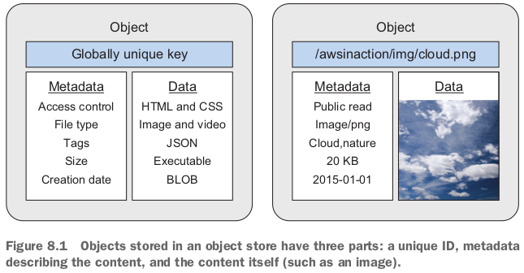

- stateless server, block-level storage, in-memory database.

---------------

- Data is managed as objects, so the storage system is called an *object store*.

## 8.1 What is an object store?



## 8.2 Amazon S3

- S3のuse case: Storing structured data for analytics, also called a ***data lake***.


- S3 uses *buckets* to **group objects**. 

## 8.3 Backing up your data on S3 with AWS CLI

1. create a bucket.
2. upload local folder to the bucket.
3. test the restore. 
   - versioning for objectsも可能。

- S3 is designed for 99.999999999% durability of objects over a year.
  - For instance, when storing 100,000,000,000 objects on S3, you will lose only a single object per year on average.
- delete: 

## 8.4 Archiving objects to optimize costs


- Amazon Glacier is designed for archiving large files that you upload once and download seldom.
  - It is expensive to upload and retrieve a lot of small files, so you should bundle small files into large archives before storing them on Amazon Glacier.

### 8.4.1 Creating an S3 bucket for the use with Glacier

- Use Glacier to archive objects that have been stored on S3 to reduce storage costs.
  - Only move data to Glacier if the chance you'll need to access the data later is low. 自動運転テストで取ったbagファイルはGlacierに保存するのにふさわしいね。

### 8.4.2 Adding a lifecycle rule to a bucket

- A lifecycle rule can be used to archive or delete objects after a given number of days.
  - Add a lifecycle rule that moves objects to Glacier.

- bucket->Management tag->Create lifecycle rule. 

### 8.4.3 Experimenting with Glacier and your lifecycle rule

- 試していない。上記のlifecycle ruleも作っていない。

- It is not possible to download files stored in Glacier directly, but you can restore an object from Glacier to S3.

## 8.5 Storing objects programmatically

- Integrating S3 into an application is one way to implement the concept of a *stateless server*.

### 8.5.1 Setting up an S3 bucket

### 8.5.2 Installing a web application that uses S3

- 改めてdockerにやった。`docker run -it --rm -v $(pwd):/home/code aws-in-action:cli `.
- ローカルbrowserで`localhost:8080`を開くので、`docker run -it -p 8080:8080 --rm -v $(pwd):/home/code aws-in-action:cli`.


- 一枚写真をアップロードした！
- もう一枚をアップロードした！

### 8.5.3 Reviewing code access S3 with SDK

```javascript
var express = require('express');
var AWS = require('aws-sdk');
var mu = require('mu2-updated');
var uuid = require('uuid');
var multiparty = require('multiparty');

var app = express();
var s3 = new AWS.S3({
	'region': 'us-east-1'
});

var bucket = process.argv[2];
if (!bucket || bucket.length < 1) {
	console.error('Missing S3 bucket. Start with node server.js BUCKETNAME instead.');
	process.exit(1);
}

function listImages(response) {
	var params = {
		Bucket: bucket
	};
	s3.listObjects(params, function(err, data) {
		if (err) {
			console.error(err);
			response.status(500);
			response.send('Internal server error.');
		} else {
			var stream = mu.compileAndRender(
				'index.html', 
				{
					Objects: data.Contents, 
					Bucket: bucket
				}
			);
			stream.pipe(response);
		}
	});
}

function uploadImage(image, response) {
	var params = {
		Body: image,
		Bucket: bucket,
		Key: uuid.v4(),
		ACL: 'public-read',
		ContentLength: image.byteCount,
		ContentType: image.headers['content-type']
	};
	s3.putObject(params, function(err, data) {
		if (err) {
			console.error(err);
			response.status(500);
			response.send('Internal server error.');
		} else {
			response.redirect('/');
		}
	});
}

app.get('/', function (request, response) {
	listImages(response);
});

app.post('/upload', function (request, response) {
	var form = new multiparty.Form();
	form.on('part', function(part) {
		uploadImage(part, response);
	});
	form.parse(request);
});
 
app.listen(8080);

console.log('Server started. Open http://localhost:8080 with browser.');
```

```html
<html>
	<head>
		<title>Simple S3 Gallery</title>
	</head>
	<body>
		<h1>Simple S3 Gallery</h1>
		<h2>Upload</h2>
			<form action="/upload" method="post" enctype="multipart/form-data">
    			<p><input type="file" name="file"></p>
    			<p><input type="submit" value="Upload"></p>
			</form>
		<h2>Images</h2>
		{{#Objects}}
  			<p></p>
		{{/Objects}}
	</body>
</html>
```

- 上記のImagesの部分は理解できていない。{{Key}}はどこからもらうの？Objectsのelement? *Getting MEAN with Mongo, Express, Angular, and Node*を読もう！

## 8.6 Using S3 for static web hosting

- 例えばblog.
- staticだけで、You can't execute server-side scripts like PHP or JSP.

### 8.6.1 Creating a bucket and uploading a static website

`aws s3 cp`.

### 8.6.2 Configuring a bucket for static web hosting

- A *bucket policy* helps you control access to bucket objects globally.
- Bucket policies are similar to IAM policies.

```json
{
  "Version":"2012-10-17",
  "Statement":[
    {
      "Sid":"AddPerm",
      "Effect":"Allow",
      "Principal": "*",
      "Action":["s3:GetObject"],
      "Resource":["arn:aws:s3:::static-web-sen/*"]
    }
  ]
}
```

- add policy, enable and configure the **static web-hosting feature** of S3. `aws s3api put-bucket-policy --bucket static-web-sen --policy file://bucketpolicy.json`; `aws s3 website s3://static-web-sen --index-document helloworld.html`.

### 8.6.3 Accessing a website hosted on S3


- Linking a custom domain to an S3 bucketも可能。

## 8.7 Best practices for using S3

### 8.7.1 Ensuring data consistency


### 8.7.2 Choosing the right keys


- できるだけdistribute your keys across partitions and increase I/O performance of S3.

### 復習

- Amazon S3 is an object store accessible **only via HTTP(S)**.
  - You can upload, manage and download objects with the CLI, SDKs or the Management Console.
- Integrating S3 into your applications will help you implement the concept of a stateless server, because you don't have to store objects locally on the server.
- You can define a lifecycle for your objects that will move them from Amazon S3 to Amazon Glacier, a special service for archiving data that you don't need to access frequently.
  - Doing so reduces your cost dramatically.