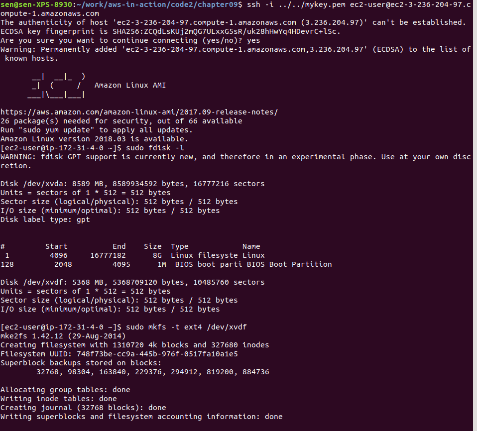
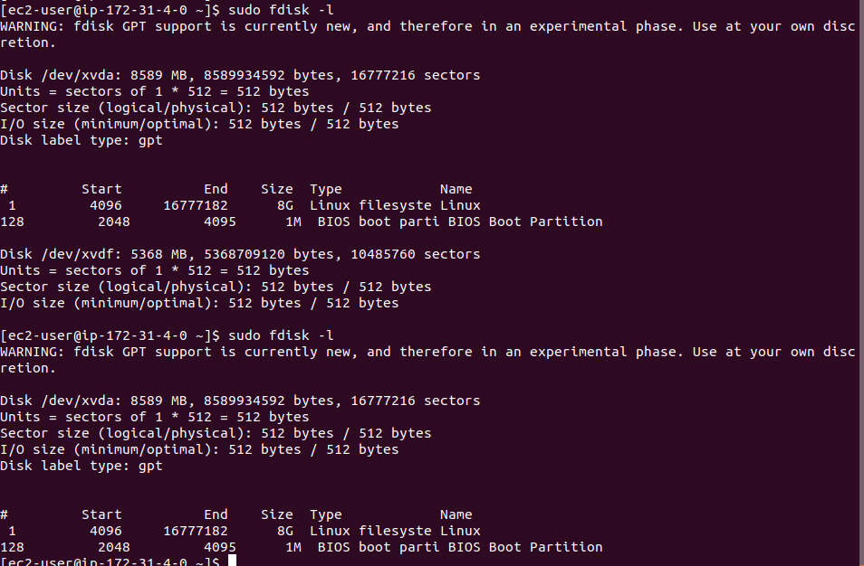
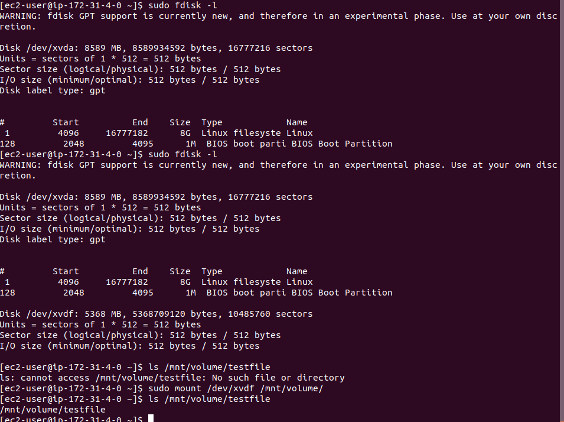
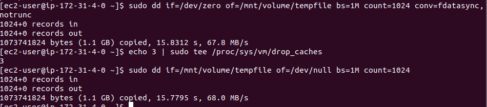
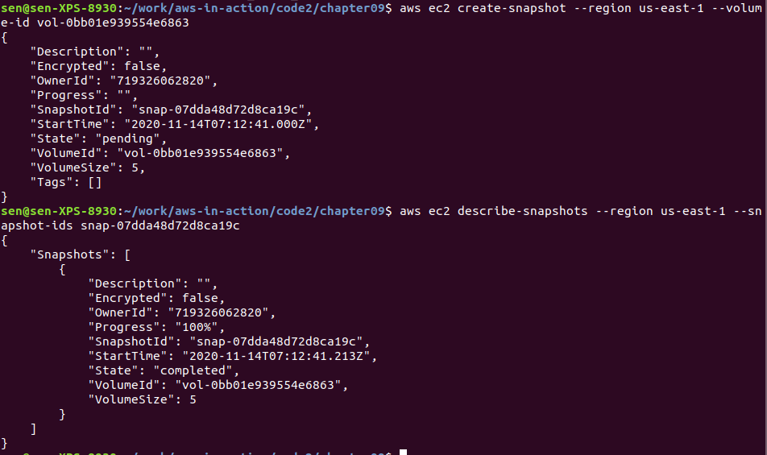
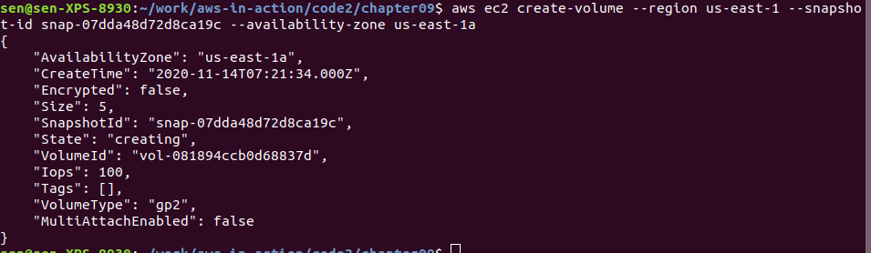
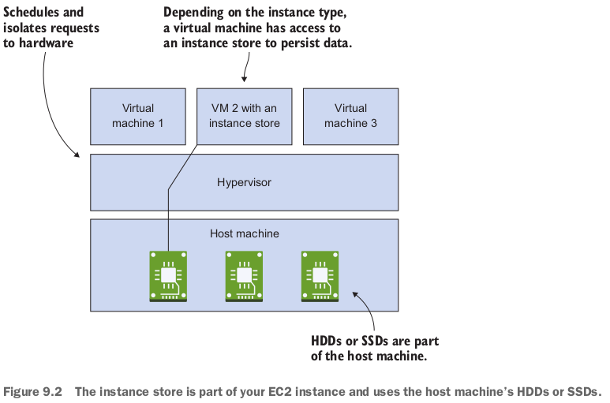

- 背景：Typically, legacy applications read and write files from a file system.
  - Switching to object storage is therefore not possible.
  - Fortunately, AWS offers good old block-level storage as well, allowing you to migrate your legacy application without the need for expensive modifications.

- You can use block-level storage only in combination with an EC2 instance where the OS is running.
- You can't tell a MySQL database to store its files in an object store because MySQL uses system calls to access files.
- AWSが提供している2種類のblock-level storage:
  - A persistent block-level storage volume connected via network.
  - A temporary block-level storage volume **physically attached to the host system** of the virtual machine.

## 9.1 Elastic Block Store (EBS): Persistent block-level storage attached over the network

- **built-in data replication**.
- You can't attach the same EBS volume to multiple virtual machines.

### 9.1.1 Creating an EBS volume and attaching it to your EC2 instance

- CloudFormation yamlに定義する例：

  ```yaml
  Resources:
    EC2Instance:
      Type: 'AWS::EC2::Instance'
      Properties:
        IamInstanceProfile: !Ref IamInstanceProfile
        ImageId: !FindInMap [RegionMap, !Ref 'AWS::Region', AMI]
        InstanceType: 't2.micro'
        KeyName: !Ref KeyName
        SecurityGroupIds:
        - !Ref SecurityGroup
        SubnetId: !Ref Subnet
        Tags:
        - Key: Name
          Value: 'AWS in Action: chapter 9 (EBS)'
    Volume:
      Type: 'AWS::EC2::Volume'
      Properties:
        AvailabilityZone: !Sub ${EC2Instance.AvailabilityZone}
        Size: 5
        VolumeType: gp2
        Tags:
        - Key: Name
          Value: 'AWS in Action: chapter 9 (EBS)'
    VolumeAttachment:
      Type: 'AWS::EC2::VolumeAttachment'
      Condition: Attached
      Properties:
        Device: '/dev/xvdf'
        InstanceId: !Ref EC2Instance
        VolumeId: !Ref Volume
  ```

- EBS volume can exist without an EC2 instance, but you need an EC2 instance to access the EBS volume.

### 9.1.2 Using EBS

- 上記yamlでstackを作ると、EC2に入って：

  - `/dev/xvdf`はyamlに定義したEBS. `/dev/xvda`はroot volume.
  - `/dev/xvdf`にfilesystemを作る。`mkfs`で。

- 上記のfilesystemにdirectoryをmountする。

  ```bash
  [ec2-user@ip-172-31-4-0 ~]$ sudo mkdir /mnt/volume/
  [ec2-user@ip-172-31-4-0 ~]$ sudo mount /dev/xvdf /mnt/volume/
  [ec2-user@ip-172-31-4-0 ~]$ df -h
  Filesystem      Size  Used Avail Use% Mounted on
  devtmpfs        488M   60K  488M   1% /dev
  tmpfs           497M     0  497M   0% /dev/shm
  /dev/xvda1      7.8G  1.1G  6.7G  14% /
  /dev/xvdf       4.8G   10M  4.6G   1% /mnt/volume
  ```

- stackをupdateして、`AttachVolume`をnoにしたが、VolumeAttachment削除失敗している。。。`Volume detachment between volume-id vol-0bb01e939554e6863 and instance-id  i-0e463e282ec39a742 at device /dev/xvdf is in busy state`のエラーメッセージ。

- 分かった！stackをupdateする前に、**umount**しないといけない：

  ```bash
  [ec2-user@ip-172-31-4-0 ~]$ sudo touch /mnt/volume/testfile
  [ec2-user@ip-172-31-4-0 ~]$ sudo umount /mnt/volume/
  ```

  - umountしないと、busyでしょう！

- umountして、stackをupdateしたら、`/dev/xvdf`がなくなった！ずっとsshしている状態だよ！

- また`AttachVolume`をyesにしましょう！そしてmountしたら、testfileまだ残っている！

### 9.1.3 Tweaking performance

- hard diskのread and write tests: `dd`ツールを使う。
  - それぞれwrite, readをテストしている。

- いろんなvolume typeがあって、違うscenarioで利用する。

- We advise you to use general-purpose (SSD) volumes as the default.
  - If your workload requires more IOPS, then go with provisioned IOPS (SSD).
  - You can attach multiple EBS volumes to a single EC2 instance to increase overall capacity or for additional performance.

### 9.1.4 Backing up your data with `EBS snapshots`

- After the first snapshot is created, only the changes will be saved to **S3**, to reduce the size of the backup.
- Creating a snapshot of an attached, mounted volume is possible, but can cause problems with writes that aren't flushed to disk.
  - You should either detach the volume from your instance or stop the instance first.
- Step 1: create snapshot from volume id: 
- Step 2: create volume from snapshot: 
- **When you launch an EC2 instance from an AMI, AWS creates a new EBS volume (root volume) based on a snapshot (an AMI includes an EBS snapshot)**. なるほど、root volumeがこのようにEBS snapshotから作られているんだ！

## 9.2 Instance store: Temporary block-level storage（未実践）

- You don't pay separately for an instance store; instance store charges are included in the EC2 instance price. 

### 9.2.1 Using an instance store

- If you launch an EC2 instance from an EBS-backed root volume (which is the default), you must define a `BlockDeviceMappings` to map EBS and instance store volumes to device names.

  ```yaml
    EC2Instance:
      Type: AWS::EC2::Instance
      Properties:
        ImageId: !FindInMap [RegionMap, !Ref 'AWS::Region', AMI]
        InstanceType: 'm3.medium'
        KeyName: !Ref KeyName
        SecurityGroupIds:
        - !Ref SecurityGroup
        SubnetId: !Ref Subnet
        BlockDeviceMappings:
        - DeviceName: '/dev/xvda'
          Ebs:
            VolumeSize: 8
            VolumeType: gp2
        - DeviceName: '/dev/xvdb'
          VirtualName: ephemeral0
        Tags:
        - Key: Name
          Value: 'AWS in Action: chapter 9 (Instance Store)'
  ```

  - The instance store volume is mounted automaticallyらしい。`/media/ephemeral10`にmountされるらしい。

### 9.2.2 Testing performance

- 著者のテストだと、writeは6倍、readは60倍、EBSより早い。

### 復習

- Block-level storage can only be used in combination with an EC2 instance because the **OS is needed to provide access to the block-level storage (including partitions, file systems, and read/write system calls)**.
- EBS volumes are connected to a single EC2 instance via network.
  - **Depending on your instance type, this network connection can use more or less bandwidth**.