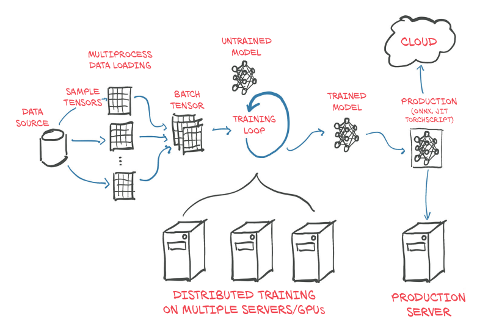
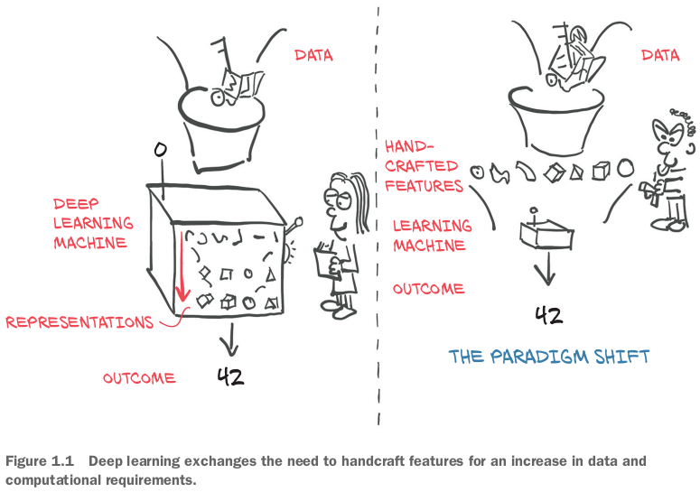

## 1.1 The deep learning revolution

## 1.2 PyTorch for deep learning

- We believe that PyTorch's **clear syntax**, **streamlined API**, and **easy debugging** make it an excellent choice for introducing deep learning.

## 1.3 Why PyTorch?

- It's Pythonic, and while like any complicated domain **it has caveats and best practices**.
- PyTorch gives us a data type, the `Tensor`, to hold numbers, vectors, matrices, or arrays in general.
- PyTorchの２つdeep learningにふさわしい特徴（high-performance library with optimization support for scientific computing in Python）：
  - accelerated computation using GPUs.
  - facilities that support numerical optimization on generic mathematical expressions.

### 1.3.1 The deep learning competitive landscape

- TensorFlow:
  - **Consumed Keras entirely, promoting it to a first-class API**.
  - Provided an immediate-execution "**eager mode**" that is somewhat similar to how PyTorch approaches computation.
  - Released TF 2.0 with eager mode by default.

- JAX: **NumPy equivalent with GPU**, autograd and JIT capabilities.
- PyTorch:
  - **Consumed Caffe2 for its backend**.
  - Replaced most of the low-level code reused from the Lua-based Torch project.
  - Added a **delayed-execution "graph mode" runtime called *TorchScript***.

- Interestingly, with the advent of TorchScript and eager mode, both PyTorch and TensorFlow have seen their feature sets start to converge with the other's, though the presentation of these features and the overall experience is still quite different between the two.

## 1.4 An overview of how PyTorch supports deep learning projects

- Actually, for performance reasons, **most of PyTorch is written in C++ and CUDA**, a C++-like language from NVIDIA that can be compiled to run with massive parallelism on GPUs.
- Both tensors and the operations on them can be used on the CPU or the GPU.
  - **Moving computations from the CPU to the GPU in PyTorch doesn't require more than an additional function call or two**.

- PyTorch also provides a way to **compile models ahead of time** through *TorchScript*.

## 1.5 Hardware and software requirements

### 1.5.1 Using Jupyter Notebooks

### 復習

- PyTorch minimizes cognitive overhead while focusing on flexibility and speed.
  - It also defaults to immediate execution for operations.
- TorchScript allows us to precompile models and invoke them not only from Python but also from C++ programs and on mobile devices.