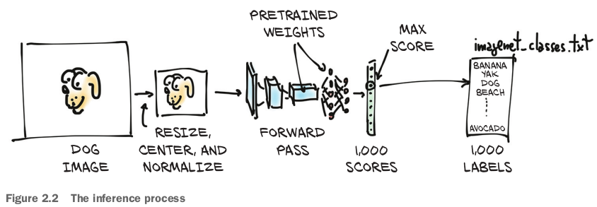
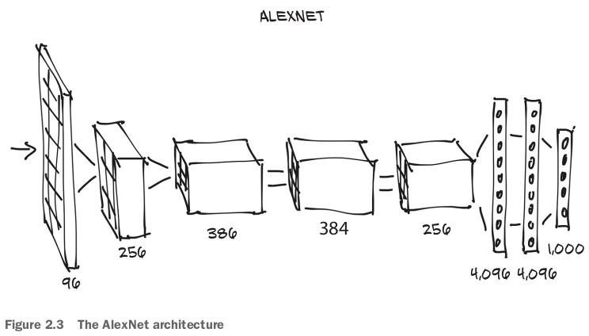
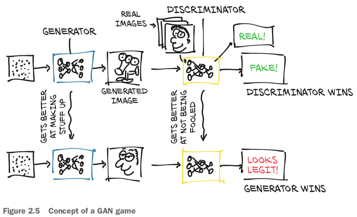
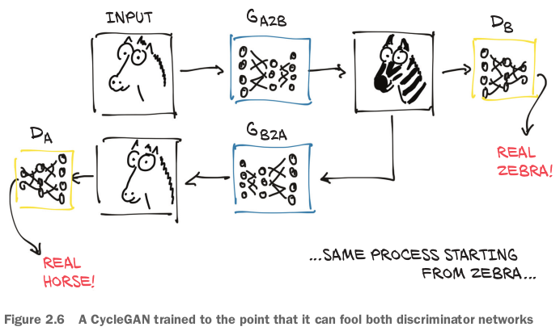
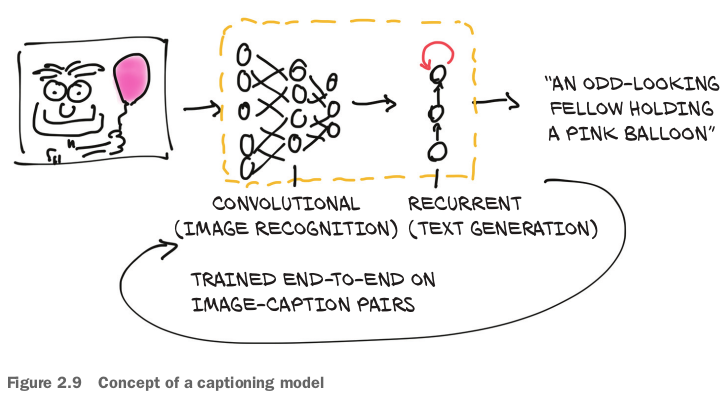

## 2.1 A pretrained network that recognizes the subject of an image

- ImageNetの画像が全部**labeled with a hierarchy of nouns that come from the WordNet** dataset, which is in turn a large lexical database of the English language.
- **scene parsing**: segmenting an image into regions associated with semantic categories, such as cow, house, cheese, hat.
- the inference process: 

### 2.1.2 AlexNet



### 2.1.3 ResNet

- `resnet101`: before the advent of residual networks in 2015, **achieving stable training at such depths** was considered extremely hard.
  - Residual networks pulled a trick that made it possible.

- `resnet101` sports **44.5 million parameters**.

### 2.1.5 Run!

- The process of running a trained model on new data is called *inference* in deep learning circles.

## 2.2 A pretrained model that fakes it until it makes it

### 2.2.1 The GAN game



- This technique has proven itself able to lead to generators that produce realistic images from nothing but noise and **a conditioning signal**, like an attribute (for example, for faces: young, female, glasses on) or **another image**.

### 2.2.2 CycleGAN

- A CycleGAN can turn images of one domain into images of another domain (and back), **without the need to explicitly provide matching pairs in the training set**. 
  - Note that there are two separate generator networks, as well as two distinct discriminators.

- **Creating such a cycle stabilizes the training process considerably, which addresses one of the original issues with GANs**.

## 2.3 A pretrained network that describes scenes



- This captioning model has two connected halves.
  - The first half of the model is a network that learns to generate "descriptive" numerical representations of the scene (Tabby cat, laser mouse, paw), which are then taken as input to the second half.
  - That second half is a *recurrent neural network* that generates a coherent sentence by putting those numerical descriptions together.
- The second half of the model is called *recurrent* because it generates its outputs (individual words) **in subsequent forward passes**, where the input to each forward pass includes the outputs of the previous forward pass.
  - This **generates a dependency of the next word on words that were generated earlier**, as we would expect when dealing with sentences or, in general, with sequences.

## 2.4 Torch Hub

- In our quest for interesting pretrained models, we can now search for **GitHub repositories that include hubconf.py**, and we'll know right away that we can load them using the torch.hub module.

- TorchVisionのhubconf.py, 本の話と違うらしい：（https://github.com/pytorch/vision/blob/master/hubconf.py）

  ```python
  # Optional list of dependencies required by the package
  dependencies = ['torch']
  
  # classification
  from torchvision.models.alexnet import alexnet
  from torchvision.models.densenet import densenet121, densenet169, densenet201, densenet161
  from torchvision.models.inception import inception_v3
  from torchvision.models.resnet import resnet18, resnet34, resnet50, resnet101, resnet152,\
      resnext50_32x4d, resnext101_32x8d, wide_resnet50_2, wide_resnet101_2
  from torchvision.models.squeezenet import squeezenet1_0, squeezenet1_1
  from torchvision.models.vgg import vgg11, vgg13, vgg16, vgg19, vgg11_bn, vgg13_bn, vgg16_bn, vgg19_bn
  from torchvision.models.googlenet import googlenet
  from torchvision.models.shufflenetv2 import shufflenet_v2_x0_5, shufflenet_v2_x1_0
  from torchvision.models.mobilenet import mobilenet_v2
  from torchvision.models.mnasnet import mnasnet0_5, mnasnet0_75, mnasnet1_0, \
      mnasnet1_3
  
  # segmentation
  from torchvision.models.segmentation import fcn_resnet50, fcn_resnet101, \
      deeplabv3_resnet50, 
  ```

  - entry-point functionはここに定義されていない（まあimportされているので同じだ）。`pretrained`という引数も。

### 復習

- By knowing **how to use** a pretrained model, we can integrate a neural network into a project without having to design or train it.
- AlexNet and ResNet are two deep convolutional networks that **set new benchmarks for image recognition** in the years they were released.
- NeuralTalk2 uses a **hybrid model** architecture to consume an image and produce a text description of the image.
- Torch Hub is a standardized way to load models and weights from any project with an appropriate hubconf.py file.