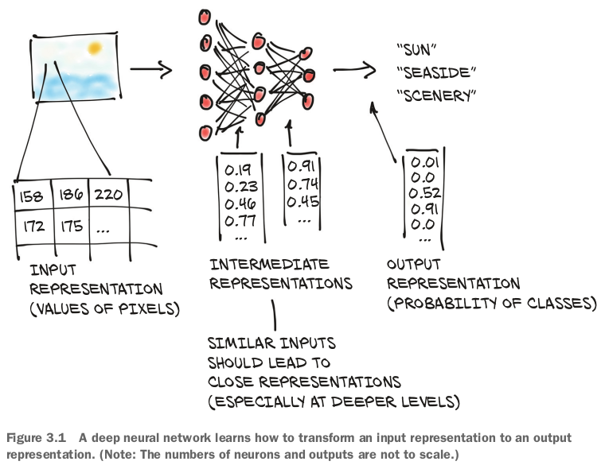
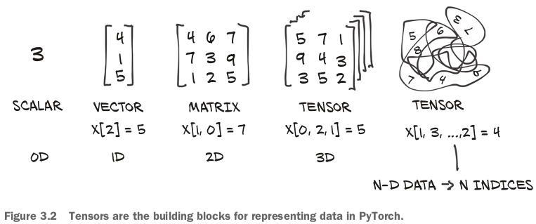
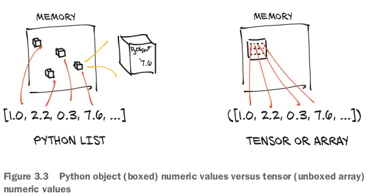
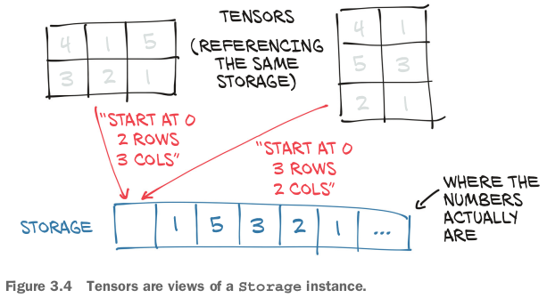
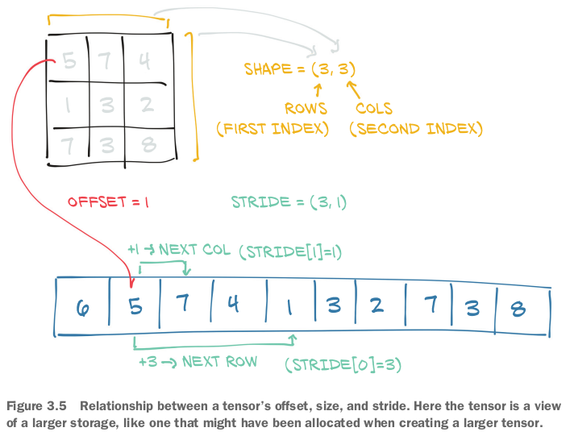
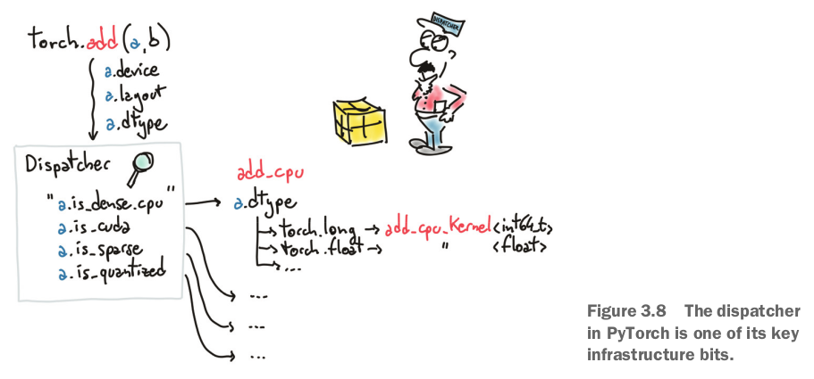

## 3.1 The world as floating-point numbers

- tensor: 
- NumPy is by far the most popular multidimensional array library, to the point that it has now arguably(間違いなく) become the **lingua franca of data science**.
- **PyTorch features seamless interoperability with NumPy, which brings with it first-class integration with the rest of the scientific libraries in Python, such as SciPy, Scikit-learn, and Pandas**.
- NumPy arraysと比べて、PyTorch tensorの強みは**perform very fast operations on GPUs, distribute operations on multiple devices or machines, and keep track of the graph of computations that created them**.

## 3.2 Tensors: Multidimensional arrays

### 3.2.3 The essence of tensors(大事)

- **Python lists or tuples of numbers** are **collections of Python objects** that are **individually allocated in memory**. 
  - **PyTorch tensors or NumPy arrays** are **views** over (typically) **continuous memory blocks** containing **unboxed C numeric types** rather than Python objects.
  - This means storing a 1D tensor of 1,000,000 float numbers will require exactly 4,000,000 contiguous bytes, plus a small overhead for the metadata (such as dimensions and numeric type).

## 3.4 Named tensors

- 伝統のindexing: When we want to index into a tensor, we need to **remember the ordering of the dimensions and write our indexing accordingly**.
  - 課題：As data is transformed through multiple tensors, keeping track of which dimension contains what data can be error-prone.

## 3.5 Tensor element types

- standard Python numeric typesを利用するのは最適ではない理由：
  - Numbers in Python are objects.
    - Whereas a floating-point number might require only, for instance, 32 bits to be represented on a computer, Python will convert it into a full-fledged Python object with reference counting, and so on.
    - This operation, called **boxing**, is not a problem if we need to store a small number of numbers, but allocating millions gets very inefficient.
  - **Lists in Python are meant for sequential collections of objects**.
  - **The Python interpreter is slow compared to optimized, compiled code**.
    - Performing mathematical operations on large collections of numerical data can be much faster using optimized code written in a compiled, low-level language like C.

- **For these reasons, data science libraries rely on NumPy** or introduce dedicated data structures like PyTorch tensors, which provide efficient low-level implementations of numerical data structures and related operations on them, wrapped in a convenient high-level API.
  - **To enable this, the objects within a tensor must all be numbers of the same type, and PyTorch must keep track of this numeric type**.

### 3.5.1 Specifying the numeric type with dtype

- `torch.float16` or `torch.half`: 16-bit, half-precision floating-point.
- `torch.int16` or `torch.short`: signed 16-bit integers.
- `torch.int64` or `torch.long`: signed 64-bit integers.
- **The default data type for tensors is 32-bit floating-point**.

### 3.5.2 A dtype for every occasion

- Computations happening in neural networks are typically executed with 32-bit floating-point precision.
- **Higher precision, like 64-bit, will not buy improvements in the accuracy of a model and will require more memory and computing time**.
- **The 16-bit floating-point, half-precision data type is not present natively in standard CPUs, but it is offered on modern GPUs**.
- Tensors can be used as indexes in other tensors.
  - In this case, PyTorch expects **indexing tensors** to have a 64-bit integer data type.
  - As such, we'll **spend most of our time dealing with `float32` and `int64`**.

- Finally, predicates on tensors, such as `points > 1.0`, produce `bool` tensors.

## 3.6 The tensor API

- *Creation ops*: like `ones` and `from_numpy`.
- *Indexing, slicing, joining, mutating ops*. like `transpose`.
- *Math ops*:
  - Pointwise ops. like `abs`, `cos`.
  - **Reduction ops**: functions for computing aggregate values by iterating through tensors, like `mean`, `std` and `norm`.
  - Comparison ops. like `equal`, `max`.
  - Spectral ops: functions for transforming in and operating in the frequency domain, like `stft` and `hamming_window`.
  - Other operations: special functions operating on vectors, like `cross`, or matrices, like `trace` (行列の跡「せき」、対角和「たいかくわ」、行列の主対角成分の総和).
  - BLAS and LAPACK operations: functions following the Basic Linear Algebra Subprograms (BLAS) specification for scalar, vector-vector, matrix-vector, and matrix-matrix operations.
- *Random sampling*. like `randn`, `normal`.
- *Serialization*. like `load`, `save`.
- *Parallelism*. functions for controlling the number of threads for parallel CPU execution, like `set_num_threads`.

## 3.7 Tensors: Scenic views of storage

- Values in tensors are allocated in contiguous chunks of memory **managed by `torch.Storage` instances**.
- **A storage** is **a one-dimensional array** of numerical data.
- **A PyTorch `Tensor` instance is a view of such a `Storage` instance** that is **capable of indexing into that storage** using an offset and per-dimension strides.
  - `Storage` may not be directly accessible in future PyTorch releases.

- Multiple tensors can index the same storage even if they index into the data differently. 
- The underlying memory is allocated only once, so creating alternating tensor-views of the data can be **done quickly regardless of the size of the data** managed by the `Storage` instance.

## 3.8 Tensor metadata: Size, offset, and stride

- In order to index into a storage, tensors rely on a few pieces of information that, together with their storage, unequivocally(明確に) define them: size, offset, and stride. 
  - The stride is the number of elements in the storage that need to be skipped over to obtain the next element along each dimension.

## 3.11 Generalized tensors are tensors, too

- **Any implementation that meets the contract of that API can be considered a tensor!**
- tensorがCPUにあってもGPUにあっても正しい計算関数が呼び出されること、is accomplished through a *dispatching* mechanism, and the mechanism can cater to other tensor types by **hooking up the user-facing API to the right backend functions**.
- 他のタイプのtensorの例：sparse tensors store only nonzero entries, along with index information.
- dispatcher: 
  - The subsequent switching done to accommodate the various numeric types is a **fixed aspect of the implementation** coded into each backend.
  - **quantized tensors** in chapter 15.
- Sometimes the usual tensors we use are called **dense** or **strided** to differentiate them from tensors using other memory layouts.

### 復習

- Neural networks transform floating-point representations into other floating-point representations.
  - The starting and ending representations are typically human interpretable, but the intermediate representations are less so.
- PyTorch has a comprehensive standard library for tensor creation, manipulation, and mathematical operations.
- All tensor operations in PyTorch can execute on the CPU as well as on the GPU, with no change in the code.
- **PyTorch uses a trailing underscore to indicate that a function operates in place on a tensor (for example, `Tensor.sqrt_`)**.