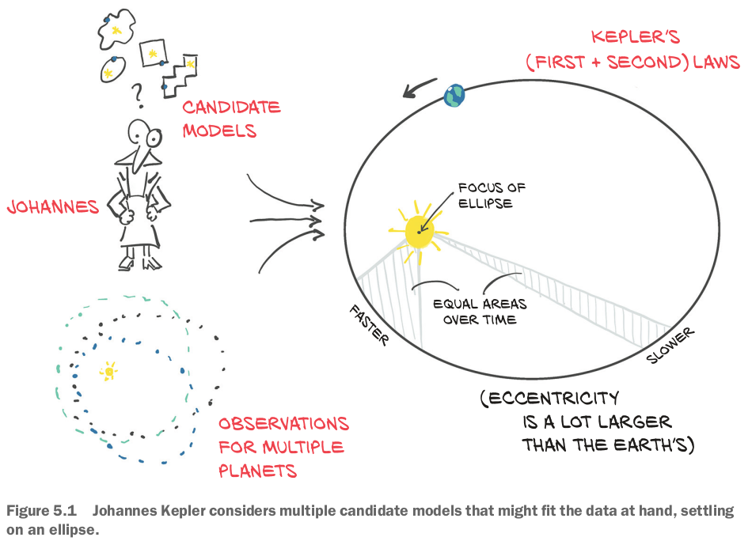
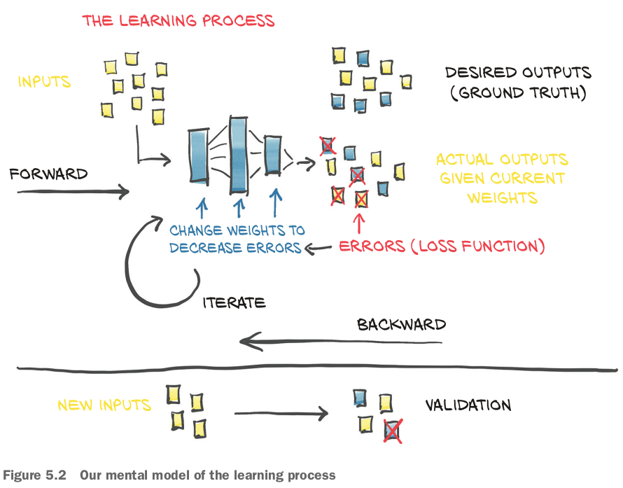
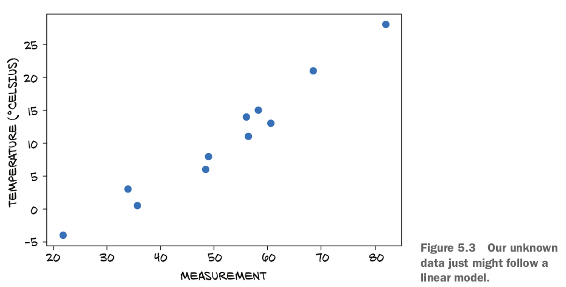

## 5.1 A timeless(時代を超越した) lesson in modeling

- Building models that allow us to **explain input/output relationships**.

- semi-latus rectumの意味：https://en.wikipedia.org/wiki/Ellipse#/media/File:Ellipse-param.svg
- How did Kepler estimate the eccentricity and size of the ellipse without computers, pocket calculators, or even calculus, none of which had been invented yet?
- In particular, PyTorch is designed to make it easy to create models for which the **derivatives of the fitting error, with respect to the parameters, can be expressed analytically**.

## 5.2 Learning is just parameter estimation

- In order to optimize the parameter (weights) of the model, the change (gradient) in the error **following a unit change in weights** is computed using the chain rule for the derivative of a composite function.

### 5.2.1 A hot problem

### 5.2.2 Gathering some data

### 5.2.3 Visualizing the data

### 5.2.4 Choosing a linear model as a first try

### 復習

- Deep learning can be used for generic models that are **not engineered** for solving a specific task, but instead can be automatically adapted to specialize themselves on the problem at hand.
- Optimizers use the autograd feature of PyTorch to compute the gradient for each parameter, depending on how that parameter contributes to the final output.