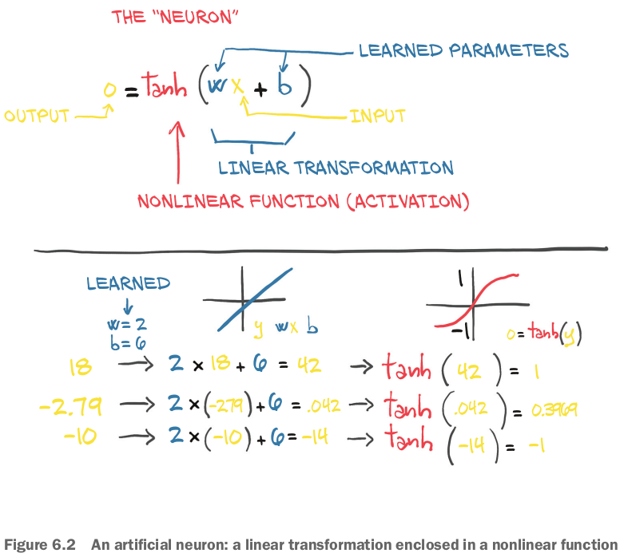
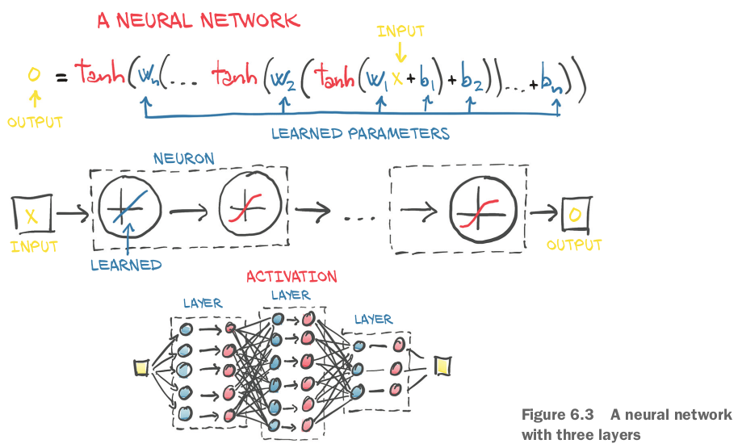
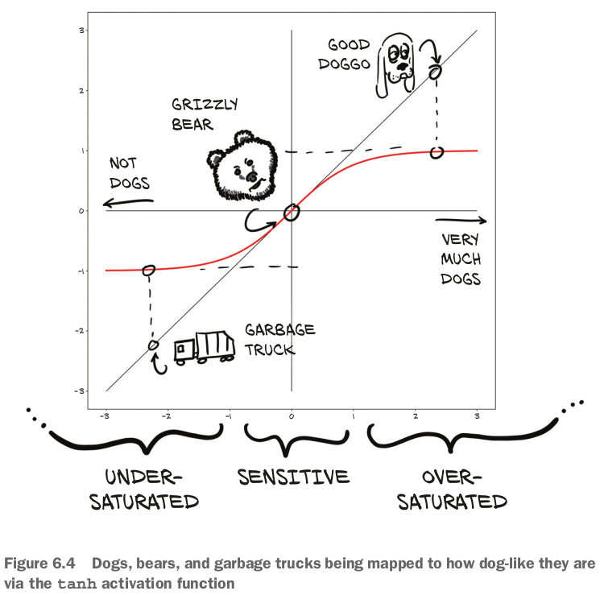
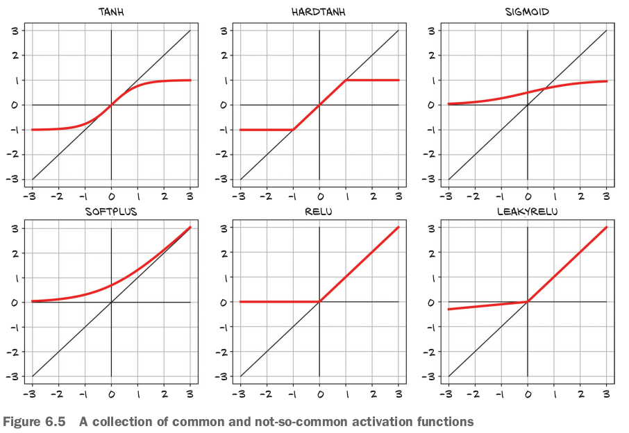
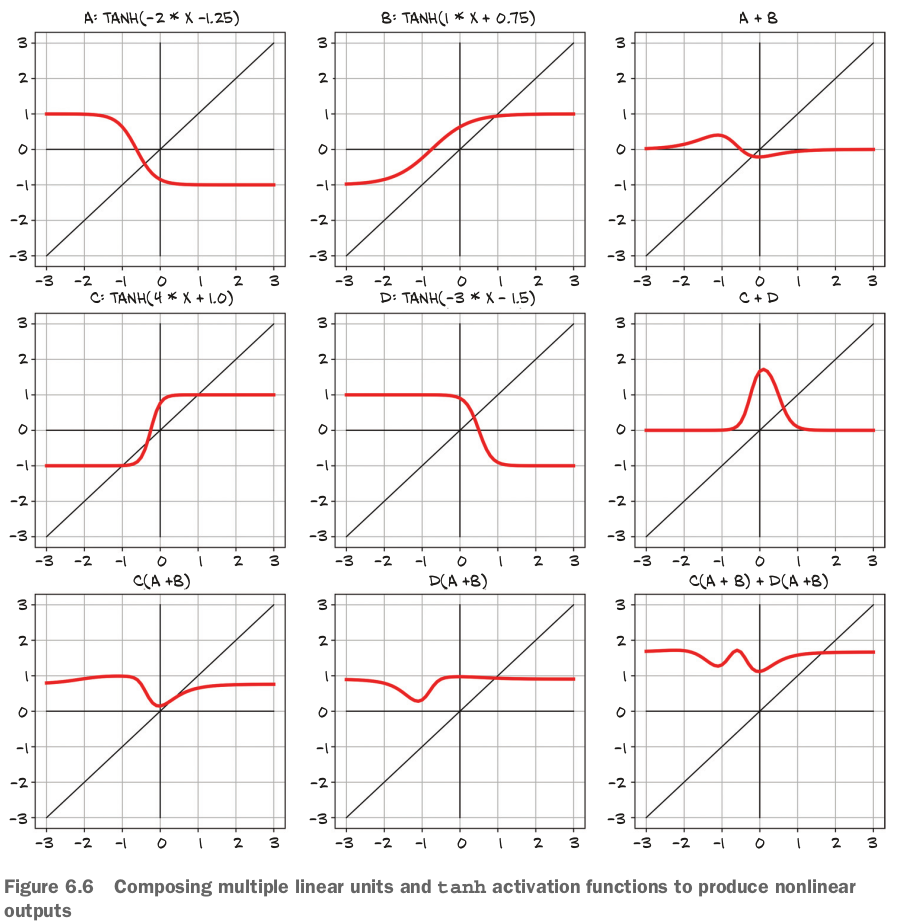

- Nonlinear activation functions as the key difference compared with linear models.

## 6.1 Artificial neurons

### 6.1.1 Composing a multilayer network

### 6.1.2 Understanding the error function

- Neural networks do not have that same property of a **convex error surface**, even when using the same error-squared loss function!
- A big part of the reason neural networks have non-convex error surfaces is due to the activation function.

### 6.1.3 All we need is activation

- activation functionの２つroles:
  - In the inner parts of the model, it allows the output function to **have different slopes at different values** - something a linear function by definition cannot do.
  - **At the last layer** of the network, it has the role of concentrating the outputs of the preceding linear operation into a given range.
- Compressing the output range: 

### 6.1.4 More activation functions

- The `Sigmoid` activation function was widely used in early deep learning work but has since fallen out of common use except where we explicitly want to move to the `0...1` range: for example, when the output should be a probability.

### 6.1.5 Choosing the best activation function

### 6.1.6 What learning means for a neural network

- 複数`tanh`やlinear functionを組み合わせることで、いろんな関数を表せる：

### 復習

- Activation functions around linear transformations make neural networks capable of approximating highly nonlinear functions, at the same time **keeping them simple enough to optimize**.
- To recognize overfitting, it's essential to maintain the training set of data points separate from the validation set.
  - There's no one recipe to combat overfitting, but getting more data, or more variability in the data, and resorting to simpler models are good starts.
- **Anyone doing data science should be plotting data all the time**.