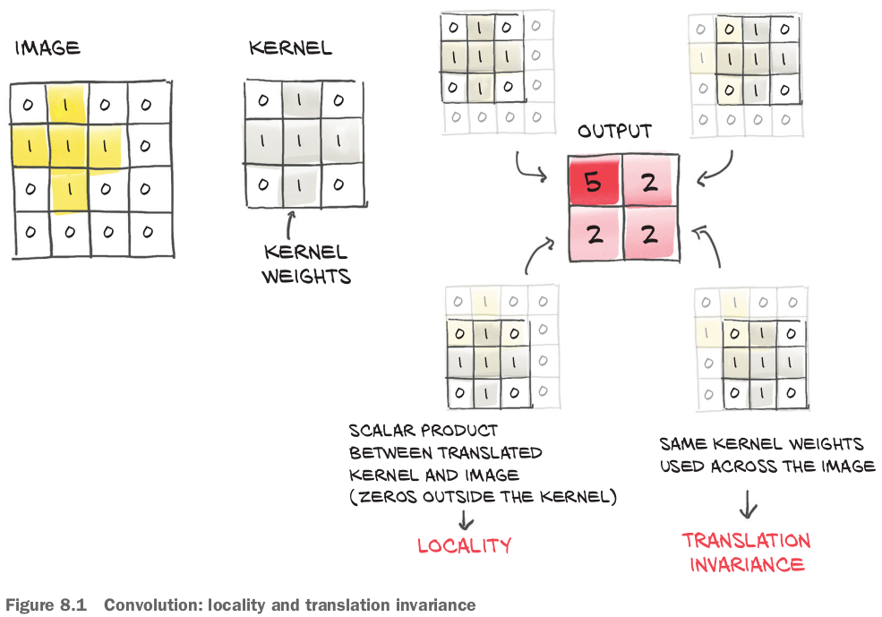

## 8.1 The case for convolutions

### 8.1.1 What convolutions do

- There is a subtle difference between PyTorch's convolution and mathematics' convolution: one argument's sign is flipped.
  - If we were in a pedantic(学者ぶった、物知り顔の) mood, we could call PyTorch's convolutions **discrete cross-correlations**. 分かる！
- **In deep learning, we typically use small kernels**.
- Convolution: 
- For a multichannel image, like our RGB image, the weight matrix would be a `3x3x3` matrix.
- The same kernel, and thus each weight in the kernel, is reused across the whole image.
  - Thinking back to autograd, this means the use of each weight has a history spanning the entire image.
  - Thus, **the derivative of the loss with respect to a convolution weight includes contributions from the entire image**.
- With a convolution layer, the number of parameters depends not on the number of pixels in the image, as was the case in our fully connected model, but rather on the **size of the convolution kernel** and on **how many convolution filters** (or output channels) we decide to use in our model.

