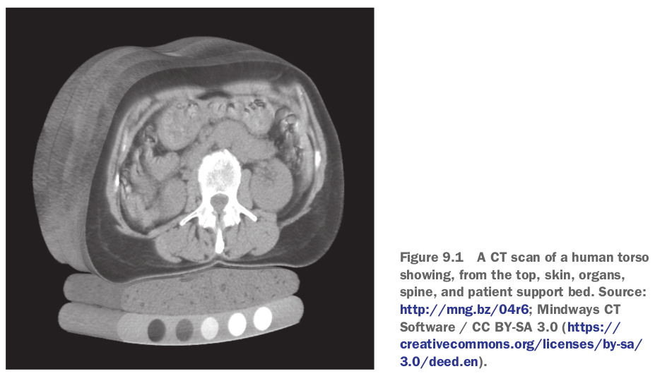
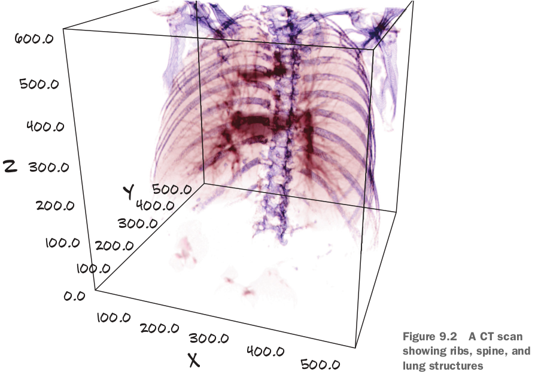
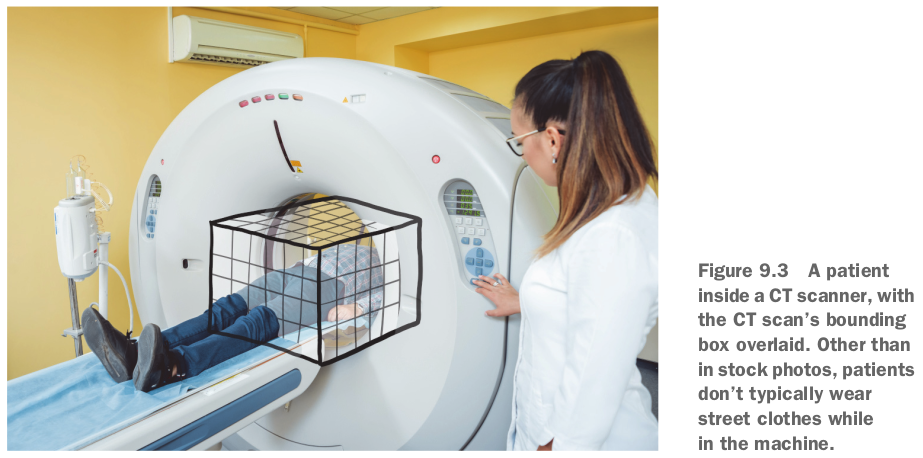
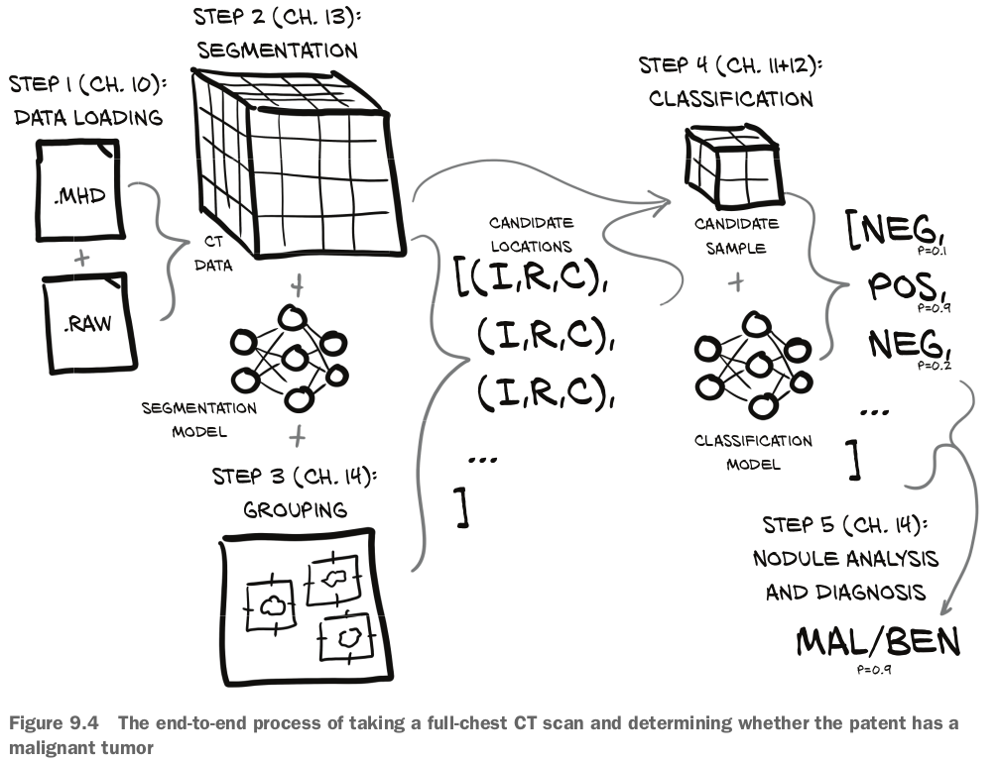
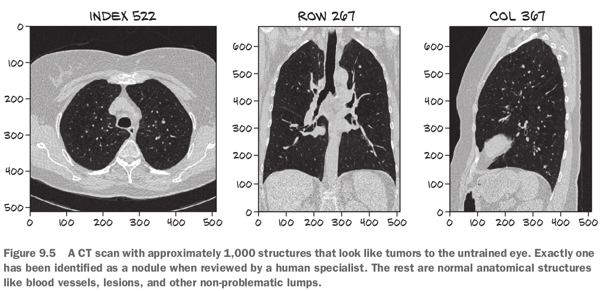
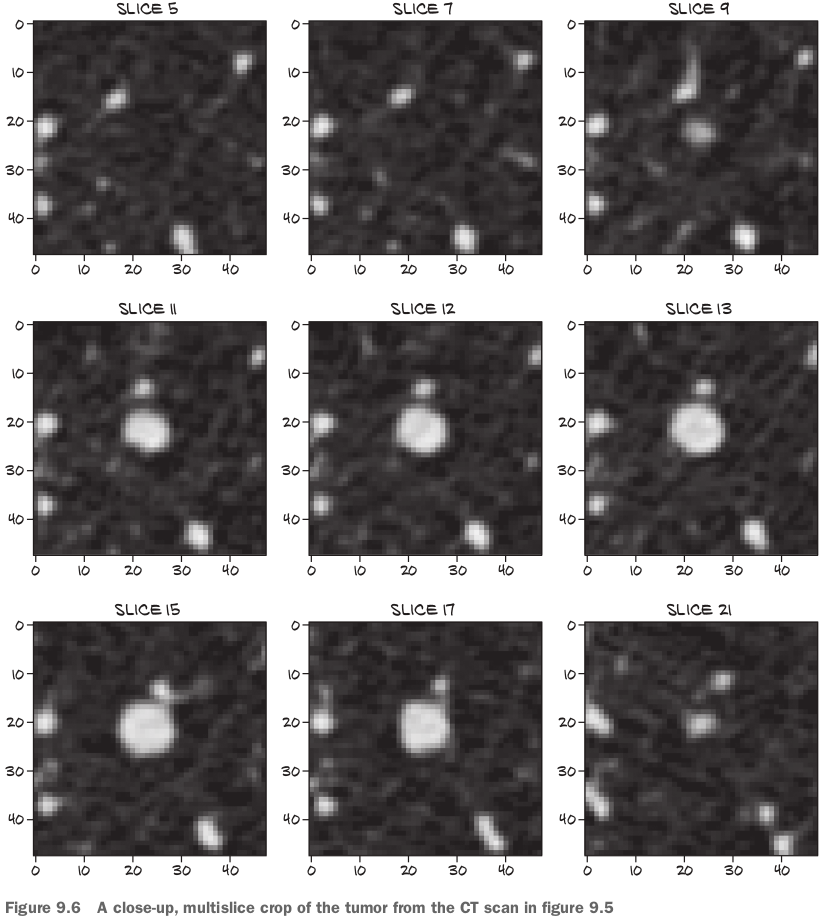
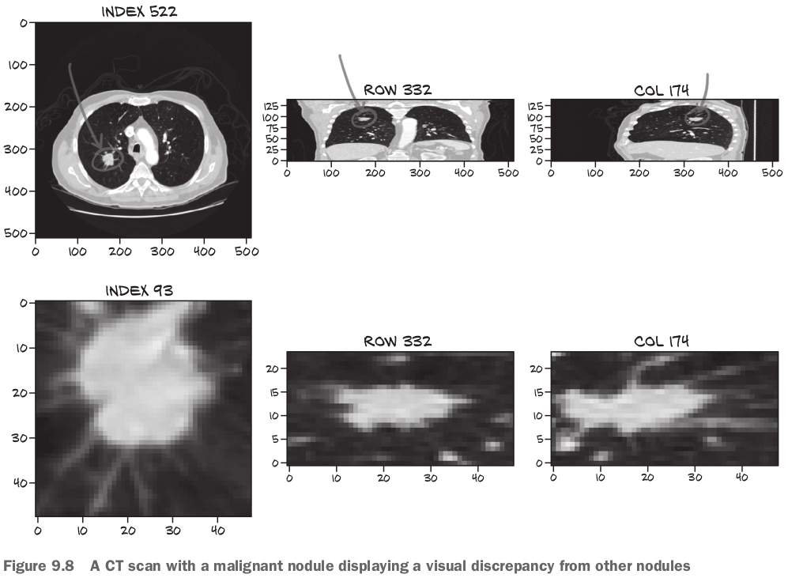

## 9.1 Introduction to the use case

- 目標：Take three-dimensional CT scans of human torsos(胴体「どうたい」) as input and produce as output the location of suspected malignant tumors, if any exist.
- Doing that job well is akin to being placed in front of 100 haystacks and being told, "Determine which of these, if any, contain a needle."
  - The human brain just isn't built well for that kind of monotonous work.

## 9.2 Preparing for a large-scale project

- The main differences are related to how much effort we put into things outside the model itself.
- As is common for real-world use cases such as this, a workable approach will be more complicated to account for confounding factors such as limited data availability, finite computational resources, and limitations on our ability to design effective models.

## 9.3 What is a CT scan, exactly?

- CT scans are essentially 3D X-rays, represented as a **3D array of single-channel data**.
  - This is like a **stacked set of gray-scale** PNG images.
- Often, voxels are cubic, but for this chapter, we will be dealing with voxels that are rectangular prisms.
  - https://www.google.com/search?channel=fs&client=ubuntu&q=rectangular+prism

- In addition to medical data, we can see similar voxel data in fluid simulations, 3D scene reconstructions from 2D images, light detection and ranging (LIDAR) data for self-driving cars, and many other problem spaces.
- Most visualizations of that data show high-density material like bones and metal implants(インプラント) as white, low-density air and lung tissue as black, and fat and tissues as various shades of gray.
- CT scanやX-rayの主な区別は、an X-ray is a projection of 3D intensity onto a 2D plane, a CT scan retains the third dimension of the data. 
  - CT scans actually measure radiodensity, which is a function of both mass density and atomic number(原子番号) of the material under examination.
- This 3D representation also allows us to "see inside" the subject by **hiding tissue types** we are not interested in.
  - For example, we can render the data in 3D and **restrict visibility to only bone and lung tissue**: 

- The scanner's darker, central ring is where the actual imaging equipment is located.

- The raw output of the scanning process doesn't look particularly meaningful to the human eye and must be properly reinterpreted by a computer into something we can understand.
  - The **settings of the CT scanner** when the scan is taken can have a large impact on the resulting data.

## 9.4 The project: An end-to-end detector for lung cancer

- Load CT data files to produce a `Ct` instance that contains the full 3D scan, **combine that with a module that performs segmentation (flagging voxels of interest)**, and then **group the interesting voxels into small lumps in the search for candidate nodules(結節「けっせつ」)**.
- The **nodule locations** are **combined back with the CT voxel data** to produce **nodule candidates**, which can then be **examined by our nodule classification model** to determine whether they are actually nodules in the first place and, eventually, whether they're malignant.
  - This latter task is particularly difficult because malignancy might not be apparent from CT imaging alone.

- Last, each of those individual, **per-nodule classifications** can then be combined into a whole-patient diagnosis.
  - We will take a simple maximum of the per-tumor malignancy predictions, as only one tumor needs to be malignant for a patient to have cancer.
  - **Actual clinical users would likely prefer a system that flags suspicious nodules for review rather than provides a single binary diagnosis**.
- Nodulesについて：
  - A mass of tissue made of **proliferating(増殖、激増) cells** in the lung is a tumor.
  - A tumor can be benign(良性) or it can be malignant, in which case it is also referred to as cancer.
  - A **small tumor** in the lung (**just a few millimeters wide**) is called a nodule.
  - About 40% of lung nodules turn out to be malignant - small cancers.

- Segmentation (heatmap)の目的：This will allow us to focus on potential tumors inside the lungs and **ignore huge swaths of uninteresting anatomy(解剖「かいぼう」学、解剖学的構造)** (a person can't have lung cancer in the stomach, for example).
- **With experience**, there are some situations where more complicated model structures can yield superlative(最上級) results (**for example, the GAN game**).

- Grouping voxels will not involve PyTorch directly.

- The data we'll use for training provides human-annotated output for both step 3 (**identifying voxels and grouping them into nodule candidates**) and 4 (nodule candidate classification).

- Being able to carve up the problem and work on steps independently is useful, since it can encourage more modular solutions; in addition, it's easier to partition the workload between members of a small team.
- **We must be able to use our intuition to guide our investigation into potential optimizations and improvements**.

### 9.4.1 Why can't we just throw data at a neural network until it works?

- In the cases where there is a malignant tumor, up to 99.9999% of the voxels in the CT still won't be cancer.
  - That ratio is equivalent to a two-pixel blob of incorrectly tinted(着色) color somewhere on a high-definition television, or a single mis-spelled word out of a shelf of novels.

- The project architecture we will use has the benefit of working well **with a more modest amount of data**.

- Step 3 (grouping) will produce and step 4 (classification) will consume data: 
  - containing sequential transverse(横の、横断する) slices of a tumor. 多分CT scannerの動く方向でしょう。

### 9.4.2 What is a nodule?

- From a radiological perspective, a nodule is really similar to other lumps that have a wide variety of causes: infection, inflammation(炎症「えんしょう」), blood-supply issues, malformed(奇形「きけい」) blood vessels, and diseases other than tumors.

### 9.4.3 Our data source: The LUNA Grand Challenge

- To be included in the public ranking, a team **must provide a scientific paper** describing the project architecture, training methods, and so on.
- Many **CT scans** "in the wild" are incredibly messy, in terms of idiosyncrasies(個人や集団の思考や行動様式の特異性、独自性、風変わり「ふうがわり」なものを指すことが多い) between various scanners and processing programs.
  - Although the LUNA data is generally clean, be sure to check your assumptions **if you incorporate other data sources**.

### 9.4.4 Downloading the LUNA data

### 復習

- Our approach to detecting cancerous nodules will have five rough steps: data loading, segmentation, grouping, classification, and nodule analysis and diagnosis.
- A CT scan is a 3D array of intensity data with approximately 32 million voxels, which is **around a million times larger than the nodules we want to recognize**.
  - Focusing the model on a crop of the CT scan relevant to the task at hand will make it easier to get reasonable results from training.

